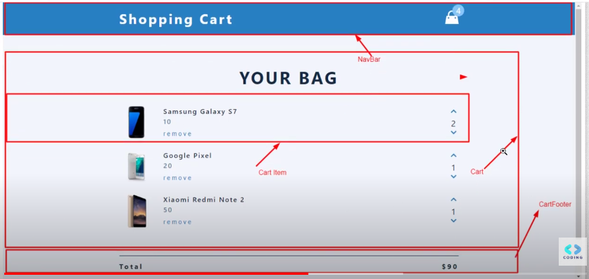
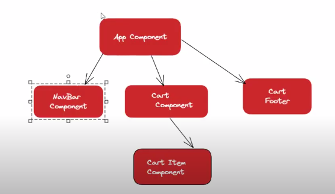

1. Xác định state

- state 1 là cái mảng chứa các object:

```jsx
[
  {
    name, 
    price, 
    amount
  },
  {
    name, 
    price, 
    amount
  },
  {
    name, 
    price, 
    amount
  }
]
```

- Kết luận: chỉ có 1 state lưu mảng các object cart

2. Xác định state đó đặt ở component nào

- Phân chia component

- Xác định component dựa vào điều kiện:
  - Khi 2 component không có quan hệ cha con mà cần đồng bộ dữ liệu với nhau thì chúng ta cần tìm component cha của 2 component trên và đặt state trên component cha.
  - Khi component cha render thì toàn bộ các component con, cháu,... của nó sẽ render lại
  - ✅ => QUY TẮC NÀY LÀ HIỂN NHIÊN ✅




