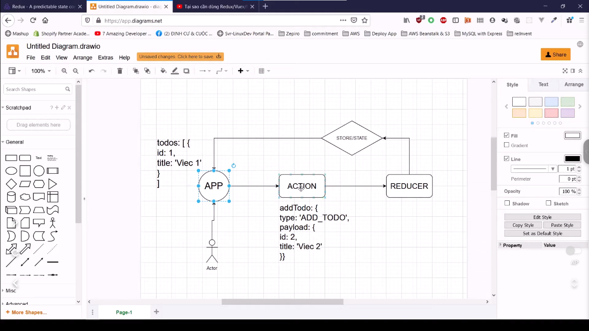

## Đây là khoá học về: Hướng dẫn Redux

[Link Course](https://www.youtube.com/playlist?list=PLKzNGvIJtUDag3UK14dvOvaHBBvSGSY8U)

---

## Các hình ảnh trong video

Đây là hình ảnh luồng dữ liệu chạy trong app. Khi người dùng xử lý 1 sự kiện nào đó thì -> nó sẽ dispatch 1 cái action lên store -> vào trong đó được reducer xử lý -> xử lý xong có kết quả -> cuối cùng nó sẽ trả về phía UI cho người dùng

Cái mấu chốt quan trọng ở đây là action và reducer

