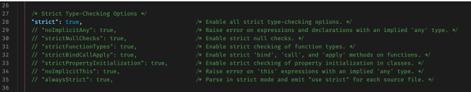

# Trong bài này chúng ta sẽ học về: Typescript: 02-03 Strictness - Các config về strict trong tsconfig.json

## Strictness - Tìm hiểu về strict flag

---

### AGENDA

- strict flag là gì?
- Option: noImplicitAny
- Option: strictNullChecks
- Option: alwaysStrict
- Other options
- Summary

### Bạn có biết độ strict trong typescript có thể config được hay không? Cùng mình tìm hiểu trong video này nhé

- Trong file tsconfig.json, có nhiều config liên quan tới việc điều chỉnh độ strict của typescript.
- Càng strict thì typescript càng bắt nhiều lỗi hơn, càng dễ ít bị lỗi vặt khi lên production, nhưng đôi khi nó bắt nhiều quá, sửa hơi mệt haha