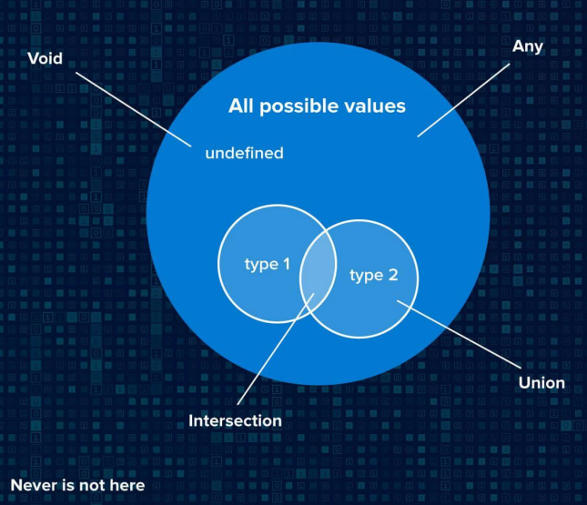

# Trong bài này chúng ta sẽ học về: Typescript: 03-01 Tổng quan về type system 🎉

- Giới thiệu nội dung mình sẽ chia sẻ trong chương 3, với các kiểu dữ liệu trong typescript, literal types, cùng nhiều điều khác sẽ có trong phần type system này 😍

### AGENDA

- Type system overview
- Type Alias vs Interface
- Function
- Enum
- Generics
- Utility types
- And more

### Các kiểu dữ liệu thường gặp

### Các kiểu dữ liệu bạn đã biết bên Javascript

- Primitive: number, boolean, string, null, undefined, symbol
- Reference: array, object, function
- Còn typescript, bạn sẽ bắt gặp: any, unknown, void, never, ...