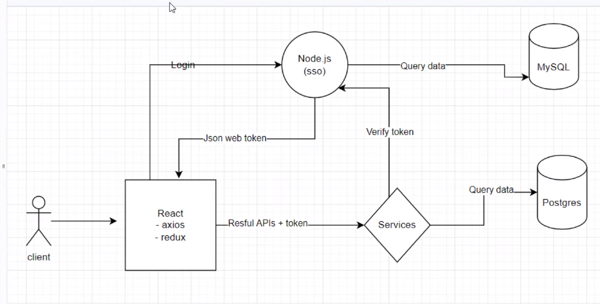
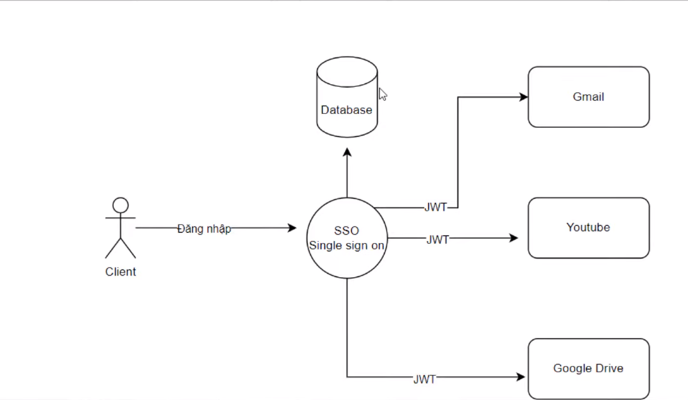
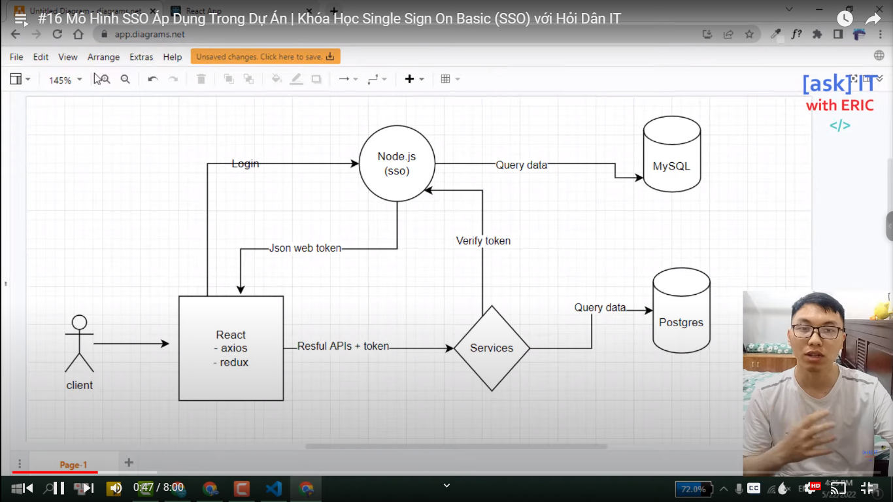
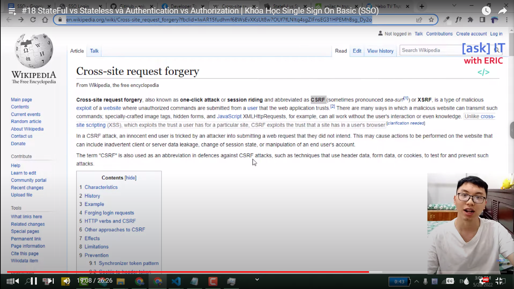
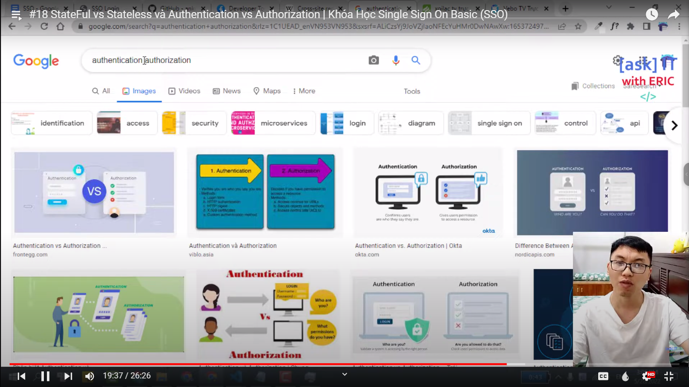
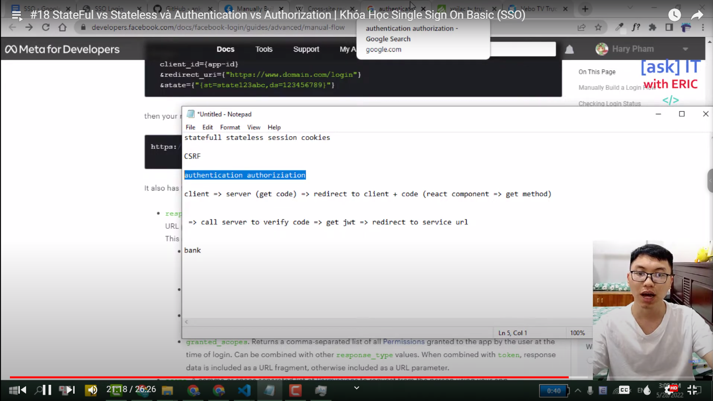
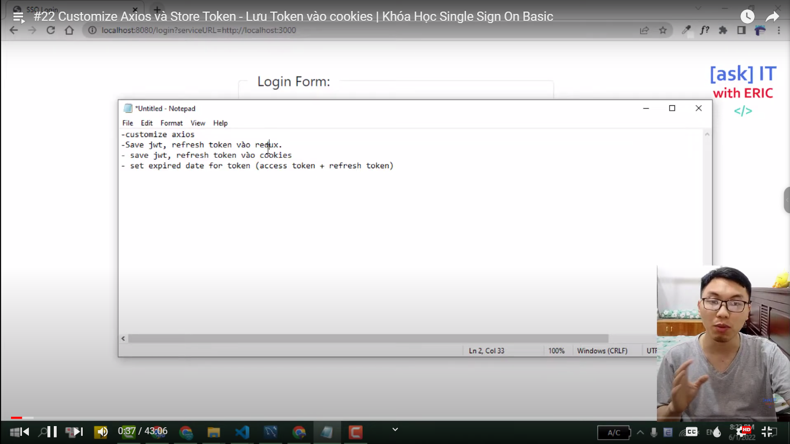
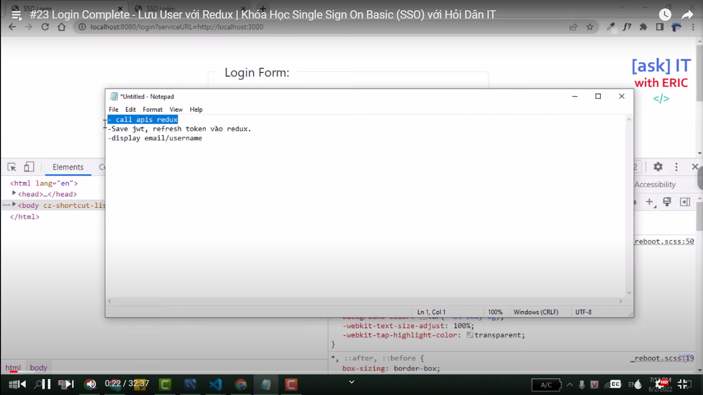

# Đây là Khóa Học SSO Basic - Single Sign On với Node.JS/React

Khóa học này là sự tiếp nối sau khi học xong khóa FullStack JWT, link ở học có đính kèm ở dưới

**Link to the course `JWT`**: [Link tutorial](https://bom.so/NAtUdS)

Trong khóa học SSO - Single Sign On này, chúng ta tập chung vào phía `Back-end` là nhiều nhất

SSO - Single Sign On, là hình thức đăng nhập tập trung được sử dụng rất phổ biến hiện nay. Các nội dung trọng tâm của khóa học có thể kể đến như:

- Hiểu rõ cách đăng nhập/đăng xuất người dùng với Node.JS, thông qua việc xác thực người dùng với Passport. Ở đây, việc sử dụng Passport giúp tối ưu hóa quá trình xử lý cũng như đảm bảo hơn về an toàn thông tin. Đồng thời, hỗ trợ đắc lực trong việc kiểm tra trạng thái người dùng thông qua "session" và "cookies".

- Thực hành sử dụng Passport với các Strategies: Local, Facebook và Google. Hiểu một cách đơn giản là học cách đăng nhập người dùng local, đăng nhập thông qua tài khoản Facebook, đăng nhập thông qua tài khoản Google.

- Triển khai mô hình SSO với React và Node.JS , ở đây React sẽ đóng vai trò là client, SSO chính là server Node.js phụ trách việc quản lý đăng nhập người dùng. Server SSO Node.JS sẽ chịu trách nhiệm chính khi người dùng đăng nhập/đăng xuất, đồng thời trao đổi với client React thông qua hình thức xác thực JWT - json web token.

> Mục tiêu của khóa học, đấy chính là mang đến một góc nhìn thực tế về mô hình triển khai quản lý người dùng trong thực tế. Hi vọng các bạn sẽ tìm thấy nhiều điều hữu ích từ khóa học, từ đấy chuẩn bị hành trang tốt nhất trên con đường trở thành một fullstack developer một cách toàn diện.

Đây là mô hinh SSO không tối ưu

Đây là mô hinh SSO tối ưu (Single Sign On là phải như thế này)

Mô hình SSO áp dụng trong dự án thực tế

> Ngoài mô hình `SSO` ra thì còn có mô hình `microservice` nữa. Mô hình đó cũng rất phổ biến, nó là dạng chia nhỏ các service ra. Nó không gom chung vào 1 cái, mà nó sẽ chia nhỏ ra. Bởi vậy mới có tên `micro` (micro: vi mô). Nó còn liên quan đến vấn đề scale ứng dụng nữa. Đó là liên quan đến vận hành hệ thống rồi. Kiến thức đó rất rộng và mênh mông.

- Tại sao chúng ta lại xây dựng mô hình SSO?

  - Về bản chất thì nếu chúng ta không có nhiều service không cùng đăng nhập 1 server thì SSO không cần sinh ra

  - Ví dụ: khi chúng ta đăng nhập tài khoản của mình vào youtube, thì sau đó khi vào gmail thì ta vẫn thấy tài khoản của chúng ta được đăng nhập sẵn luôn. Bởi vì chúng là 1 dịch vụ chung của Google

## Hướng Dẫn Cài Đặt Database MySQL Từ A Đến Z - Cấu Hình Hệ Cơ Sở Dữ Liệu Quan Hệ SQL

[Video guide download](https://bom.so/nMscPE)

[Link download](https://drive.google.com/file/d/1c2T2hjO5-Mt9UqBcjFadOJ5ifQTPFxiR/view)

## Import Database - Tạo Data Mẫu Cho Dự Án | Khóa Học Single Sign On Basic (SSO) với Hỏi Dân IT

[Video guide download](https://bom.so/Q7oABF)

[Create data](https://drive.google.com/file/d/1w5Q2uixk9O-pNQPjFXptO-Wvh-oxTXBV/view)

### Nên tìm hiểu về vấn đề này để hiểu những cách bảo mật hệ thống, cũng như là xác thực người dùng

> Những ảnh này thuộc chủ đề: StateFul vs Stateless và Authentication vs Authorization => Single Sign On Basic (SSO)

#### Các hình ảnh từ mỗi bài học

Chúng ta đang theo mô hình stateless

