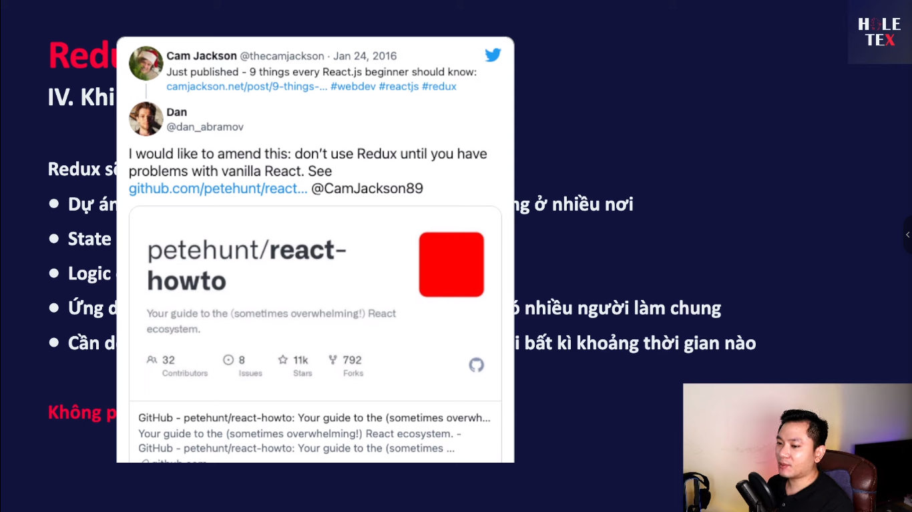

# Học REDUX (+Toolkit) trong 1 video (2022)

[Link Video](https://www.youtube.com/watch?v=g_K1w8e0lLo)

---

## Ảnh từ video

## Khái niệm chính

### 1. Redux hoạt động theo mô hình một chiều (one-way data flow)

- **State**: Lưu trữ lại các trạng thái, các điều kiện của ứng dụng tại một thời điểm nào đó.
- **View**: Hiển thị dữ liệu dựa trên state.
- **Ví dụ**: Khi người dùng thao tác với UI (nhấn nút), sẽ cập nhật giá trị trong state. Sau đó, UI sẽ re-render để hiển thị giá trị mới nhất từ state.

  

### 2. Mutable và Immutable

- **Mutable (bên trái)**: Có thể thay đổi thuộc tính bên trong object hoặc mảng sau khi khai báo.
- **Immutable (bên phải)**: Không thay đổi giá trị trong object gốc, mà phải clone (dùng spread operator) object hoặc mảng đó ra cái mới, rồi mới thực hiện thay đổi.

  

- **Khuyến nghị**: Trong React, nên sử dụng cách immutable vì an toàn hơn. Tránh sử dụng mutable để thay đổi giá trị trực tiếp.

### 3. Redux là một pattern

- Có nhiều ràng buộc mà chúng ta phải tuân theo để đạt được các lợi ích mà Redux mang lại.

### 4. Kiến trúc của Redux

## Tổng kết

- Redux giúp quản lý state của ứng dụng một cách hiệu quả và dễ dàng theo dõi các thay đổi của state.
- Sử dụng Redux Toolkit để đơn giản hóa các thiết lập và viết code Redux dễ dàng hơn.
- Redux DevTools hỗ trợ debug và theo dõi state của ứng dụng.

---
