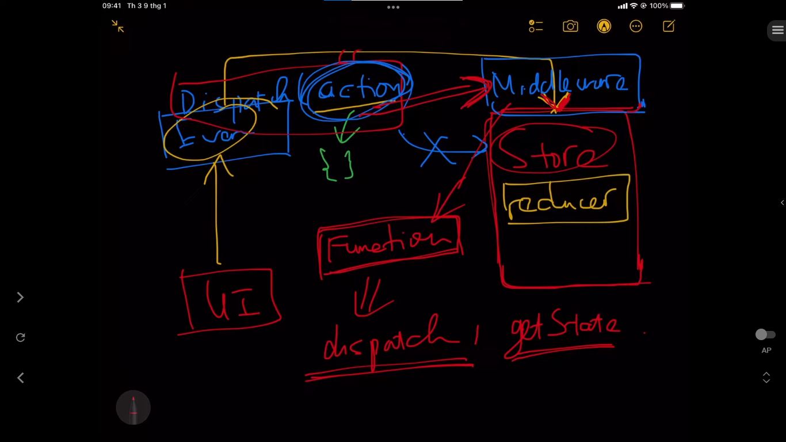

## Đây là source code của ứng dụng TODO APP bằng React + Redux

Video tutorial: https://youtu.be/g_K1w8e0lLo
Live Demo: https://focused-engelbart-3d0ac1.netlify.app/

---

## Redux Thunk - Middleware trong Redux Toolkit (2022)

Ở video trước chúng ta đã học về Redux. Và chúng ta có 1 ràng buộc là ở trong Store chúng ta không được có bất kì đoạn code bất đồng bộ hoặc bất kì side-effect nào. Bất kì các tác vụ bất đồng bộ nào thì đều phải thực hiện phía bên ngoài của store.

Tuy nhiên, trong thực tế thì đôi khi các ứng dụng sẽ cần thực hiện các tác vụ side-effect trước khi cập nhật state trong Store chung. Vậy thì có một câu hỏi đặt ra là. Chúng ta sẽ cần viết các đoạn logic side-effect này ở đâu trong khi không thể viết chúng ở trong các reducer?
⇒ Và đó là lúc mà Redux Middleware ra đời để cho phép chúng ta viết các đoạn code logic mà thực hiện các side effects này

## Hình ảnh này trong video học Middleware trong Redux Toolkit

Đây là flow thực hiện các tác vụ trong redux

Khi ở phía UI khi người dùng click 1 sự kiện nào đó (event) thì nó sẽ dispatch 1 action -> thì action này sẽ lên store -> khi được đi vào store thì trong store sẽ có các function (được gọi là reducer) -> trong store thì có reducer -> Khi action vào store rồi -> thì lúc này reducer sẽ xử lý các logic và trả và trả về state mới **Mọi người có thể xem luồng chạy của redux ở bên trong folder documents in video**

_Ghi chú:_

`action`: là 1 object (bao gồm type và payload) -> type thì bắt buộc mỗi action phải có -> còn payload thì có hoặc là không

---

Khi mà chúng ta muốn viết code bất đồng bộ (asynchronous) trong redux thì sẽ như nào. Thì lúc đó chúng ta sẽ cần middleware

Thì khi chúng ta sử dụng middleware -> thì mỗi khi chúng ta dispatch 1 cái action nào đó thì action đó sẽ vào middleware -> và trong middleware này nó sẽ xử lý các tác vụ bất đồng bộ -> rồi sau đó thằng middleware này nó sẽ dispatch 1 cái action thật sự

Các bạn có thể hiểu middleware chỉ là 1 cái function.

Thì cái redux middleware này nó cho phép mở rộng khả năng của store, và cho phép chúng ta làm 1 số công việc như là viết thêm các đoạn logic code khi có 1 cái action được dispatch.

Và đối với function này chúng ta sẽ có 2 tham số (dispatch, getState)

_Ghi chú:_

- `dispatch`: thằng này là của redux -> dùng để dispatch 1 cái action

- `getState`: khi mà thực thi cái function getState thì nó sẽ trả về dữ liệu hiện tại ở trong store. Cũng tương tự như cách chúng ta lấy state ở trong phần UI, cũng như là cách mà chúng ta dispatch 1 cái action ở trong UI

=> thì lúc này chúng ta sẽ làm các việc này ở trong phần `middleware function`

---

Thay vì chúng ta `dispatch(action)` -> thì bây giờ chúng ta sẽ không làm như vậy nữa.

Mà chúng ta sẽ `dispatch(thunkAction)` -> cái thunkAction hay còn được là thunk function -> trong cái thằng function này thì chúng ta sẽ `dispatch(action)`

=> thì đó là cái luồng dữ liệu nó được thực thi khi chúng ta áp dụng thằng thunk middleware vào trong redux của chúng ta

---

Và chúng ta sẽ dùng thằng redux thunk. Đây sẽ là thư viện mà chúng ta sẽ dụng trong code ở folder `redux-thunk`. Nó là 1 middleware rất phổ biến dùng để xử lý code bất đồng bộ

Thì trong `configuration` của `redux-toolkit` thì nó đã cấu hình tự động `redux-thunk` của chúng ta rồi. Nên chúng ta sẽ không cần cài bất kỳ thư viện nào khác nữa

Ngoài ra chúng ta còn nhiều middleware khác dùng để xử lý bất đồng bộ như là `redux-saga`,...
