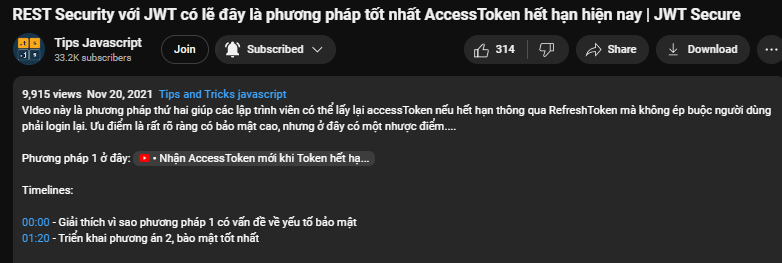

# REST Security với JWT có lẽ đây là phương pháp tốt nhất AccessToken hết hạn hiện nay | JWT Secure

> Trong video này mình có custom code lại 1 tí, nhưng code lõi code thì vẫn giống như video. Mình có thêm `console.log` vào cho code log ra cho dễ hiểu và viết lại code clean hơn

[Link part 2](https://s.net.vn/AGeA)

VIdeo này là phương pháp thứ hai giúp các lập trình viên có thể lấy lại accessToken nếu hết hạn thông qua RefreshToken mà không ép buộc người dùng phải login lại. Ưu điểm là rất rõ ràng có bảo mật cao, nhưng ở đây có một nhược điểm....

Phương pháp 1 ở đây: [Link part 1](https://s.net.vn/iaKC)



Timelines:

```bash
00:00 - Giải thích vì sao phương pháp 1 có vấn đề về yếu tố bảo mật
01:20 - Triển khai phương án 2, bào mật tốt nhất
```

```bash
#axios #jsonwebtoken #nodejs
```
