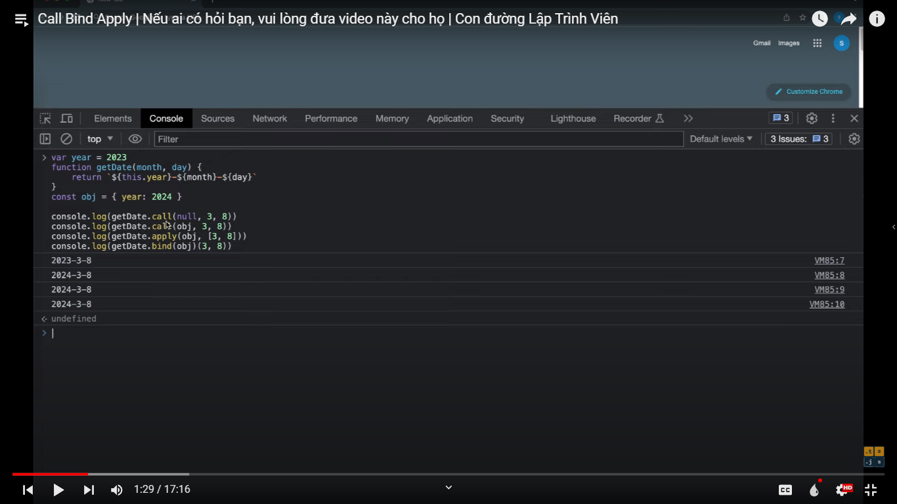
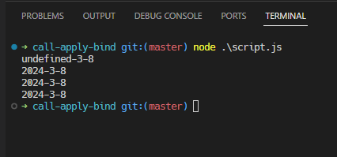

# Call Bind Apply | Nếu ai có hỏi bạn, vui lòng đưa video này cho họ | Con đường Lập Trình Viên

Call Bind Apply | Nếu ai có hỏi bạn, vui lòng đưa video này cho họ | Con đường Lập Trình Viên

[Link video](https://s.net.vn/8RCx)

That code in file script must run on browser, because on enviroment nodejs no have window, so it don't know

after run code:

this is the code run on enviroment nodejs:

