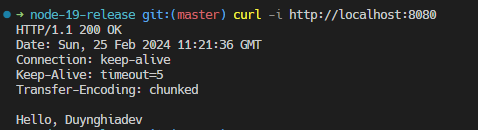

# Node.js 19 phát hành NÊN học tính nằng này không cần phải nhiều?| What's new in Node v19?

Node.js 19 Release: What’s New ?

The Node.js team recently announced the release of version 19. This has the following features:

1 - node --watch (experimental)

2 - KeepAlive by default

3 - Stable WebCrypto

4 - V8 engine updates

[Link video](https://www.youtube.com/watch?v=MBs9BmArgCc)
[Blog trên web AnonyStick](https://bom.so/LjjnYS)

## Command line to run code

Muốn chạy file nào thì chạy file đó

- Ví dụ chạy file `index.js`

```shell
node --watch index.js
```

- lần lượt chạy file `crypto`, `numberFormat`

```shell
node --watch crypto.js
```

```shell
node --watch numberFormat.js
```

**Chỉ có file `message.js` là chạy không được thôi**

- Khi chạy file `server.js` thì chạy lệnh

```shell
curl -i http://localhost:8080
```

nó sẽ ra kết quả như này



Trong đó ta có `Keep-Alive`, mà thuật đó đã có trong node version `18.1` rồi (hiện tại đang code node version `v18.16.0`)
