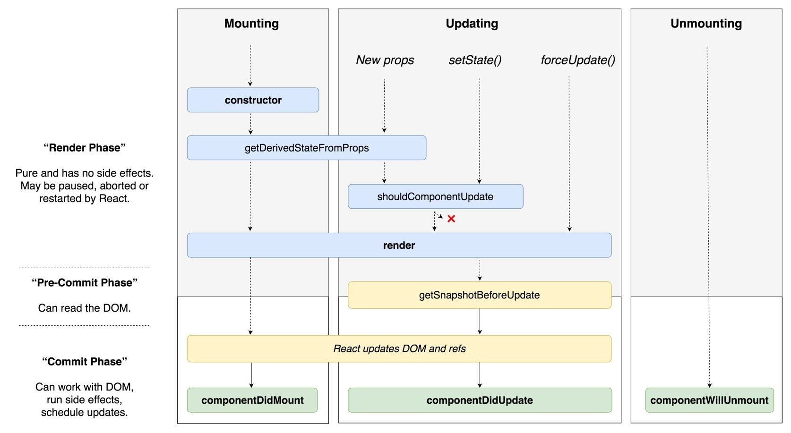

# Ghi chú của Trung Nguyễn Minh:

- Khóa ["Modern React with Redux" của Stephen Grider](https://www.udemy.com/react-redux/) tuy được đánh giá rất cao, nhưng nó có một vấn đề:
    - Chỉ 25% thời lượng dành cho React (01 app Youtube search)
    - Tận 75% thời lượng dành cho Redux (và React Router) (03 app còn lại)

- Dẫu Redux hiện tại cực kỳ phổ biến, rất nhiều người cứ nghĩ đến React là kết hợp luôn với Redux, nhưng bản thân [Dan Abramov - tác giả của Redux lại nói như sau](https://stackoverflow.com/questions/36634522/how-to-avoid-using-setprops-in-react/36636886#36636886):
    > It looks like you dived into using Redux without first getting a firm grip of React. I wouldn’t recommend doing this because you appear to be somewhat confused now.
    >
    > [Thinking in React](https://reactjs.org/docs/thinking-in-react.html) is a great guide and I recommend you to go through it first and get comfortable with the idea of state ownership in React, before using Redux.

- Do vậy, tốt hơn là nên luyện tập thêm React trước khi học đến Redux. Việc này tạm thời theo thứ tự sau:

    - **Giai đoạn 1**: Học *pure* React và 1 thư viện quan trọng là React Router

        - Học section 1 và section 2 khóa "**Modern React with Redux**" của Stephen Grider. Khóa này thực sự hay bởi tác giả rất biết cách giải thích, chia nhỏ vấn đề, lật đi lật lại để người học hiểu. Bản thân app "Youtube Video" của tác giả hướng dẫn cũng thú vị. 

        - Đọc hiểu và dịch phần [Quick Start](https://reactjs.org/docs/hello-world.html) trong tài liệu chính thức của ReactJS. Đây là phần rất cơ bản và được tổ chức có hệ thống, không thể bỏ qua.

        - Học khóa "[React for beginners](https://reactforbeginners.com/) của Wes Bos. Wes Bos nổi tiếng,  mình đã thấy được mời trình bày tại nhiều JS Conference ở châu Âu. Khóa học của Wes Bos cũng *chỉ tập trung* vào React, không hề đụng đến Redux. App trông rất ấn tượng, đủ để người dùng luyện tập với props và state. Ngoài ra còn những thứ hữu ích như:
            - React Router -> thư viện này rất quan trọng, vì nó đụng đến vấn đề chuyển giữa các trang theo kiểu hoàn toàn khác so với web tĩnh (vốn sử dụng thẻ `<a>`)
            - Deploy sản phẩm (liên quan đến authentication, Firebase, now.sh, v.v)
            - Sử dụng React Developper Tool. Tham khảo bài viết ở [đây](https://github.com/freeCodeCamp-Hanoi/learn-react-udemy/blob/master/posts/Trung-react-developper.md).

        - Tự làm 2 -3 "app" chỉ có MỘT và CHỈ MỘT trang bằng React. Một app dạng này có thể tham khảo là [Pabla](https://goshakkk.name/pabla/index.html)

        - Đọc[Hướng dẫn sử dụng create-react-app](https://github.com/facebook/create-react-app/blob/master/packages/react-scripts/template/README.md). Phát hiện ra cái này cực kỳ chi tiết, đội Facebook rất chăm chút cho nó, và viết hướng dẫn sử dụng không khác gì hướng dẫn làm app. Đây là 1 điểm khởi đầu rất tốt để phát triển ứng dụng App thay vì sử dụng ReactSimpleStarter của Stephen Grider.

        - Học theo [tutorial của chính React Router](https://github.com/reactjs/react-router-tutorial/tree/master/lessons/01-setting-up). Như đã nói ở trên, phần routing trong React rất mới, bắt buộc phải biết để làm những thứ tưởng chừng đơn giản, đó là nav bar.
        
        - Ngoài ra, có thể tham khảo các demo app thực hiện bởi Mr. Lê Quân ở [Facebook group "Pure React"](https://www.facebook.com/groups/purereact/)

    - **Giai đoạn 2**: Học Redux trong các section tiếp theo của "Modern React with Redux". 

- 01.04.2018: Styling rất quan trọng. Ko nắm vững CSS (CSS thuần hoặc các framework) thì viết component cũng bằng thừa, vì không biết cách căn chinh, tinh chỉnh các element như thế nào. Sau khi học được basic của basic của React, lại chuyển qua đọc và clone example của Bootstrap. 

## App tự làm:

- [:heavy_check_mark:] Kính vạn hoa bản đơn giản: Vẽ 01 siprograph dựa trên các thông số về màu nền, màu nét, và các thông số khác:
    - Link product: http://ngminhtrung.github.io/react-draw-spirograph/
    - Link Github repo: https://github.com/ngminhtrung/react-draw-spirograph
- [:heavy_check_mark:] Album sample clone từ 1 ví dụ "[Album](https://getbootstrap.com/docs/4.0/examples/album/)"của Bootstrap 4.0. Mục đích để test cách sử dụng React với Bootstrap 4.0, việc style cho component ra sao.
    - Link product: http://ngminhtrung.github.io/react-album-hanoi,
    - Link Github repo: https://github.com/ngminhtrung/react-album-hanoi
- [📊] Shopping cart - clone lại form của Thegioididong.com. Mục đích để tập làm 1 form thật, sử dụng các khái niệm cơ bản của ReactJS như props, state. Chỉ dùng CSS3 và flexbox.
    - Link product: https://ngminhtrung.github.io/react-form-shopping-cart
    - Link Github repo: https://github.com/ngminhtrung/react-form-shopping-cart
- Kế hoạch:
    - App chèn quote vào ảnh giống app Pabla nói trên
    - App giúp search, chọn, và copy vào clipboard Emjoi. List ở [đây](https://github.com/StylishThemes/GitHub-Dark/wiki/Emoji)
    - App sun calculator, tương tự như trang [này](suncalc.net/)
    - App visualize regular expression, tương tự như trang [này](https://jex.im/regulex/#!flags=&re=%5E(a%7Cb)*%3F%24)
    - Những module nhỏ như ở [đây](https://huynhsamha.github.io/create-react-app-config/):
    - Những app được nhắc đến trong khóa React Native của Techmaster. Xem ở [đây](https://techmaster.vn/khoa-hoc/25567/react-native):
        - Ứng dụng Shopping List, quản lý danh sách các mặt hàng cần mua, thêm bớt, xoá và lưu dữ liệu vào App
        - RSS Reader: App cập nhật và quản lý danh sách tin tức thời sự cập nhật.
        - Ứng dụng đặt xe(Car Booking App): có chức năng hiển thị bản đồ, tìm kiếm địa điểm, xe, ghim một vị trí trên bản đồ. Có hướng dẫn tạo các hiệu ứng Animations đẹp mắt.
    - Clone lại [app "Coffee House" của Lê Quân](https://github.com/quanla/pure-react-sample-coffee), nhưng cho chủ đề "thu rác thải điện tử":
        - Inspired by this [post](https://www.facebook.com/minhcuong/posts/10155720490979495)
        - Homepage: Tác hại của rác thải điện tử 
        - Người dùng có thể đăng nhập để lưu thông tin
        - Người dùng điền:
            - Thông tin cá nhân
            - Địa chỉ
            - Số lượng và loại rác thải
    - Một vài gợi ý tại [đây](https://daveceddia.com/pure-react/?utm_campaign=after-post):
        - Fake Github
        - Shopping cart 
        - Clone of Slack
        - Reddit 
        - Hacker News 
        - Pinterest
## Link hay

### Kỹ thuật
- [https://goshakkk.name/controlled-vs-uncontrolled-inputs-react/](https://goshakkk.name/controlled-vs-uncontrolled-inputs-react/): So sánh 2 kỹ thuật tạo form trong React.
- [Hướng dẫn sử dụng create-react-app](https://github.com/facebook/create-react-app/blob/master/packages/react-scripts/template/README.md): Cực kỳ chi tiết

### Kinh nghiệm chung
- [So you completed the official React tutorial. What's next?](https://goshakkk.name/next-steps-official-react-tutorial/): Một vài hướng đi sau khi làm xong tutorial (game X O) trên trang của React. 
- [Where do I get ideas for my learning projects?](https://goshakkk.name/learning-project-ideas/): Lấy ý tưởng để làm projec tự học ở đâu?
- [5 practical tips to finally learn React in 2018](https://goshakkk.name/tips-finally-learn-react/): 5 kinh nghiệm thực tế để học React năm 2018
- [You Might Not Need Redux](https://medium.com/@dan_abramov/you-might-not-need-redux-be46360cf367): Bài viết của Dan Abramov - tác giả Redux.

### Nguồn bài viết tiếng Việt
- [kipalog](https://kipalog.com/search?q=reactjs)
- [ehkoo](https://ehkoo.com/chu-de/react)
- [viblog.asia](https://viblo.asia/search?q=reactjs)

### Boilerplate

- [creat-react-app](https://github.com/facebook/create-react-app/): Boilerplate chính thức của Facebook cho ReactJS. Không biết có gọi là ngon bổ rẻ không. Thuần React, không có Redux. Config sẵn hết, chỉ việc khởi tạo, chạy, deploy lên Github Pages rất dễ (nhất là khi không có router).
- [ReactSimpleStarter](https://github.com/StephenGrider/ReduxSimpleStarter): Boilerplate của Stephen Grider cho khóa "Modern React with Redux". Chứa cả Redux lẫn React Router. Cái này sẽ dùng khi học khóa học kia. Còn có dùng tiếp không thì chắc cần cân nhắc. 
- [react-boilerplate](https://github.com/react-boilerplate/react-boilerplate): Không rõ của ai, chắc là một open-source project. Được quảng cáo là "*A highly scalable, offline-first foundation with the best developer experience and a focus on performance and best practices.*". Được Cường (Techmaster, Framgia) khuyên dùng. Trông thì hoành tráng và nhiều chức năng.

### Khóa học tham khảo khác
- [DevTips - React JS prototyping - Building a high-fidelity prototype](https://www.youtube.com/playlist?list=PLqGj3iMvMa4LFqyGab_aR7M0zfQm2KTuX): Khóa học này hay ở chỗ nào? Vì có từ "prototyping". Điều này giúp hình dung việc làm prototype cho sản phẩm thật nhanh bằng ReactJS thay vì sử dụng html với css tĩnh truyền thống. Có một vài đoạn cùng tư duy với 2 người làm video khá vui.

### Reading list 
- [ ] [React in Pattern - Krasimir Tsonev](https://krasimir.gitbooks.io/react-in-patterns/content/)

## Ghi chú chi tiết:

- [ReactJS - Form validation với một hoặc nhiều inputs](https://kipalog.com/posts/ReactJS---Form-validation-voi-mot-hoac-nhieu-inputs)
- [So sánh nhanh ReactJS form: controlled vs. uncontrolled](https://kipalog.com/posts/ReactJS---Uncontrolled-vs-controlled-forms)
- [Sử dụng React Developper Tool để sờ nắn được state, props, method](https://github.com/freeCodeCamp-Hanoi/learn-react-udemy/blob/master/posts/Trung-react-developper.md)
- [Style trong React như thế nào](https://github.com/freeCodeCamp-Hanoi/learn-react-udemy/blob/master/posts/Trung-style-in-react.md)
- [Hoàng Đức Quân - Cài đạt môi trường ReactJS trên Codepen](https://viblo.asia/p/tao-1-ung-dung-doc-api-voi-react-va-axios-RQqKLzo4l7z#-cai-dat-moi-truong-3)
- [Simple ReactJS template trên Codepen](https://codepen.io/ngminhtrung/pen/erYmPd)

## Danh sách câu hỏi:

1. Làm sao truyền props vào component để thay đổi style của component đó?
2. Trong hướng dẫn sử dụng "create-reat-app" có mục "ejecting". Vậy "ejecting" là gì?
3. Có thể truyền props để đổi class của component được hay không?

## Component Lifecycle Methods

