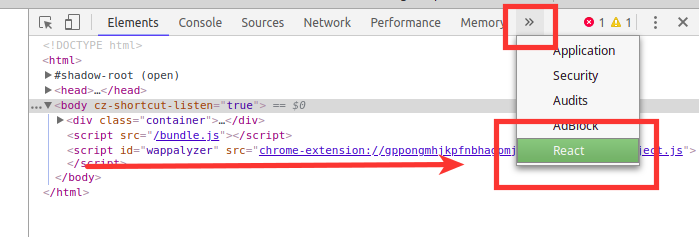
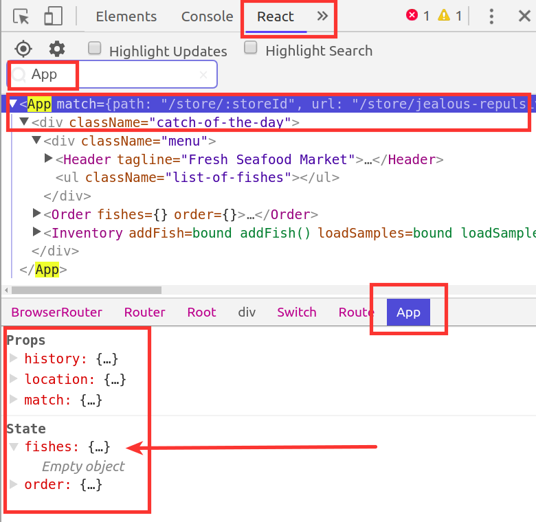
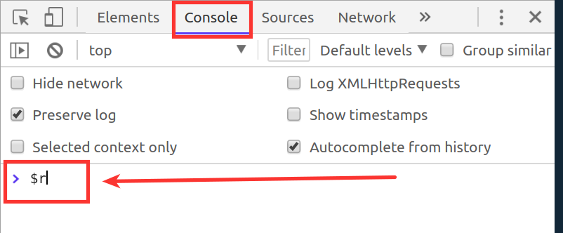
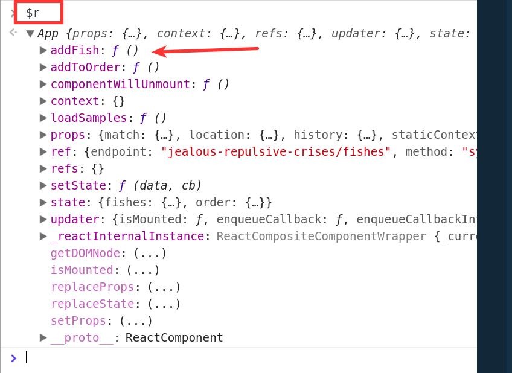
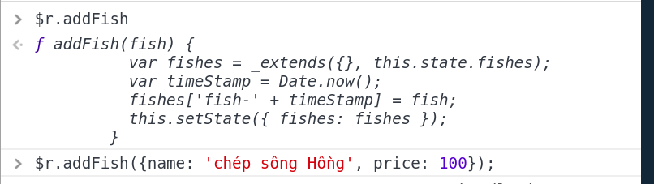
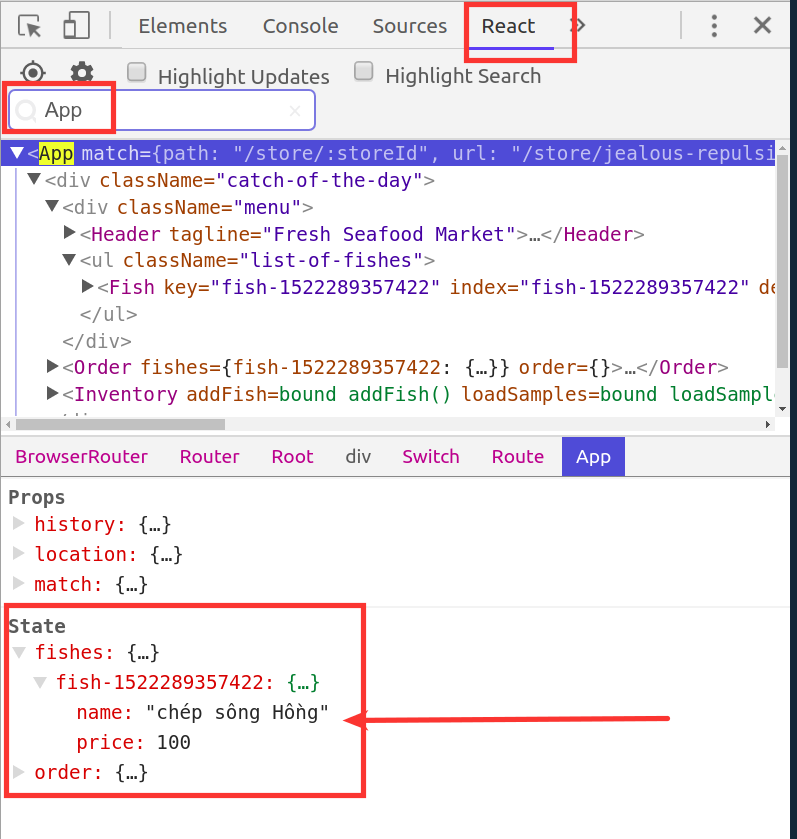
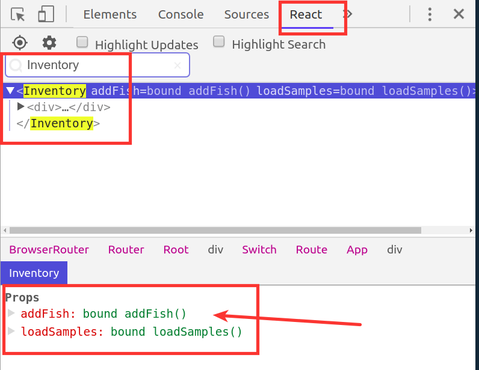
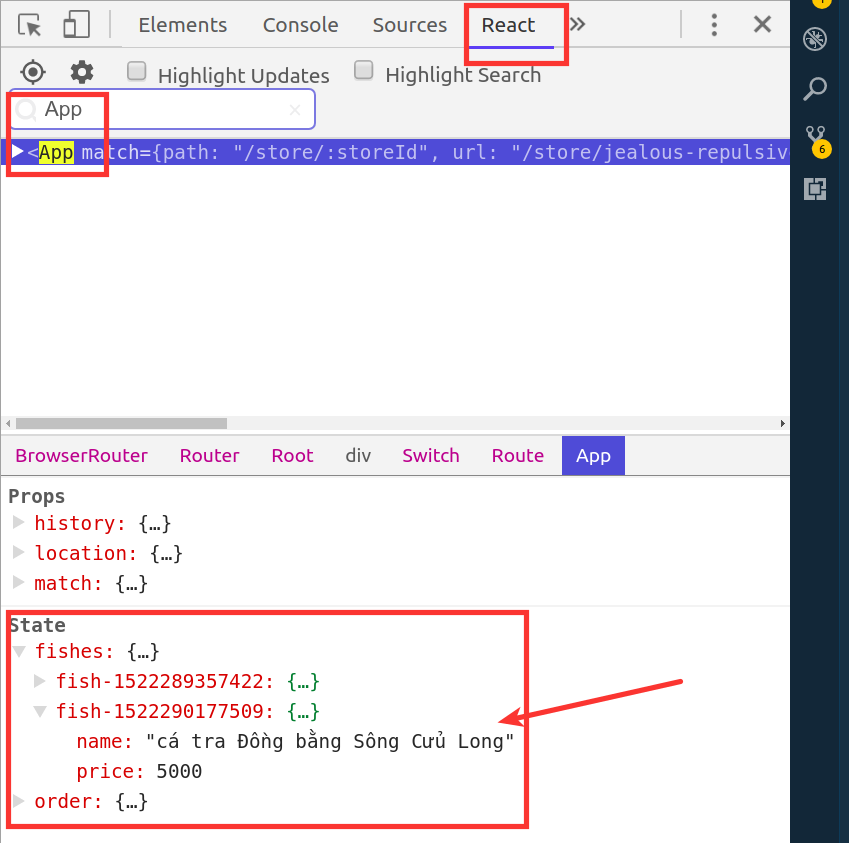

Với người mới học Reactjs, việc dữ liệu được truyền từ component con đến component cha thông qua hàm callback truyền từ cha xuống con tương đối khó nắm bắt. Để có thể tạo cảm giác "sờ nắm được" React và luồng dữ liệu truyền qua lại, người mới có thể sử dụng 1 Chrome Extension tên là React Developer Tool. Link ở [đây](https://chrome.google.com/webstore/detail/react-developer-tools/fmkadmapgofadopljbjfkapdkoienihi?hl=en). 

Công cụ này do Facebook phát triển, có gần 1 triệu users, và gần 1000 lượt đánh giá. Sau khi cài vào thì nó sẽ thêm 1 mục tên là **React** bên trong **Chrome Developer Tool**.

Phần dưới đây sẽ trình bày cách công cụ này có thể giúp người mới học hình dung và test bài toán truyền callback từ cha xuống con theo từng cấp. 

## Code flow

Giả sử ta có 3 components quan hệ với nhau là:
```js
App
|
|----Inventory
        |
        |---AddFishForm
````

Component `AddFishForm` có chứa 1 form. Người dùng nhập thông tin về 1 con CÁ nào đó (bao gồm tên và giá), khi click submit thì thông tin về con CÁ ở component này sẽ phải được cập nhật ở state của component `App`. Sau đó `App` đem state đi làm việc gì, render lại component nào thì là việc khác. 

Nếu chưa biết code như thế nào thì xem bài "[Lifting State Up](https://reactjs.org/docs/lifting-state-up.html)" trên trang của ReactJs. Đại loại code flow sẽ là:

- Bước 1: 
    - Khai báo hàm `addFish()` là 1 method trong component `App` (viết dạng "class" chứ không phải dạng "function"). Lưu ý `addFish()` cần được "bind" với "this" ứng với `App`. 
    - Hàm `addFish()` này nhận tham số truyền vào là 1 object `fish`, sau đó cập nhật object `fish` đó vào `fishes` của state thông qua `setState()`.

- Bước 2: Vẫn bên trong component `App`, truyền hàm `addFish()` dưới dạng props cho component `Inventory`. 

- Bước 3: Bên trong component `Inventory`, truyền hàm `addFish()` cũng dưới dạng props cho component `AddFishForm`.

- Bước 4: Bên trong component `AddFishForm`, sử dụng hàm `addFish()` mà nó nhận được từ `Inventory` qua props, truyền cho hàm đấy thông tin về cá (tên + giá) vừa nhận được từ form. Hàm `addFish()` sẽ được gọi với tham số đầu vào của cá ở component `AddFishForm`, nhưng lại thực hiện mọi thứ cứ như nó đang ở trong `App` nhờ vào "this" đã nói ở bước 1. 

## Test flow

Ta sẽ test từng bước nói trên thông qua Chrome Developer Tool và React Developer Tool. 

### Test hàm ở level component `App`:

- Chạy app (`npm start`), mở Chrome phần Developer Tool, kéo đến phần React, gõ vào ô Search từ "App", nó sẽ ra đầy đủ cả phần DOM lẫn Props và State của App. Để ý hiện tại `fishes` của State vẫn đang rỗng. 





- Giữ nguyên như vậy, chuyển sang tab Console. Ở đây, ta có thể gọi `App` thông qua `$r` (đây là mặc định của React Developer Tool). `$r` này đại diện cho component đang được chọn ở bên tab React. Bên tab React mà chọn component khác, thì giá trị của `$r` cũng khác theo. 



- Gõ `$r` rồi Enter, ta sẽ thấy hiện ra thông tin về `App` với các properties và method mà nó có. Hàm `addFish()` xuất hiện ở đây, vậy là hàm này đã được thêm thành công vào `App`. 



- Gõ tiếp:
```js
$r.addFish({name: "Cá chép sông Hồng", price: 100})
``` 


để xem hàm có chạy hay không. Ở tab Console thì không có hiện kết quả, phải quay ngược về tab React, kiểm tra State, fishes. Nhìn hình dưới đây thấy mọi thứ OK rồi. Vậy là ta đã đảm bảo hàm này hoạt động chuẩn ở phạm vi của `App`. 



### Test hàm ở level component `Inventory`:

Làm tương tự như bước trên, vào tab React, gõ vào ô Search chữ "Inventory", ta sẽ có thông tin về component này, kèm theo Props và State của nó (trường hợp này component Inventory không có State). Như hình bên dưới, ta thấy hàm `addFish()` đã được truyền vào props của component Inventory. 



Cái này rất quan trọng, để người học hiểu là muốn gọi `addFish()` ở Inventory, phải gọi thông qua props. 

Quay lại về tab Console, lại sử dụng `$r`, nhưng lưu ý lúc này ký tự đấy lại đại diện cho component `Inventory`. Muốn test hàm `addFish()` ở Inventory, lưu ý phải gọi `$r.props.addFish()` (vì lý do vừa giải thích ở trên), chứ gọi `$r.addFish()` là sai.

```js
$r.props.addFish({name: 'cá tra Đồng bằng Sông Cửu Long', price: 5000});
```

Giờ lại quay về React, tìm đến component `App` (bằng việc gõ App vào ô Search), ta thấy con cá vừa rồi đã được thêm thành công vào fishes trong state của App.



Vậy là OK đến bước này. Hàm `addFish()` đã hoạt động ngon ở phạm vi của `Inventory`. 

### Test hàm ở level component `AddFishForm`

Cái này lại lặp lại giống hệt bước trên, không cần viết lại nữa. 

## Kết luận

Tạm thời sử dụng React Developer Tool rất có lợi cho người mới học React, vì cảm giác sờ nắm được từng object, từng state, props, method, test và đảm bảo mọi thứ chạy dần dần thay vì bị rối tung lên khi dữ liệu truyền qua vài cấp như ma thuật, lúc lỗi không hiểu cần kiểm tra ở đâu. 

Ngoài tool này ra còn thằng nào khác giúp việc học React dễ dàng hơn? Có thấy bài "[10 React Developer Tools You Might Have Missed](https://medium.com/@jondot/10-react-developer-tools-you-might-have-missed-6c7575cc27eb)" nhưng đọc lướt chưa kịp thử cái gì. Bà con cô bác đi qua ai có gì hay làm ơn góp ý. Xin cảm ơn.

PS: Ví dụ trên lấy từ course [React for beginners của Wes Bos](https://reactforbeginners.com/).
