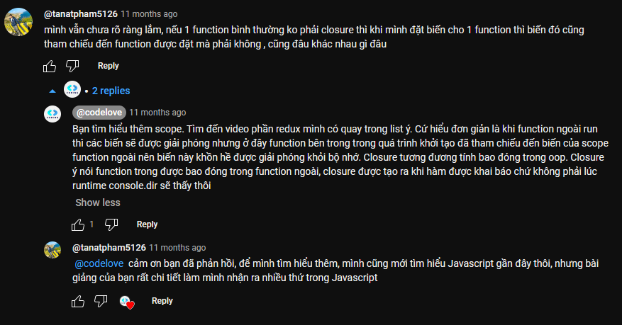
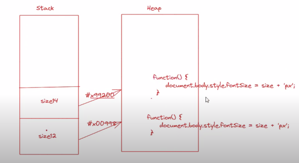

## Đây là bài học: Closures JavaScript #4 - Luyện Tập

- Mỗi lần chạy thì nó sẽ tạo ra 3 instance khác nhau. 
- Dẫn đến 3 biến đó đều được lưu vào trong bộ nhớ ở 3 địa chỉ khác nhau.
- Cho nên các tham số truyền vào 3 hàm đó không liên quan đến nhau => do nó lưu tại 3 địa chỉ khác nhau