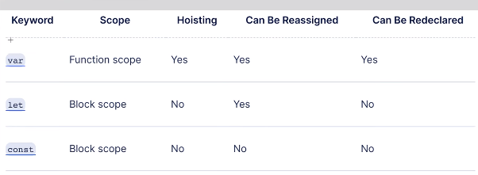
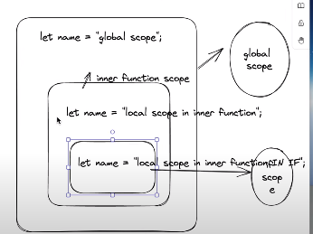

- Khai báo biến với từ khóa var (trước khi có es6)
- Với từ khóa var biến có thể được khai báo lại trong cùng 1 scope
- Khi nói đến từ khóa var thì các bạn nghĩ ngay đến function scope (gồm if else, while, do while, for,...)

- Khai báo với từ khóa let, const (2 biến này thuộc es6)
  - Với từ khóa let, biến này không thể được khai báo lại trong cùng 1 scope
  - Khi nói đến từ khóa let thì các bạn nghĩ ngay đến block scope (bao gồm tất cả những gì ở trong cái `{}`)

