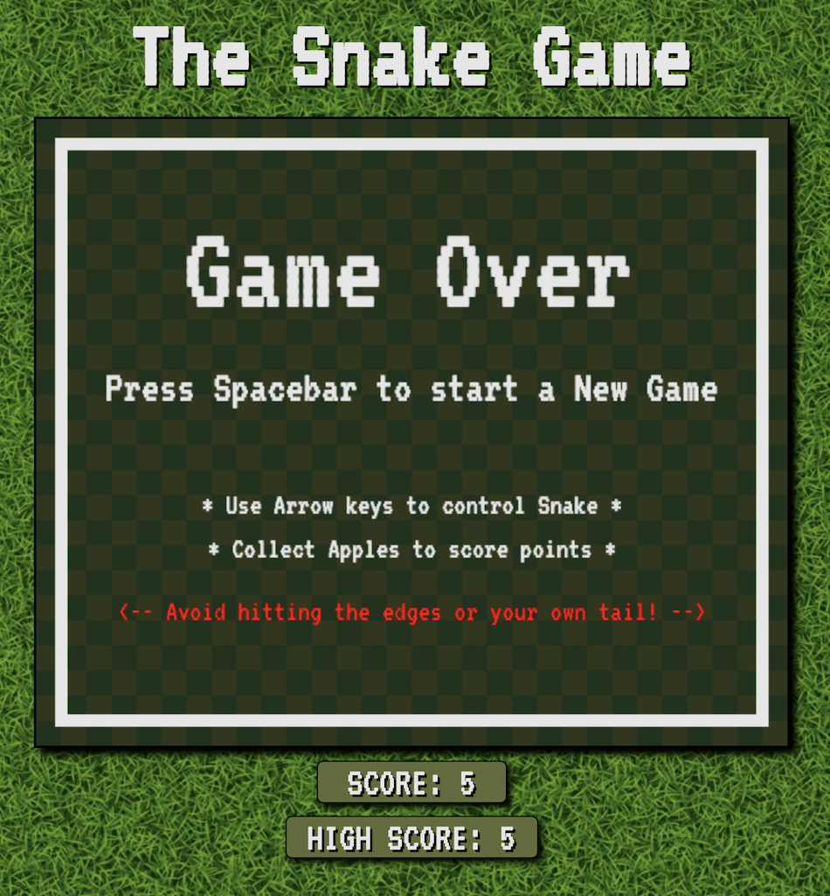

Source code: https://github.com/BryanGK/snake_game

# The Snake Game

### A Snake Game created with HTML, CSS, Javascript.

### See it [here](https://bryangk.github.io/snake_game/)

## Summary

A Javascript and HTML Canvas game, using object-oriented programming priciples and game logic. Chase the apples aronud the game board while the snake gets bigger. The app will also save your last games score and high score in local storage. Have fun with my game and DM your high score!

## Author

Bryan Krauss - Full Stack Software Developer - [LinkedIn](https://www.linkedin.com/in/bryan-krauss-556b3a200/) | [Portfolio Website](https://bryankrauss.ca)
