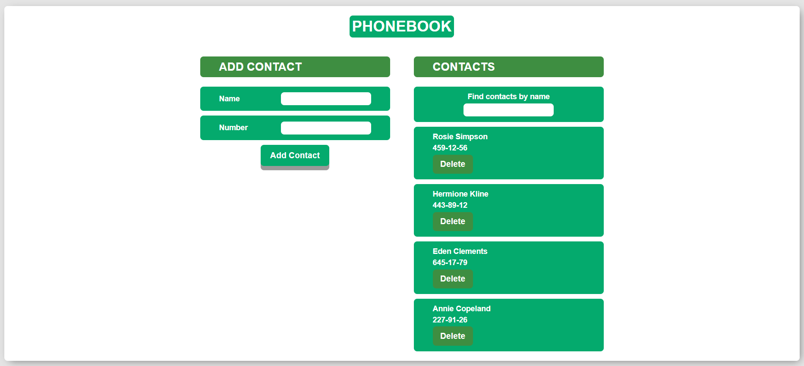
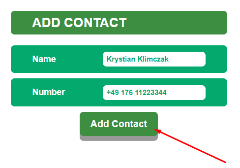
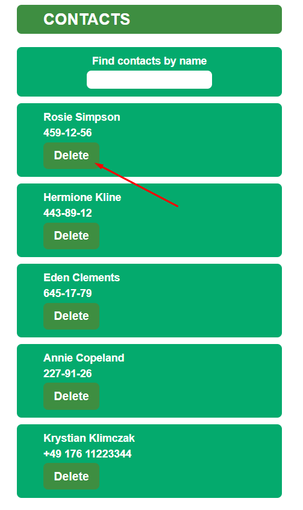

**Przeczytaj w innym języku: [english](README.md).**

# PhonebookApp

Prosta aplikacja pozwalający użytkownikowi dodać kontakty do listy. Wprowadź
nazwę użytkownika oraz jego numer. App doda wprowadzony kontakt do twojej listy.
Utworzone z React.js, HTML, CSS, JS, i odrobiną pasji...

---

## Demo

Sprawdź jak działa: (
https://krystianklimczak.github.io/goit-react-hw-07-phonebook/ )

---

## Site

### Strona główna

### Po prostu kliknij aby dodać nowy kontakt

### Zawsze możesz usunąć kontakt ze swojej listy

---

## Użyte tecnnologie

- HTML
- CSS
- JavaScript
- React.js

---

## Instalacje

Zklonuj to repozytorium na swój komputer i użyj komendy `npm install` aby
zainstalować wszystkie zależności projektu.

---

## Użycie

Po zklonowaniu repozytorium na swój komputer, przejdz do głównego folderu
projektu i użyj komendy `npm install` aby zainstalować zależności.

Kiedy zależności są zainstalowane, możesz użyć komendy `npm start` aby uruchomić
aplikację. Będziesz miał wtedy dostęp do aplikacji pod adresem localhost:3000

---

## Daj mi znać co powinienem zmienić, lub co Ci się spodobało

- https://www.linkedin.com/in/klima96/
