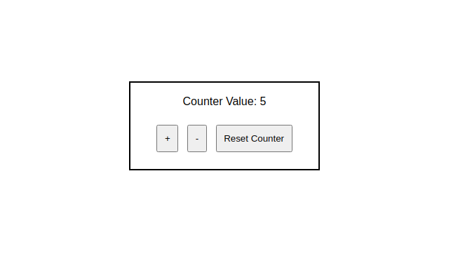

Link github: https://github.com/developer-junaid/Redux-Tutorial

## React Redux Tutorial

#### Redux is an open-source JavaScript library for managing application state. It is most commonly used with libraries such as React or Angular for building user interfaces.

### Explained with a "Simple" _Counter_ Example using ReactJs and React Redux

