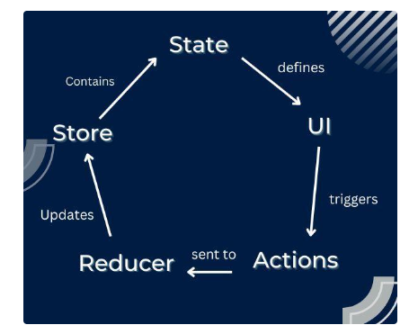
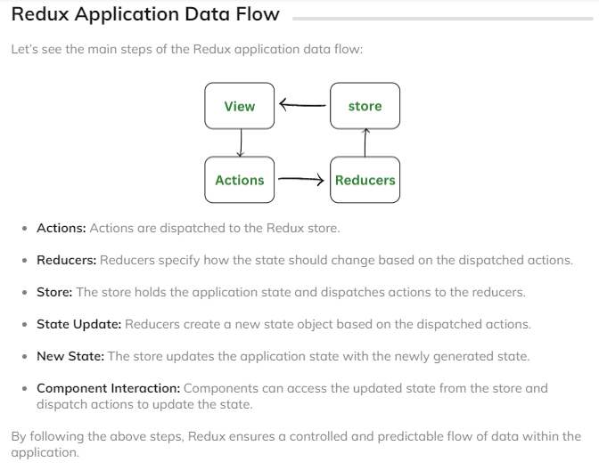

Link Tutorial: [Redux Ultimate - Redux Siêu Dễ Cho Beginners Từ Z đến A](https://bom.so/5CZgxk)

---

> Các nội dung trọng tâm trong khóa học này:

- Cài đặt Redux cho ứng dụng React.JS
- Cài đặt các middleware cần thiết cho Redux, có thể kể đến như là Redux Thunk, Redux Saga.
- Hiểu cách hoạt động và luồng dữ liệu trong Redux, có thể kể đến như các functions mapStateToProps, mapDispatchToProps (React Class) và các hook useDispatch, useSelector (React Hook)
- Hiểu cách hoạt động và sử dụng Redux hiện đại với Redux Toolkit

Redux - một thư viện của Javascript, được sử dụng rộng rãi trong cộng đồng Javascript, đặc biệt với React và Angular. Với Redux, chúng ta có thể chia sẻ dữ liệu trong ứng dụng javascript một cách dễ dàng và linh hoạt.

Nếu bạn là người mới bắt đầu, muốn học, hiểu, và làm chủ hoàn toàn Redux, thì đây chính là khóa học các bạn tìm kiếm. Trong khóa học này, chúng ta sẽ tìm hiểu từ đầu về Redux, và học cách sử dụng nó trong ứng dụng React.

Khi kết thúc khóa học này, các bạn mới bắt đầu sẽ hiểu được data Flow của Redux. Điều quan trọng ở đây chính là việc chúng ta luyện cách tư duy, hiểu cách thư viện Redux nó hoạt động.

Làm được điều này, thì cho dù chúng ta vào công ty nào, sử dụng công nghệ gì (Redux thuần, Redux Tookit, Redux với Class component, Redux với Hook) thì chúng ta đều tự tin và có thể làm chủ được công nghệ.

Hi vọng các bạn sẽ học được nhiều điều hữu ích từ khóa học này, phục vụ đắc lực cho việc trở thành một FrontEnd Developer một cách toàn diện.

---

# Khóa Học "All in One - Gánh Team Tất Cả Version của Redux (Redux & Redux Toolkit) Kết Hợp React.JS"

## Các Nội Dung Trọng Tâm

- Cài đặt Redux cho ứng dụng React.JS
- Cài đặt các middleware cần thiết cho Redux, như Redux Thunk và Redux Saga.
- Hiểu cách hoạt động và luồng dữ liệu trong Redux, bao gồm functions `mapStateToProps`, `mapDispatchToProps` (React Class), và hook `useDispatch`, `useSelector` (React Hook).
- Hiểu cách hoạt động và sử dụng Redux hiện đại với Redux Toolkit.

## Giới Thiệu Redux

Redux, một thư viện JavaScript, được rộng rãi sử dụng trong cộng đồng JavaScript, đặc biệt với React và Angular. Với Redux, chúng ta có khả năng chia sẻ dữ liệu trong ứng dụng JavaScript một cách dễ dàng và linh hoạt.

## Mục Tiêu Khóa Học

Nếu bạn là người mới bắt đầu, muốn học, hiểu, và làm chủ hoàn toàn Redux, thì đây chính là khóa học bạn đang tìm kiếm. Trong khóa học này, chúng ta sẽ tìm hiểu từ đầu về Redux và học cách sử dụng nó trong ứng dụng React.

Khi kết thúc khóa học này, các bạn mới bắt đầu sẽ hiểu được data flow của Redux. Điều quan trọng ở đây là việc luyện cách tư duy, hiểu cách thư viện Redux hoạt động.

Làm được điều này, thì cho dù chúng ta vào công ty nào, sử dụng công nghệ gì (Redux thuần, Redux Toolkit, Redux với Class component, Redux với Hook), thì chúng ta đều tự tin và có thể làm chủ được công nghệ.

Hi vọng các bạn sẽ học được nhiều điều hữu ích từ khóa học này, phục vụ đắc lực cho việc trở thành một FrontEnd Developer một cách toàn diện.

---

Reference:

- [React Js - Redux: Basic Concepts and Data Flow](https://www.codingninjas.com/studio/library/redux-basic-concepts-and-data-flow)

- [Concepts of Redux](https://www.codingninjas.com/studio/library/concepts-of-redux)

- [Redux Fundamentals, Part 2: Concepts and Data Flow](https://redux.js.org/tutorials/fundamentals/part-2-concepts-data-flow)
