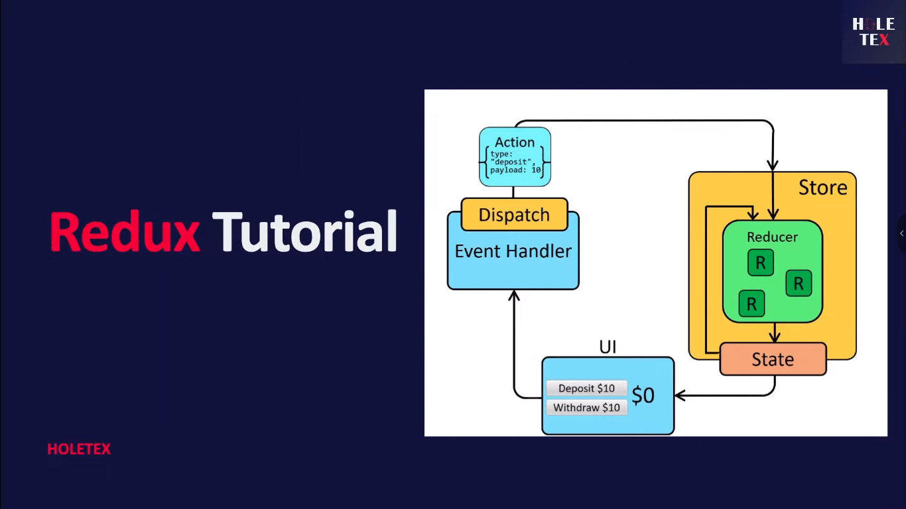
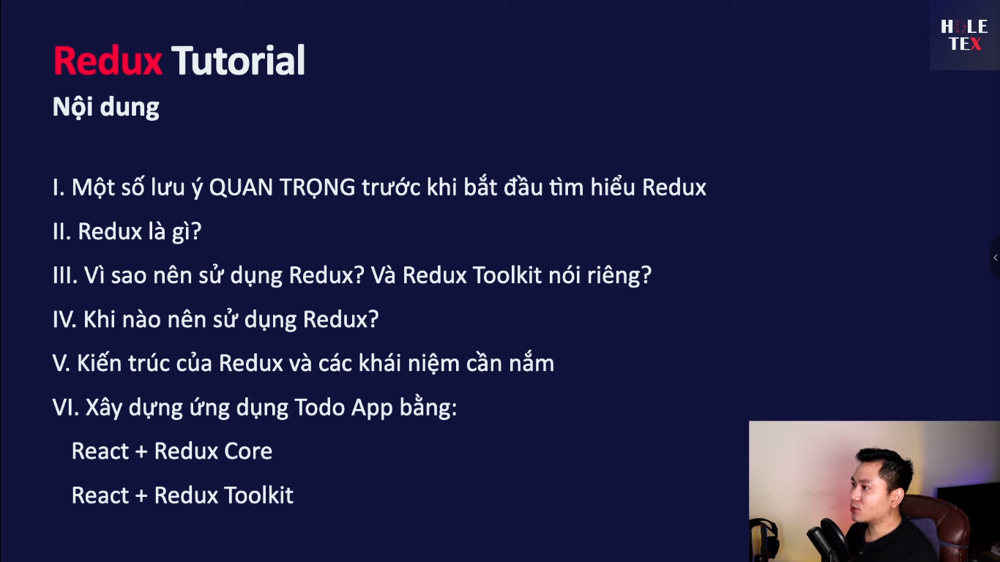
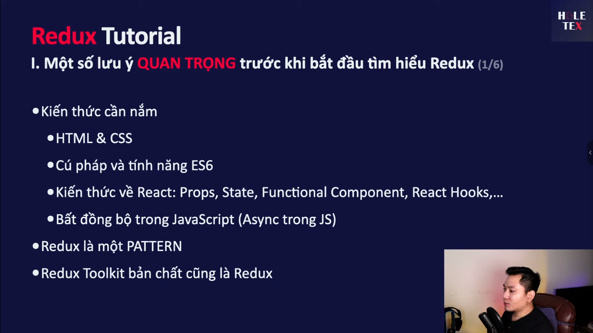
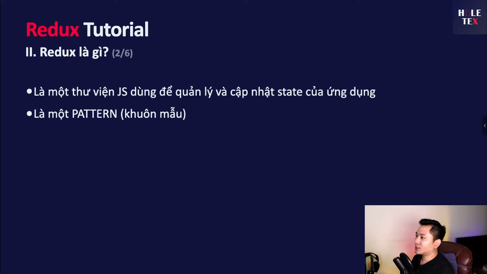
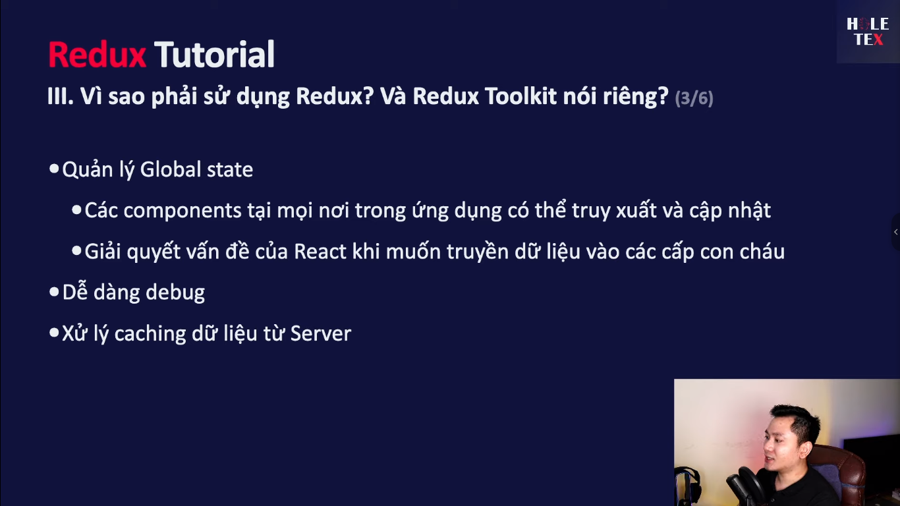
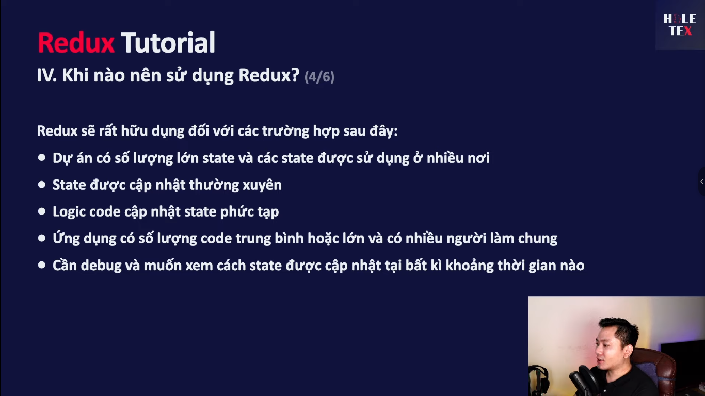
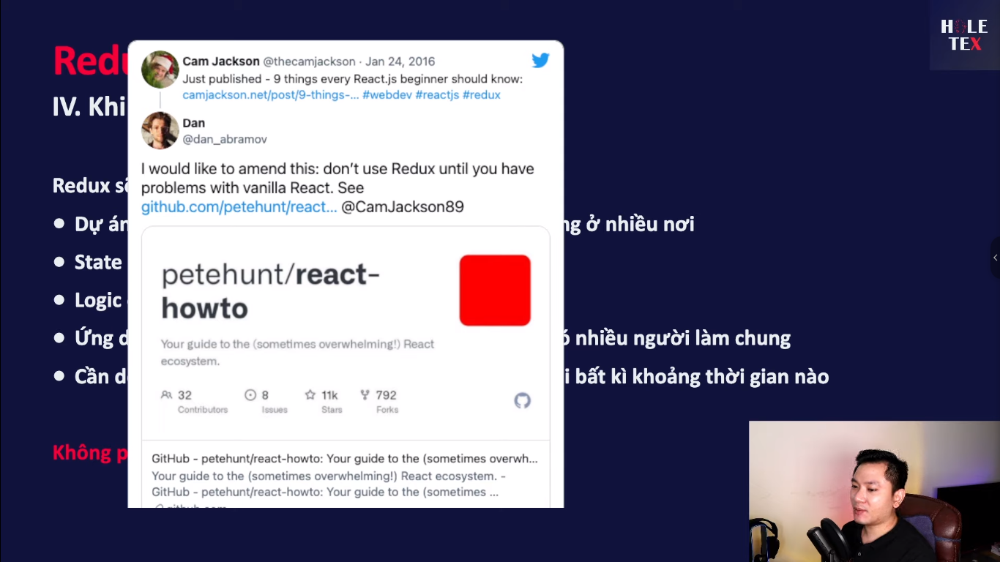
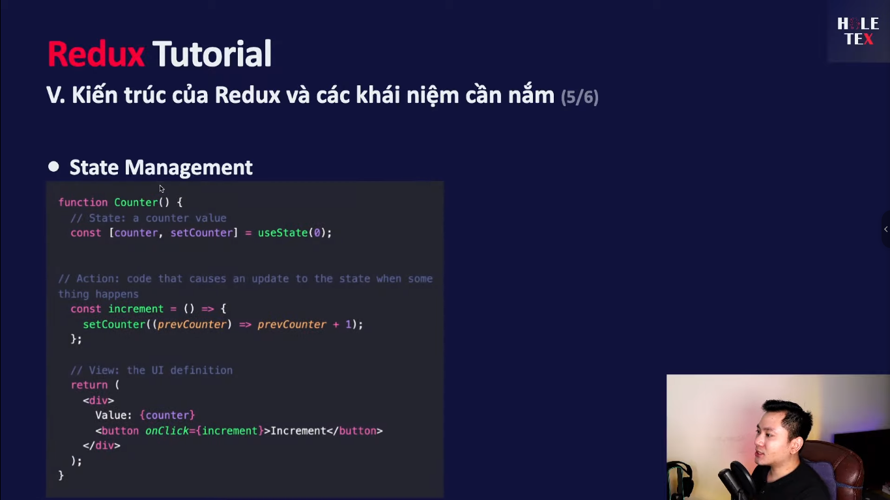

# Học REDUX (+Toolkit) trong 1 video (2022)

[Link Video](https://www.youtube.com/watch?v=g_K1w8e0lLo)

---

## Ảnh từ video












## Khái niệm chính

### 1. Redux hoạt động theo mô hình một chiều (one-way data flow)

- **State**: Lưu trữ lại các trạng thái, các điều kiện của ứng dụng tại một thời điểm nào đó.
- **View**: Hiển thị dữ liệu dựa trên state.
- **Ví dụ**: Khi người dùng thao tác với UI (nhấn nút), sẽ cập nhật giá trị trong state. Sau đó, UI sẽ re-render để hiển thị giá trị mới nhất từ state.

  

### 2. Mutable và Immutable

- **Mutable (bên trái)**: Có thể thay đổi thuộc tính bên trong object hoặc mảng sau khi khai báo.
- **Immutable (bên phải)**: Không thay đổi giá trị trong object gốc, mà phải clone (dùng spread operator) object hoặc mảng đó ra cái mới, rồi mới thực hiện thay đổi.

  

- **Khuyến nghị**: Trong React, nên sử dụng cách immutable vì an toàn hơn. Tránh sử dụng mutable để thay đổi giá trị trực tiếp.

### 3. Redux là một pattern

- Có nhiều ràng buộc mà chúng ta phải tuân theo để đạt được các lợi ích mà Redux mang lại.

### 4. Kiến trúc của Redux


## Tổng kết

- Redux giúp quản lý state của ứng dụng một cách hiệu quả và dễ dàng theo dõi các thay đổi của state.
- Sử dụng Redux Toolkit để đơn giản hóa các thiết lập và viết code Redux dễ dàng hơn.
- Redux DevTools hỗ trợ debug và theo dõi state của ứng dụng.

---

## Kiến trúc Redux và các kiến thức cần nắm

### 1. Reducers

- Reducer là một hàm cơ bản nhận vào hai tham số: `state` và `action`.
- Hàm này dùng để cập nhật lại `state` trong kho (store) chung.
- `state` cần có một giá trị khởi tạo.
- `action` bao gồm `type` và `payload`. `type` là bắt buộc, còn `payload` là dữ liệu người dùng nhập vào (có hoặc không đều được).
- Trong reducer, nó sẽ kiểm tra `action` để xác định `state` cần thay đổi theo hành động gì và thực hiện các đoạn code tương ứng.

**Các quy ước quan trọng:**

1. `state` mới luôn được tính toán dựa trên giá trị của `state` trước đó.
2. Khi tính toán `state`, phải dùng immutable để tạo ra một bản copy (clone) của `state` trước khi cập nhật. **Lưu ý: Không được thay đổi trực tiếp giá trị trong `state` này.**
3. Trong reducer, không được thực hiện các hành động bất đồng bộ hoặc các hàm tạo giá trị ngẫu nhiên như `Math.random()` hay `Date.now()`. Những hành động này làm `state` trở nên không dự đoán được và phá vỡ quy tắc của Redux.

Các hàm tuân thủ các quy tắc trên được gọi là Pure Function.

**Ví dụ:**

```js
const initValue = {
  value: 0,
};

const rootReducer = (state = initValue, action) => {
  switch (action.type) {
    case "INCREMENT":
      return {
        ...state,
        value: state.value + 1,
      };
    default:
      return state;
  }
};
```

Bạn có thể sử dụng extension Redux DevTools trên Chrome để xem cách Redux hoạt động. Có một khái niệm cần tìm hiểu thêm là `time-travel debugging`.

2. Action:

- action là 1 cái object do chúng ta quy định
- Theo redux thì trong action nó có 2 field đó là: type, payload

```js
const INCREMENT = {
  type: "todoList/increment",
  payload: 10,
};
```

### 2.1 Action Creators

Action creator là một hàm dùng để tạo ra các action. Khác với việc khai báo action trực tiếp, action creator giúp chúng ta tạo ra action một cách dễ dàng và tái sử dụng. Khi dùng action creator, chỉ cần gọi hàm đó và truyền vào payload, nó sẽ trả về một object chứa `type` và `payload`.

**Ví dụ:**

```js
const incrementCreator = (data) => {
  return {
    type: "todoList/increment",
    payload: data,
  };
};
incrementCreator(10);
```

## 3. Dispatch

`dispatch` là một hàm. Cách duy nhất để cập nhật `state` trong `store` là sử dụng `dispatch` một `action`: `dispatch(action)`. `dispatch` nhận vào một `action` và bắn đi hành động từ phía người dùng. Ví dụ, khi người dùng nhấn nút tăng, nó sẽ `dispatch` trạng thái với dữ liệu vào `store`. `store` sau đó sẽ nhận hai tham số (`state` trước đó và `action` cần thực hiện) và truyền vào reducer để xử lý.

```js
// Ví dụ sử dụng dispatch
dispatch(incrementCreator(10));
```
