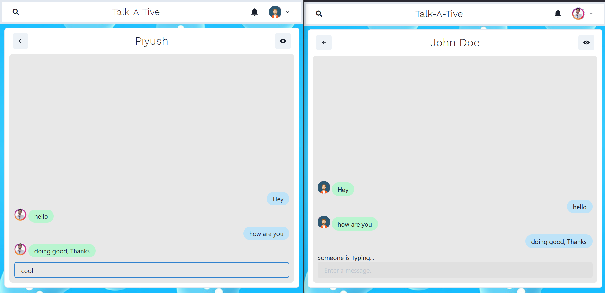

# Talk-A-Tive

- Talk-a-tive is a Full Stack Chatting App.
Uses Socket.io for real time communication and stores user details in encrypted format in Mongo DB Database.

## Tech Stack

**Client:** React JS

**Server:** Node JS, Express JS

**Database:** Mongo DB

## Demo

https://talk-a-tive.herokuapp.com/


## Run Locally

Clone the project

```bash
  git clone https://github.com/piyush-eon/mern-chat-app
```

Go to the project directory

```bash
  cd mern-chat-app
```

Install dependencies

```bash
  npm install
```

```bash
  cd frontend/
  npm install
```

Start the server

```bash
  npm run start
```

Start the Client

```bash
  //open now terminal
  cd frontend
  npm start
```

# Features

### Authenticaton


### Real Time Chatting with Typing indicators



### One to One chat


### Search Users


### Create Group Chats


### Notifications


### Add or Remove users from group


### View Other user Profile


## Coder

- [duynghiadev](https://github.com/duynghiadev)
- Trong project này mình có tạo Database sử dụng MongoDB.
   - Tên Database là MERN-CHAT-APP
   - 

## Made By

- [@Piyush-eon](https://github.com/piyush-eon)
  - [Youtube Tutorial](https://goeco.link/CjBZs)
