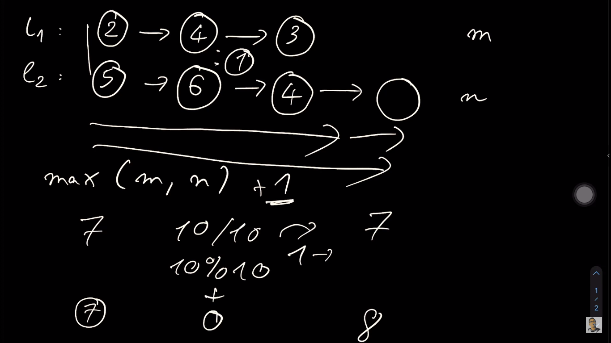
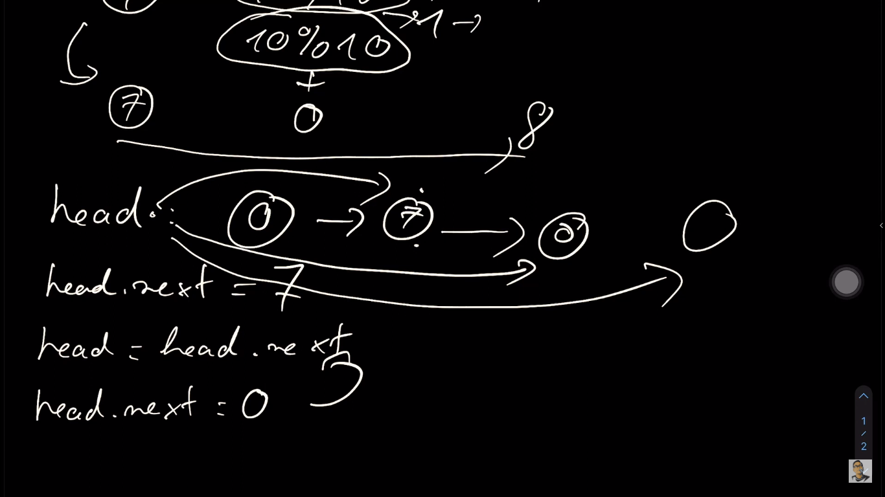
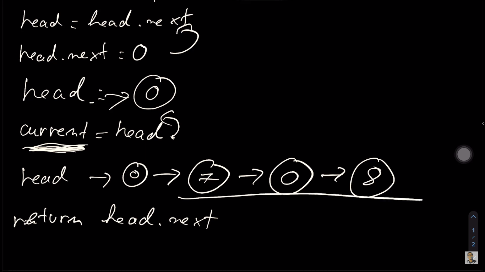
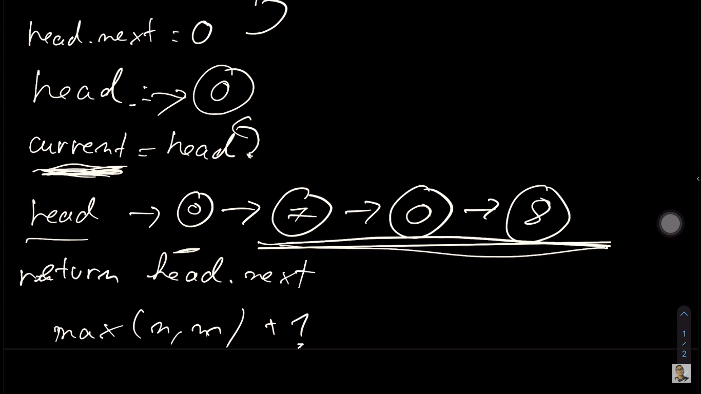

Hướng dẫn chi tiết bài `addTwoNumbers` trong leetcode

- chia kiểu này là lấy kết quả, không lấy dư

```bash
10/10 = 1, dư 0
```

- chia kiểu này là lấy số dư, không lấy kết quả

```bash
10%10 = 1, dư 0
```





- Time Complexity là `max(m,n) + 1` mà `+ 1` thì nó vô nghĩa. Nên chỉ còn `max(m,n)`
  
