## Trong khóa này có nhiều từ thuật ngữ tiếng anh. Các bạn có thể search google hoặc chat-GPT để tìm hiểu thêm nhé ✅✅✅

### 1. Javascript Execution Context và Lexical Environment Là Gì

- Biên dịch code

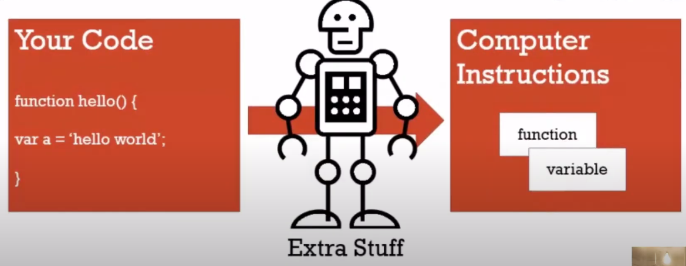

- Global Execution Context

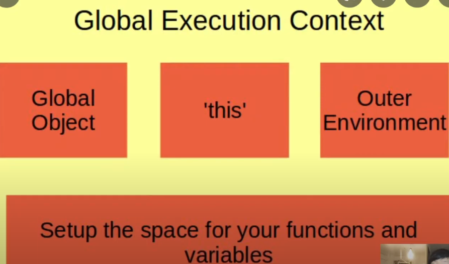
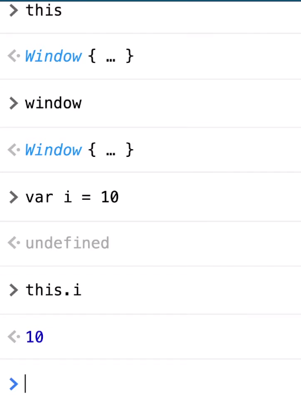

- Từ mới Tiếng anh trong video, xem thêm video để hiểu ý nghĩa nhé:
  - Syntax parser
  - Lexical environment
  - Execution Context
  - Hoisting

### 2. Javascript Execution Stack, Invocation và Variable Environment | Justin Nguyen

- Dưới đây là code chạy đồng bộ

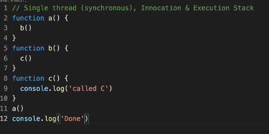
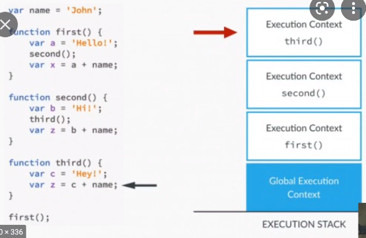

- Từ mới Tiếng anh trong video, xem thêm video để hiểu ý nghĩa nhé:
  - Concurrent: Chạy đồng thời
  - Synchronous: Chạy đồng bộ
  - Invocation: Chạy 1 function, gọi hàm
  - Lexical environment
  - Execution Context
  - Execution Stack
  - Variable environment

### 3. Scope Chain và Block Scope Trong Javascript | Justin Nguyen

- Ví dụ về javascript về Scope Chain và Block Scope trong javascript

- Tất cả các ví dụ ở trên là mình dùng biến `var`. Biến `var` được hiểu nôm na là `global scope` hoặc là `function scope`. Nên biến `var` rất ít người dùng. Hầu như là họ không dùng nữa mà chuyển qua dùng `let`, `const`
- `let`, `const` là ES6 (ES2015) thì nó có hỗ trợ `block scope`
- `block scope` là gì? Thì nó có nghĩa là các dòng code nằm trong dấu ngoặc nhọn `{}`. Đó là block scope. Ví dụ như các dòng code nằm trong `if else`, `forEach`, `for`,...Mỗi cái block như này thì nó sẽ tạo ra cho mình cái scope riêng
- Các biến nằm trong block đó thì biến đó chỉ tồn tại trong scope đó thôi. Nó không ảnh hưởng gì, và cũng không liên quan đến các biến bên ngoài

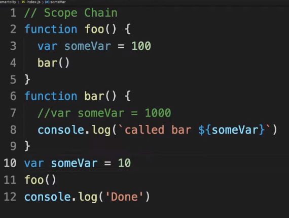

- Từ mới Tiếng anh trong video, xem thêm video để hiểu ý nghĩa nhé:
  - Scope chain
  - Lexical environment
  - Execution Context
  - Execution Stack
  - Variable environment

### 4. By Value vs By Reference Trong Javascript | Justin Nguyen

- Ở trong bài này thì chúng ta cùng tìm hiểu về Static types, Dynamic types, Primitive types (kiểu nguyên thủy), Object
- By value và By references

- Tất cả các kiểu primitive type đều là tham trị (pass by value)
- Còn tất cả các kiểu mà mình khai báo kiểu object thì đều là tham chiếu (pass by reference)

- Primitive type: được gán theo giá trị
- Object type: được gán theo vùng nhớ

- Từ mới Tiếng anh trong video, xem thêm video để hiểu ý nghĩa nhé:
  - By Value
  - By Reference
  - Execution Context
  - Variable Environment
  - Dynamic Type, Static Type
  - Primitive Type

### 5. Tại Sao 2 + 2 = 22 Trong Javascript | Justin Nguyen

- Trong bài này thì chúng ta cùng tìm hiểu về bài so Sánh Strict Equality hay '==='
- Dù sao đi chăng nữa thì chúng ta nên luôn luôn sử dụng 3 dấu bằng (`===`). Khi dùng cách đó thì khi kiểm tra thì nó nghiêm ngặt hơn và chính xác hơn
- Nếu chúng ta sử dụng 2 dấu bằng (`==`) trừ khi chúng ta đang biết là ta đang làm gì đó, và hiểu được cách sử dụng của nó hoặc là đang hướng dẫn ai đó hiểu 2 dấu bằng khác nhau như thế nào với 3 dấu bằng
- Trong thực tế thì mọi người hầu như đều sử dụng 3 dấu bằng (`===`) để so sánh cái gì đó

- [MDN bảng so sánh bằng](https://bit.ly/3uVL7XD)
- [MDN bảng Precedence](https://bom.so/0kf88Q)
- 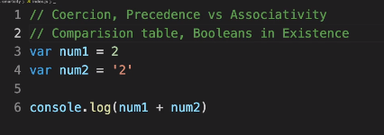

- Từ mới Tiếng anh trong video, xem thêm video để hiểu ý nghĩa nhé:
  - Coercion
  - Strict Equality, Strict Inequality
  - Precedence, Associativity
  - Hoisting

### 6. CLOSURE Trong Javascript Là Gì?

- Nếu các bạn muốn trở thành senior trong JavaScript thì nên nắm thật chắc về closure nhé
- Khái niệm trong javascript về closure là gì, lexical environment, inheritance
- Những cách sài và vấn đề hay gặp phải khi sử dụng closure.

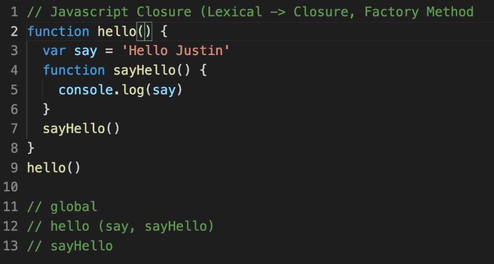
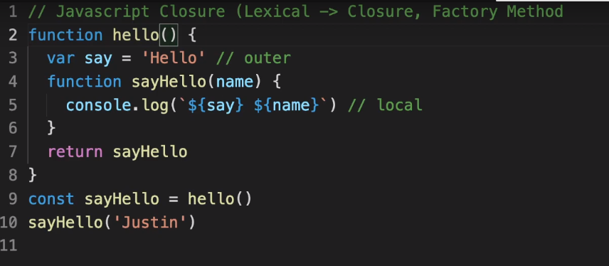
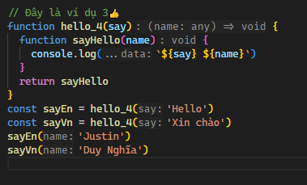

[MDN về Closure](https://bom.so/3lOFYu)

- Từ mới Tiếng anh trong video, xem thêm video để hiểu ý nghĩa nhé:
  - Closure
  - Hoisting
  - Execution Context, Lexical Environment, Scope Chain

### 7. Hàm Bind vs Call vs Apply Trong Javascript | Justin Nguyen

- Khái niệm trong javascript về sự khác nhau giữa hàm bind, apply, call trong javascript

- Giống nhau giữa call và apply ở chổ:

  - Là một lời gọi hàm nào đấy với 1 cái context nào đấy mà các bạn truyền vào là tham số đầu tiên, và bạn có thể thay đổi context (ngữ cảnh) lời gọi hàm đó

- Khác nhau giữa call và apply ở chổ:

  - Khác biệt duy nhất giữa cái call và apply là từ tham số thứ 2 trở đi. Các bạn có thể truyền vào 1 mảng hoặc từng cái riêng lẻ
  - Trong call thì chúng ta truyền tham số thứ 2 như bình thường, các phần tử được cách nhau bởi dấu phẩy
  - Còn trong apply thì khi ta truyền tham số thứ 2 thì ta phải truyền vào 1 mảng, và các phần tử trong 1 mảng được phân cách nhau bởi dấu phẩy

- Nói tóm lại là `Bind` nó ràng buộc trong phạm vi 1 `object` nhưng không gọi hàm được, còn `Call` vừa có `Bind` vừa gọi hàm được, `Apply` cũng y chang `Call` nhưng nhận đối số trong mảng

- Từ mới Tiếng anh trong video, xem thêm video để hiểu ý nghĩa nhé:
  - Event Loop
  - Callback Queue, Task Queue, Event Queue
  - Spread operator

### 8. Giới Thiệu Prototypal Inheritance Trong Javascript | Justin Nguyen

- Học Javascript Qua Khái Niệm về lập trình hướng đối tượng Prototypal Inheritance trong javascript

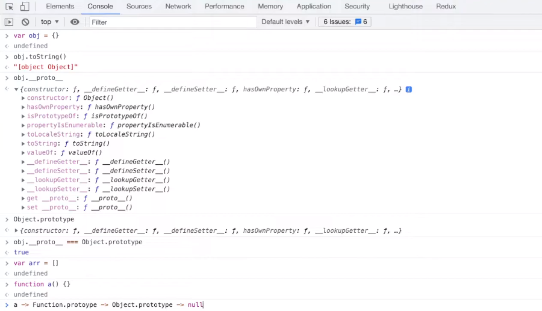

- Từ mới Tiếng anh trong video, xem thêm video để hiểu ý nghĩa nhé:
  - Constructor Function
  - Prototypal Inheritance, Classical Inheritance
  - Prototype Chain
  - Sugar Syntax

### 9. Task Queue và Job Queue Trong Async Javascript | Justin Nguyen

- Khái niệm trong javascript về xử lý bất đồng bộ, task queue, job queue, event loop trong Javascript

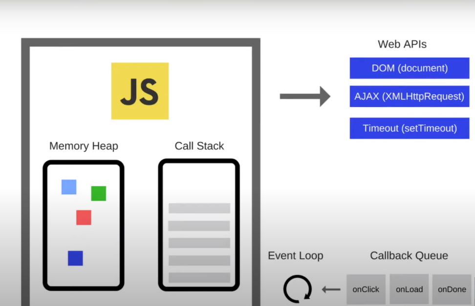

- Từ mới Tiếng anh trong video, xem thêm video để hiểu ý nghĩa nhé:
  - Task Queue, Callback Queue, Event Queue
  - Job Queue, Microtasks Queue, Promise Queue
  -  Event Loop

### 10. Immediately Invoked Function Expression IIFE Là Gì | Justin Nguyen

- IIFE Là Gì? Series học Javascript Qua Khái Niệm với video lần này về Immediately Invoked Function Expression hay còn gọi là IIFE cùng với cách sử dụng IIFE để tạo ra thư viện JS nhằm sài lại được cho dự án khác tương tự như Jquery nhé.

- Từ mới Tiếng anh trong video, xem thêm video để hiểu ý nghĩa nhé:
  - Task Queue, Callback Queue, Event Queue
  - Job Queue, Microtasks Queue, Promise Queue
  - Closure, Prototypal Inheritance
  - Function chain