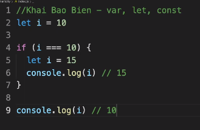

1. Giới Thiệu Về Series Video Học Javascript Qua Ví Dụ | Justin Nguyen

- Trong bài này thì chúng ta được giới thiệu sơ qua về khóa học
- Nếu các bạn nào muốn học cách khai báo function thì khóa này sẽ không phù hợp 
- Bởi vì trong khóa này chúng ta sẽ học JavaScript cơ bản qua ví dụ và hiểu code, từ đó ta sẽ hiểu được các khái niệm về JavaScript

2. Học Javascript - Sử Dụng Cho Đúng Javascript VAR, LET, CONST

- Chúng ta nên sài biến nào? Và tại sao phải sài biến đó? Và sài biến đó trong trường hợp nào?
- var: có scope của nó là global hoặc function scope

- let: không phải là global scope và function scope. Mà là block scope
  - Có nghĩa là: nếu chúng ta có biến đó được khai báo ở trong scope if else, thì biến đó sẽ có scope nằm trong if else. Nếu log biến đó ra ngoài scope thì nó sẽ không đúng giá trị mà chúng ta mong muốn
  

- const: nó cũng là block scope. Nhưng mà 1 khi nó đã khai báo rồi thì biến đó sẽ không thay đổi được. Nó được hiểu nôm na là 1 hằng số