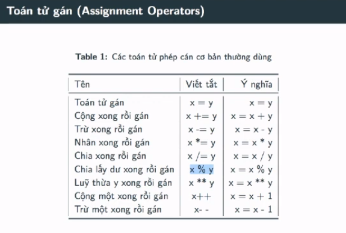
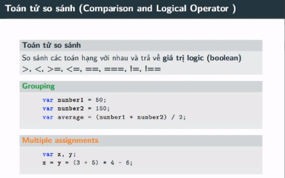
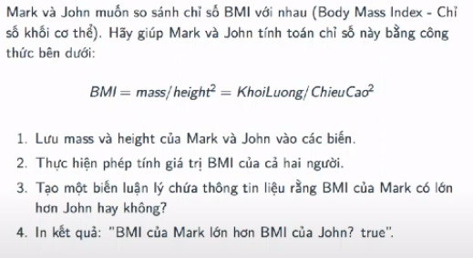

## 

- Phép toán so sánh thì luôn trả về kiểu giá trị boolean
- Lưu ý: phải là toán tử có 2 `dấu bằng` và 3 `dấu bằng` thì mới là toán tử so sánh. Chứ có 1 `dấu bằng` là phép toán tử gán rồi

---

- Giải bài tập JavaScript cơ bản

