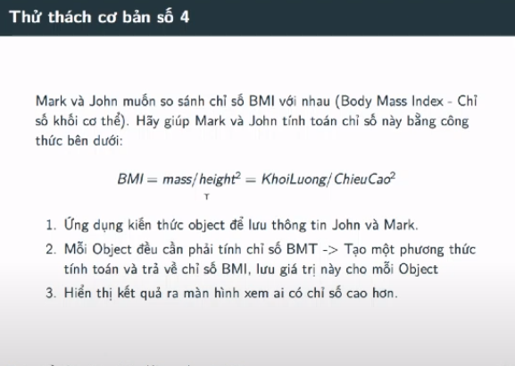
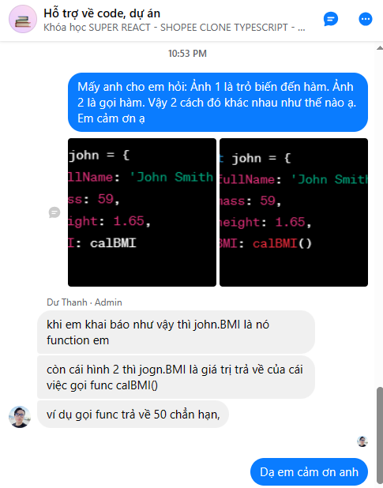

## Javascript Cơ Bản - #12 - Bài tập cơ bản Challenge 04 ứng dụng Object

---

- Đây là bài tập đã làm ở challenge 01 rồi. Mà lúc đó mình mới học cơ bản nên làm cách cơ bản
- Còn bài hôm nay chúng ta làm theo dạng `Object`

