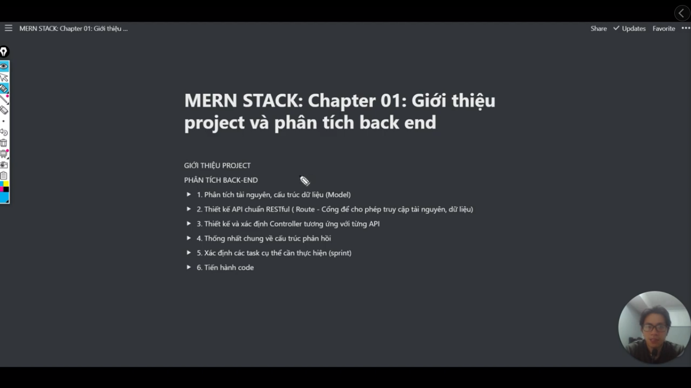
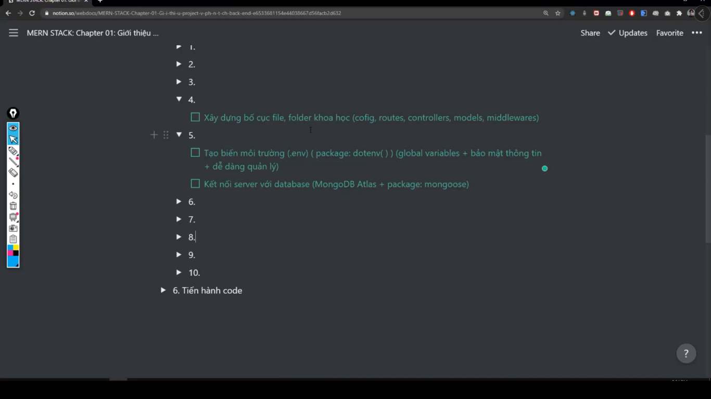

# Đây là những video từ bài giảng MERN Stack từ kênh Tu Tran

[Link tutorial](https://bom.so/FrfhFj)

---

## There are some images about of project

---

---

**Analysis Back-end**

---

**Back-end work flow**

- Tạo mới thì dùng phương thức POST.
- Phương thức POST thì khi gửi lên thì nó sẽ gửi 1 object (dữ liệu được gửi lên server thì sẽ gọi đó là request)
- Sau khi vào `router` thì nó sẽ vào `controller`. Nhiệm vụ của `controller` là điều khiển dữ liệu. Controller sẽ truy cập vào `database` sẽ lấy dữ liệu -> và sau khi nó có dữ liệu thì nó sẽ trả ngược về `router` đó -> và cuối cùng nó sẽ render ra giao diện cho người dùng

---

> Design and Identify Controller

---

> General agreement on the response structure (Thống nhất chung về cấu trúc phản hồi)

---

> This is course MERN Stack 🤷‍♀️

> Suitable person of this course (Đối tượng phù hợp với khóa này 👨‍💻)

---

> There are principle in JavaScript 🚀

Reference: 🌈

- https://developer.mozilla.org/en-US/docs/Web/JavaScript
- https://javascript.info/

---

> Determine the specific tasks that need to be performed (Xác định các task cụ thể cần thực hiện 🎯) --> Sprint

---

- ExpressJS là Web framework của NodeJS
- Trong ExpressJS có những tính năng nổi bật là error handling (xử lý lỗi), middleware, body parse, route,...

**Lưu ý:**

- file `server.js` là file entry point. Khi mà client gửi request lên server thì nó sẽ vào `server.js` đầu tiên
- entry point -> có nghĩa là điểm bắt đầu

---

**Lưu ý:**

- Trong phần này mình sẽ học về `middleware`

**`Middleware` là gì?**

- `Middleware` là 1 function, nó nằm giữa request và response (yêu cầu từ client và phản hồi từ phía server)

- Ví dụ: 🎉

  - Khi mình tạo bài post thì request sẽ đi vào server -> server đi vào route -> route nó đi vào controller để tạo bài viết -> controller nó liên kết với database -> và cuối cùng nó sẽ trả về theo thứ tự đó -> xong nó render ra giao diện

- Nhược điểm: ✅

  - Bất cứ người dùng nào (kể cả người có account và người không có account) thì có thể vào để tạo bài viết. Thì để làm sao mà xác thực người dùng kiểm tra là: mình chỉ cho những người dùng có tài khoản thôi thì người ta mới có quyền tạo bài post

  👉 Thì lúc đó thằng `middleware` mới nhảy vào giữa và dùng. Khi mà server nó vào route. Thì bình thường nó sẽ vào controller, thì lúc này nó sẽ vào thằng `middleware` (nó là 1 function để giúp xác thực người dùng). Nếu người dùng OK, có tài khoản trong database thì nó mới vào tiếp controller. Thì thằng controller này mới cho tạo bài post, và nó phản hồi lại route -> route phản hồi lại server -> server phản hồi lại client -> client sẽ thấy được bài post của mình

Hình ảnh minh họa: 🌈

- Cũng tương tự đó: khi người dùng (client) đăng kí người dùng, người ta sẽ gửi (request) các thông tin như: email, số điện thoại,...

👉 Thì nó sẽ vào route

👉 và nó kiểm tra thông tin có đạt yêu cầu hay không (như là: có đủ kí tự hay không, mật khẩu có đúng định dạng hay không...)

👉 Thì sau đó nó sẽ vào middleware kiểm tra các yêu cầu đó (email đúng định dạng, mật khẩu đúng yêu cầu,...)

👉 Sau đó nó sẽ vào thằng controller để cho người ta đăng kí

👉 và nó sẽ vào database để lưu các thông tin vào đó

👉 cuối cùng nó sẽ trả về thằng client

Hình ảnh minh họa: 🌈

✅ Bởi vậy thằng `middleware` này nó rất quan trọng, nó nằm giữa thằng request và thằng response

✅ Nó sẽ ứng dụng vào trong các ứng dụng thực tế như: đăng kí, đăng nhập, tạo bài post, xác thực người dùng,...

✅ Nó ứng dụng vào trong các ngôn ngữ khác nhau như là: php, c#, java,...

---

**Hãy tìm hiểu về `CORS` và `Body Parse`:**

- `CORS` này nó giúp chúng ta kết nối front-end và back-end
- Cụ thể là khi mà front-end (reactjs) yêu cầu đến server (nodejs) thì `CORS` này nó cho phép client nói chuyện được với server

- `Body Parse` là 1 middleware
- Nó có tác dụng, khi người dùng nhập email, password, name,... thì làm sao server nó đọc được mấy thứ đó. Nó sẽ đọc được, nhưng phải thông qua thằng `body parse` để chuyển thành dạng `object`, và cho chúng ta truy cập vào từng phần tử trong đó. Thì đó là các dụng của body parse
- Tóm lại: cứ cái gì liên quan đến, khi mà người dùng gửi dữ liệu hoặc cái input vào cái server thì thằng `body parse` nó sẽ chuyển đổi thành các `object` để cho chúng ta làm việc với các phần tử trong object đó

**Tổng kết CORS và Body Parse:**

✅ CORS cho phép front-end giao tiếp với back-end

✅ Body parse dùng để chuyển đổi dữ liệu của người dùng thành object. Để từ đó server dễ dàng thao tác với các thuộc tính trong đó

---

> Setup structure folder (config, middleware, route, controller, model,...)

---
