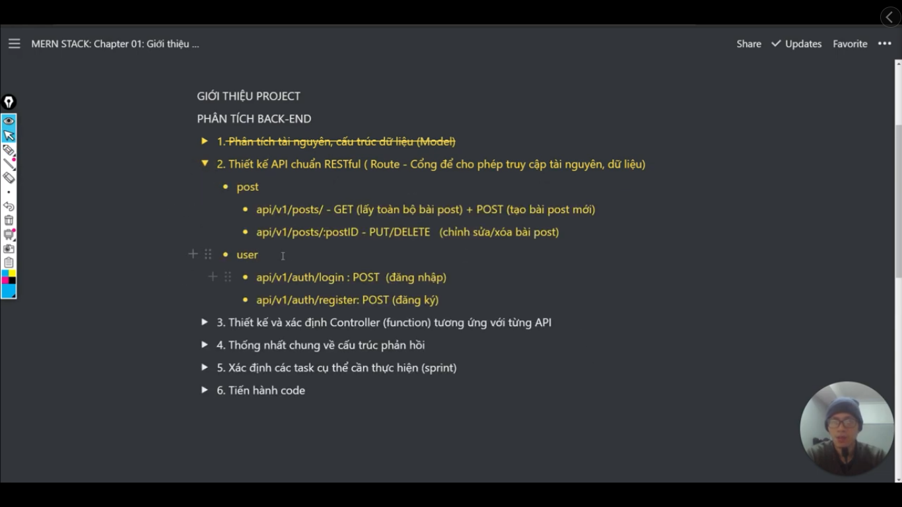
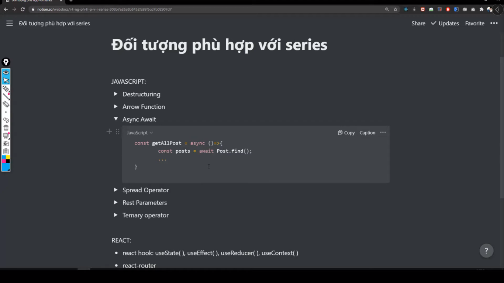
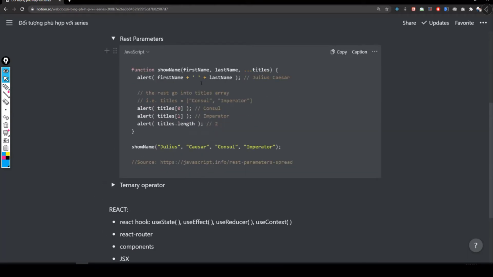
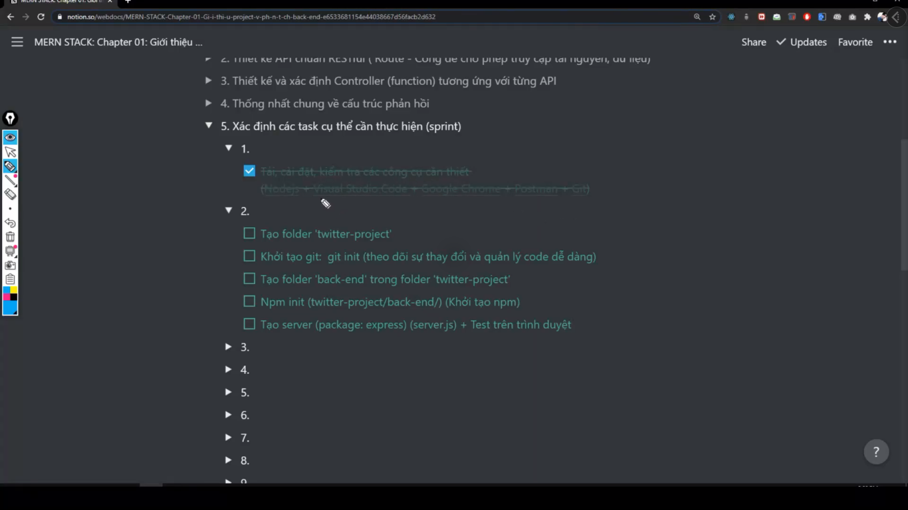

# Đây là những video từ bài giảng MERN Stack từ kênh Tu Tran

[Link tutorial](https://bom.so/FrfhFj)

---

## There are some images about of project

---

---

**Analysis Back-end**

---

**Back-end work flow**

- Tạo mới thì dùng phương thức POST.
- Phương thức POST thì khi gửi lên thì nó sẽ gửi 1 object (dữ liệu được gửi lên server thì sẽ gọi đó là request)
- Sau khi vào `router` thì nó sẽ vào `controller`. Nhiệm vụ của `controller` là điều khiển dữ liệu. Controller sẽ truy cập vào `database` sẽ lấy dữ liệu -> và sau khi nó có dữ liệu thì nó sẽ trả ngược về `router` đó -> và cuối cùng nó sẽ render ra giao diện cho người dùng

---

> Design and Identify Controller

---

> General agreement on the response structure (Thống nhất chung về cấu trúc phản hồi)

---

> This is course MERN Stack 🤷‍♀️

> Suitable person of this course (Đối tượng phù hợp với khóa này 👨‍💻)

---

> There are principle in JavaScript 🚀

Reference: 🌈

- https://developer.mozilla.org/en-US/docs/Web/JavaScript
- https://javascript.info/

---

> Determine the specific tasks that need to be performed (Xác định các task cụ thể cần thực hiện 🎯) --> Sprint

---

- ExpressJS là Web framework của NodeJS
- Trong ExpressJS có những tính năng nổi bật là error handling (xử lý lỗi), middleware, body parse, route,...

**Lưu ý:**

- file `server.js` là file entry point. Khi mà client gửi request lên server thì nó sẽ vào `server.js` đầu tiên
- entry point -> có nghĩa là điểm bắt đầu
