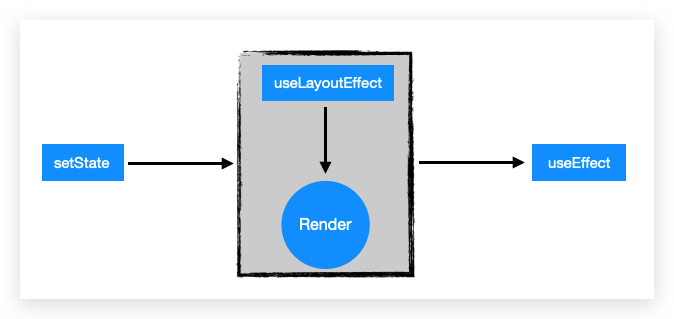

[Link Repo](https://github.com/GeekEast/react-hooks-examples)

### variable
 |        特性        | `plain variable` | `state` | `ref` |
 | :----------------: | :--------------: | :-----: | :---: |
 | 渲染后引用是否相同 |        ❎         |    ❎    |   ✔   |
 |   是否可以update   |        ❎         |    ✔    |   ✔   |

### useContext vs redux
- useContext的变化会引起中间组件的重新渲染
- store的变化只会引起相关组件的重新渲染

### useRef
- 持久化的引用，只有`current`可用
- 可以用来获取或者添加`dom node`

### useMemo vs useCallback vs memo
- `useMemo`用来**缓存**`昂贵计算`的**值**, 也可以缓存`组件`
- `useCallback`用来**持久化**函数的`引用`
- `memo`用来缓存`组件`, 可以避免由`父组件渲染`引起的**不必要**的`子组件渲染`


### useEffect vs useLayoutEffect
<div style="text-align:center; margin:auto"></div>

- [useEffect 和 useLayoutEffect 的区别](https://juejin.im/post/5de38c76e51d455f9b335eff)
- [react hook——你可能不是“我”所认识的useEffect](https://imweb.io/topic/5cd845cadcd62f86299fcd76)


### useContext
- 创建context
  - defaultContext是在没有provider的情况下，传给consumer或者useContext的默认值，但是是不可变的，无法通过setContext来变更。
```javascript
// userContext.js
import { createContext } from 'react';

const UserContext = createContext([
  {
    firstName: 'Bob',
    lastName: 'Bobberson',
    suffix: 1,
    email: 'bobberson@example.com'
  },
  obj => obj
])
const { Provider } = UserContext;
export { Provider, UserContext }
```
- 创建Provider
```javascript
const UseContext = () => {
  // 这个才是人类理解的默认值，可通过setContext来变更
  const user = useState({
    firstName: 'James',
    lastName: 'Tan',
    suffix: 1,
    email: 'james@example.com'
  })

  return (
    <div>
      <Provider value={user}>
        <h1>1st level</h1>
        <Level2></Level2>
      </Provider>
    </div>
    //  
  )
}
```
- 创建Consumer
```javascript
const Level5 = () => {
  // 接收context
  const [user, setUser] = useContext<any>(UserContext);
  return (
    <div>
      <h5>{`${user.firstName} ${user.lastName} the ${user.suffix} born`}</h5>
      <button onClick={() => { setUser({ ...user, suffix: user.suffix + 1 }) }}>Increment</button>
    </div>
  )
}
```

### forwardRef
- 能够跟`useRef`一起获得子组件的`DOM`
- 在`父组件`创建`ref`,传递到`子组件`, 在`父组件`获取`DOM`
```javascript
const FancyButton = React.forwardRef((props, ref) => (
  <button ref={ref} className="FancyButton">
    {props.children}
  </button>
));

// You can now get a ref directly to the DOM button:
const ref = React.createRef();
<FancyButton ref={ref}>Click me!</FancyButton>;
```

### useImperativeHandle
- 结合`useRef`和`forwardRef`, 允许`子组件`将操作**自身DOM**的`函数`传递给`父组件`(向上传递)

### 零碎
- `htmlFor` for `for`
- `Context` + `useReducer` = `Redux`; 其实还是redux的方案更好，context其实只是props多层传递的一种简化而已。
- `styled-component`: `emotion.sh` 将css复用粒度提升tag层面到了component层面，但是加快了开发速度，可以适用于小型项目。
- `styled-component`高亮插件: `vscode-styled-component`
- `sass`: `yarn add node-sass`
- `setState`: hooks是function之外的又一层，写在代码里的顺序，不一定是它真实的执行顺序

