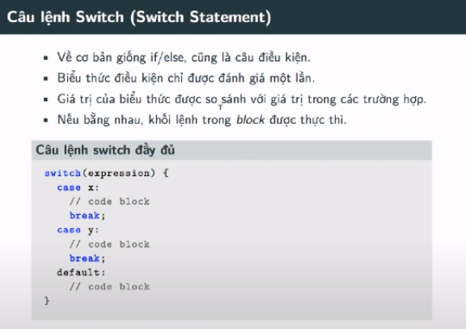
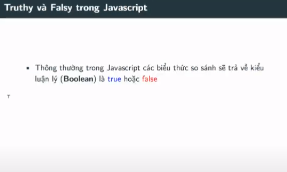

# Javascript Cơ Bản - #03 - Câu lệnh Switch/Case trong Javascript

---

- Nên nhớ: chỉ dùng câu điều kiện `switch case` khi mà chúng ta chỉ so sánh bằng với giá trị trước đó mà chúng ta đã định nghĩa. Vì trong `case` là một biểu thức so sánh luận lý (tức là chỉ có `true` hoặc `false`. Nếu là `true` thì nó log ra và nó `break` luôn), chứ không có so sánh giá trị. Tham số trong `switch` là một giá trị `true` hoặc `false`
  - Chứ không được so sánh lớn hơn, bé hơn,...

---

