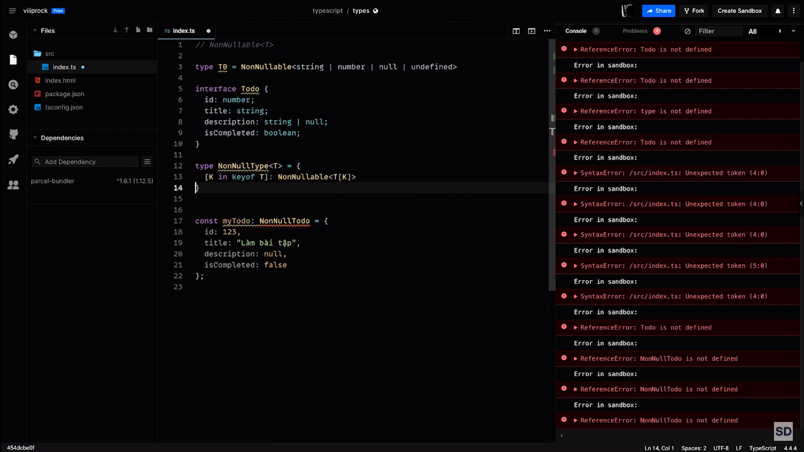
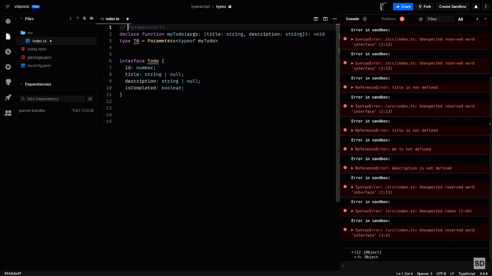
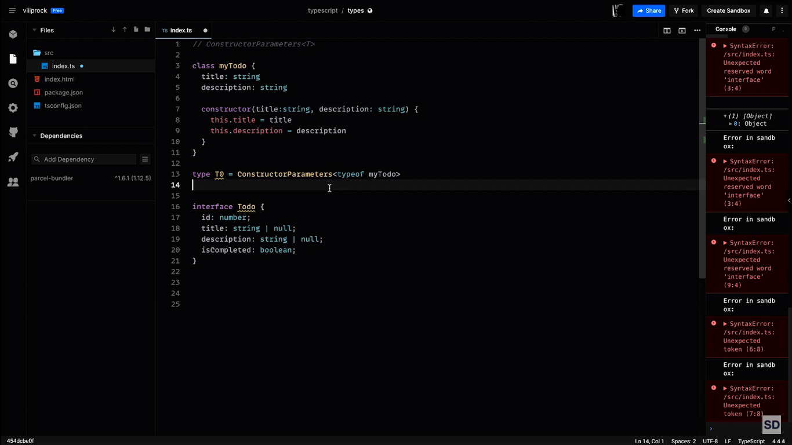
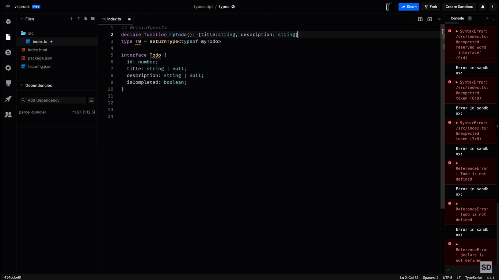
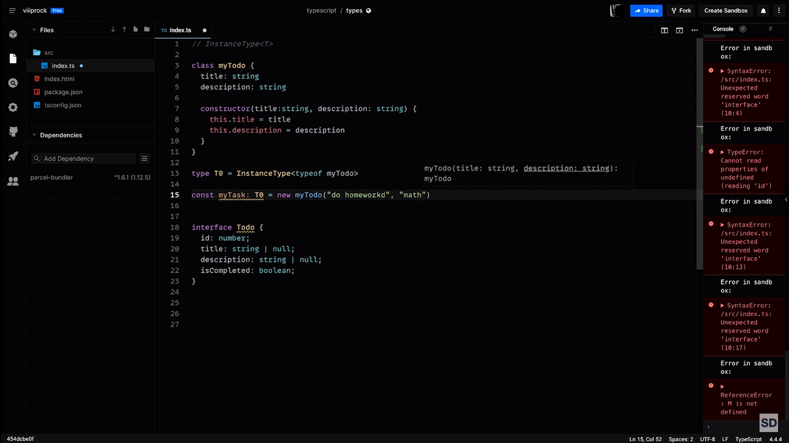
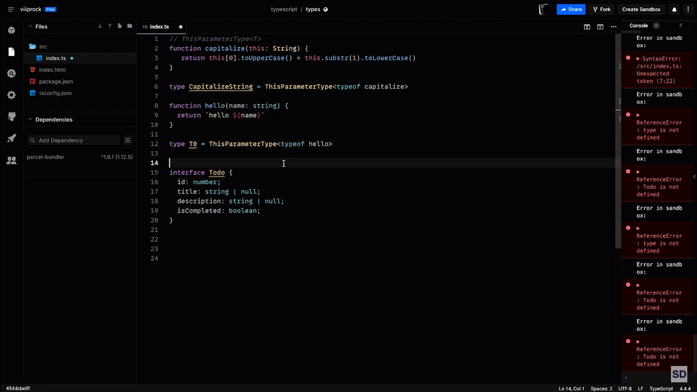
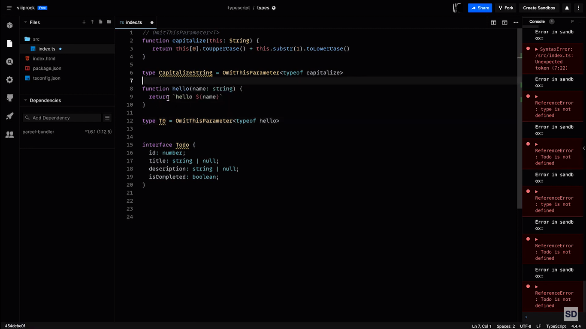
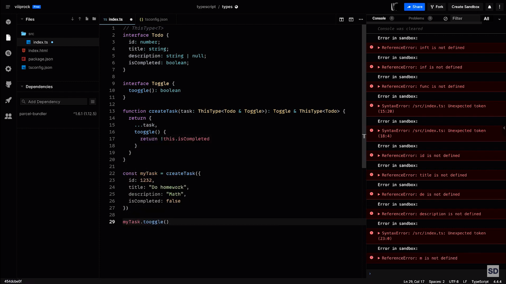

- `NonNullable<T>`
  

---

- `Parameters<T>`
  

---

- `ConstructorParameters<T>`
  

---

- `ReturnType<T>`
  

---

- `InstanceType<T>`
  

---

- `ThisParameterType<T>`
  

---

- `OmitThisParameter<T>`
  

---

- `ThisType<T>`
  