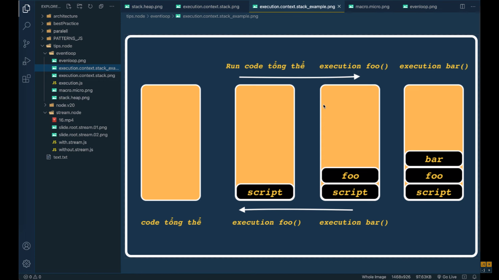
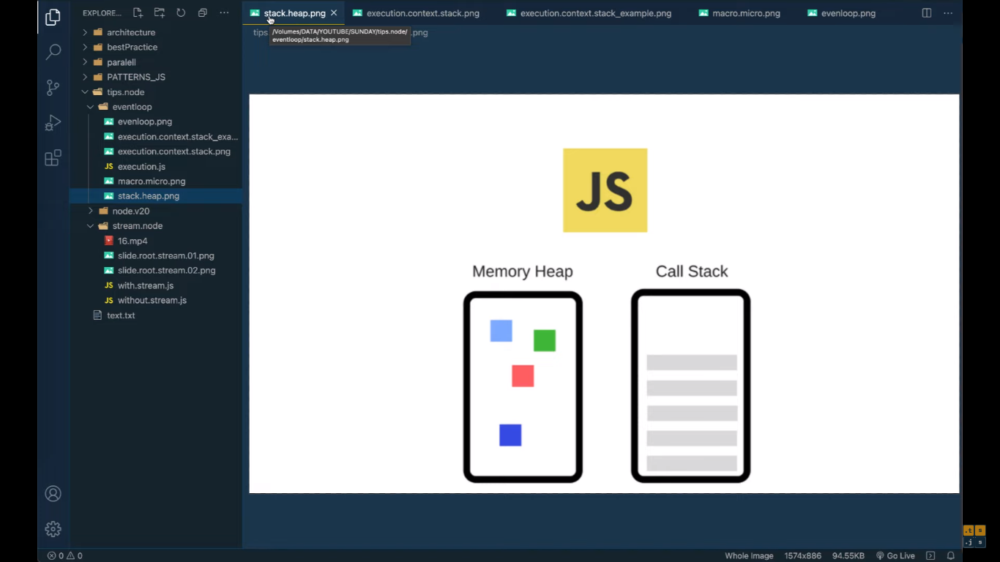
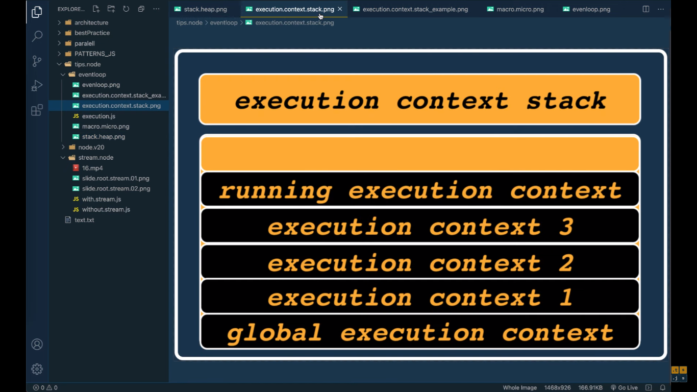
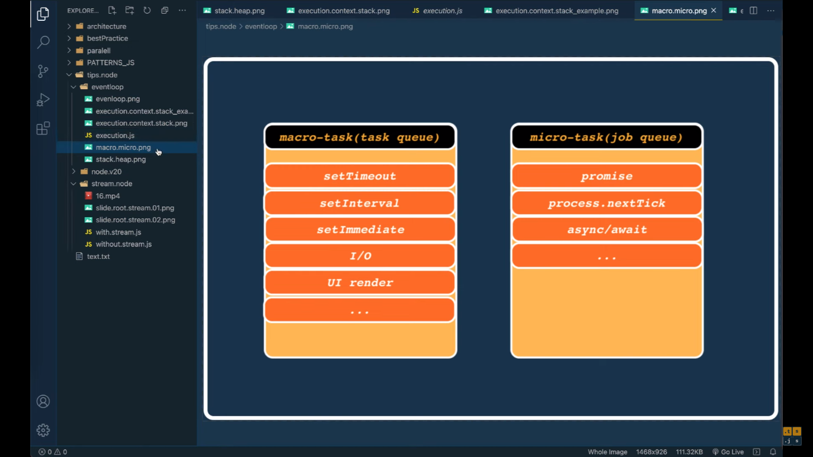

# Event loop Nodejs - Lần cuối giải thích cho những bạn còn NGHI NGỜ thông qua hai VÍ DỤ kinh điển

[Link video](https://bom.so/aJt5l5)

Event Loop Nodejs - Lần cuối giải thích cho những bạn còn NGHI NGỜ thông qua hai VÍ DỤ kinh điển

Không còn nghi ngờ gì nữa, mọi người đều biết rằng javascript là ngôn ngữ đơn luồng, điều đó có nghĩa là JS không thể đa luồng, nhưng chức năng không đồng bộ trong JS hoàn toàn có thể mô phỏng đa luồng và hiệu quả không tệ. Tất nhiên, nếu bạn muốn hiểu đầy đủ về sự không đồng bộ, trước tiên bạn phải hiểu cốt lõi của hoạt động JS - vòng lặp sự kiện (Event Loop), video sau đây mô phỏng sự hiểu biết về vòng lặp sự kiện theo ba phần:

1. Vì sao trong event loop lại nhắc đến macro task (task queue) và micro task (job queue)
2. macro task và micro task bao gồm những tác vụ nào?
3. 2 ví dụ để thấy event loop chạy như thế nào?

Timline:

```
00:00 Event loop là gì? Cốt lõi là gì?

04:50 Giải thích về macro task (task queue) và micro task (job queue)

12:30 2 ví dụ kinh điển để giải thích về event loop trong nodejs
```






