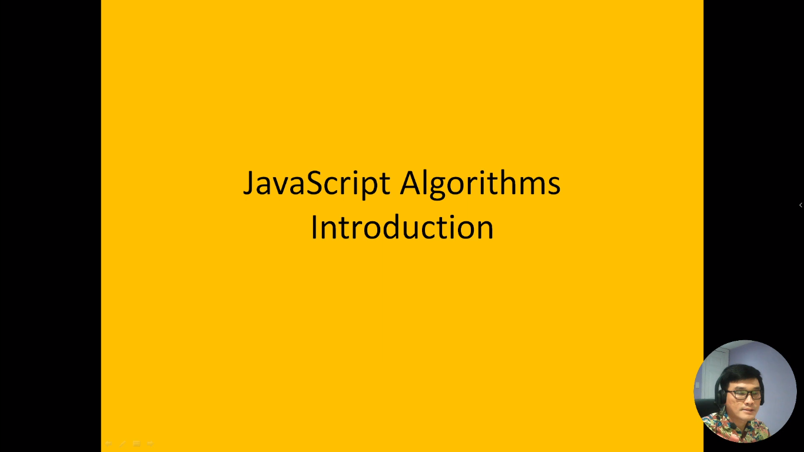
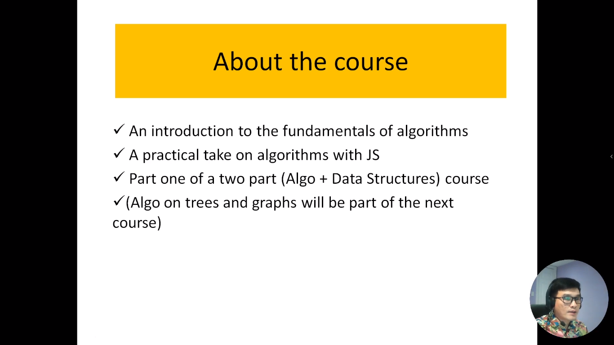
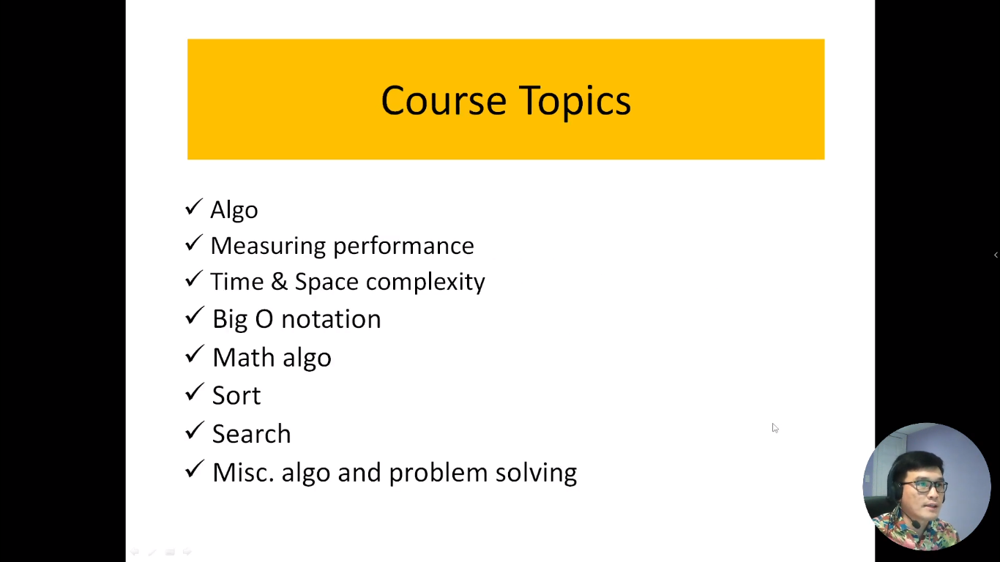
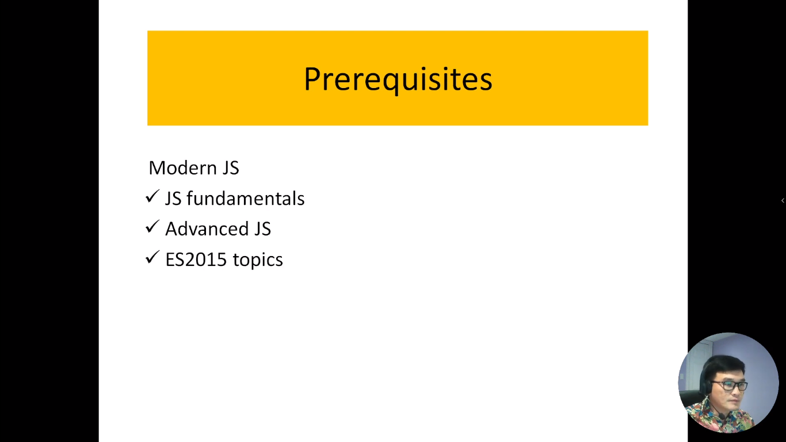
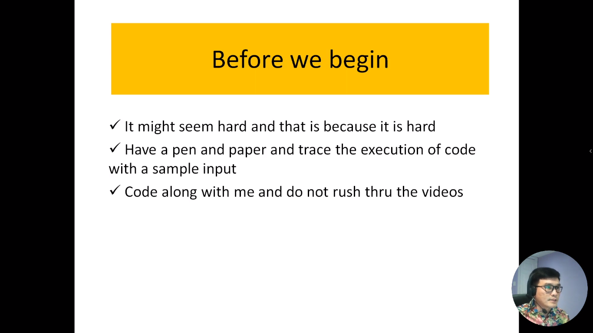

Trong video này, chúng tôi sẽ giới thiệu loạt bài học về thuật toán viết bằng ngôn ngữ JavaScript. Chúng ta sẽ khám phá các khái niệm quan trọng về đo lường hiệu suất của thuật toán và những kiến thức cơ bản cần thiết để bạn có thể tận dụng tối đa loạt bài giảng này. Đây là bước đầu tiên trong hành trình học thuật toán của bạn, và chúng tôi sẽ hướng dẫn bạn về cấu trúc dữ liệu trong những bài học sắp tới.

---

---
