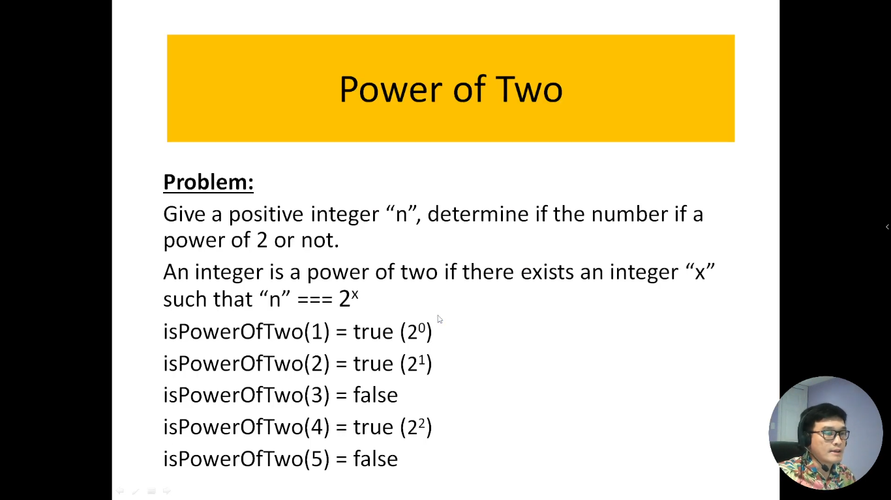
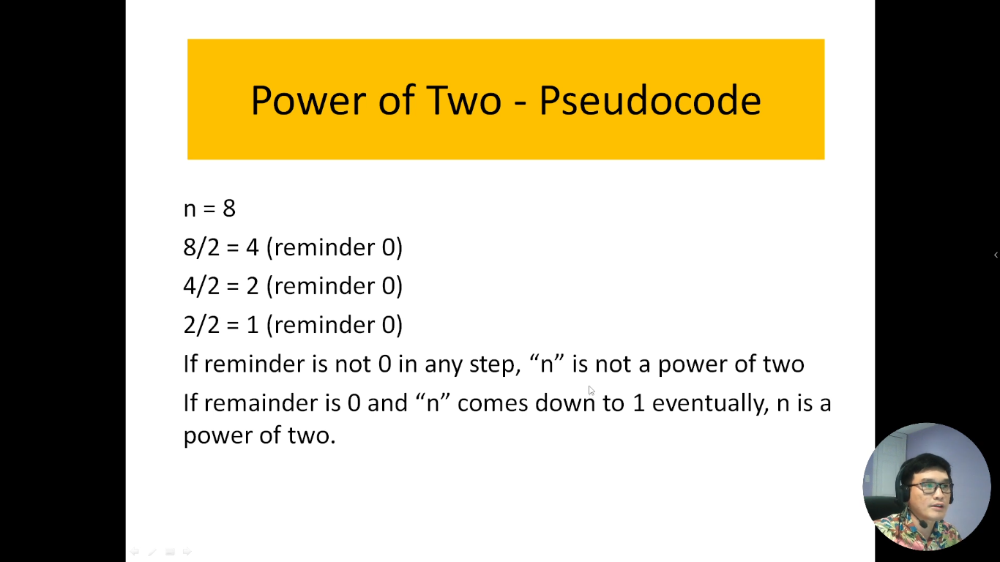
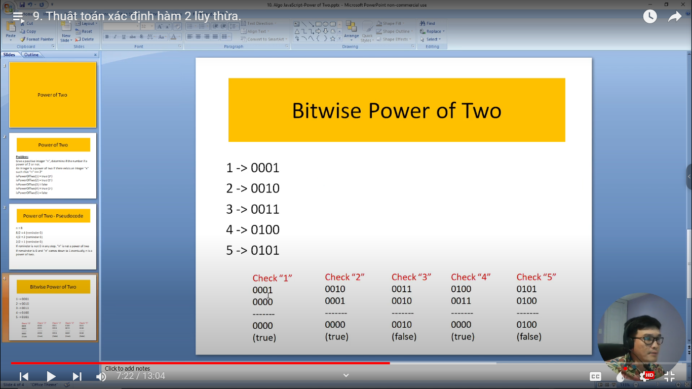
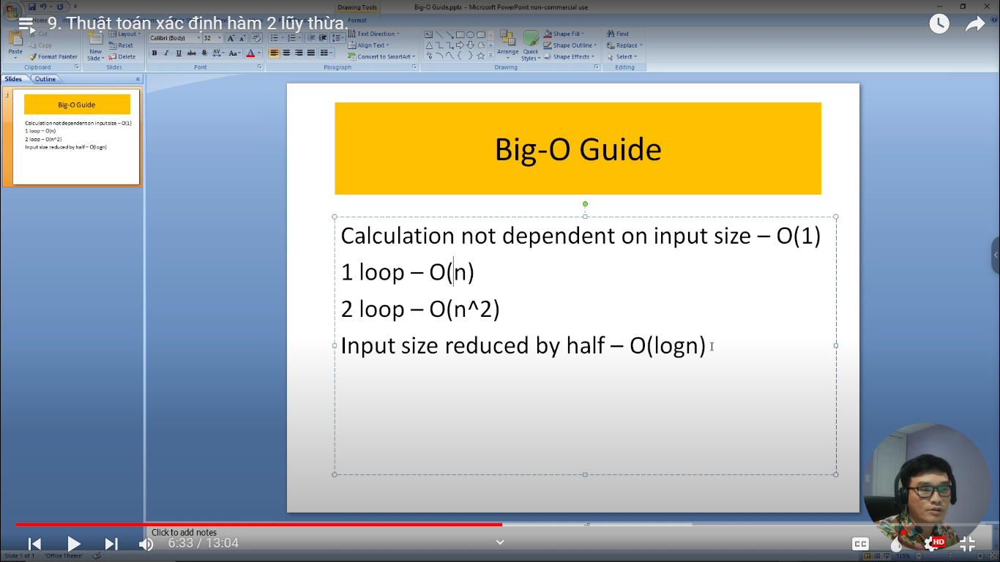

# 9. Thuật toán xác định hàm 2 lũy thừa.

Trong lĩnh vực toán học và khoa học máy tính, việc xác định liệu một số có phải là hàm 2 lũy thừa hay không là một vấn đề quan trọng. Một hàm 2 lũy thừa là một số mà có thể biểu diễn dưới dạng 2^x, trong đó "x" là một số nguyên không âm.

Thuật toán xác định hàm 2 lũy thừa là một quá trình tính toán để kiểm tra xem một số có thể biểu diễn dưới dạng 2^x hay không, và nếu có, thì tìm giá trị của "x." Thuật toán này là một phần quan trọng trong nhiều ứng dụng, bao gồm kiểm tra tính toán hiệu quả và quản lý dữ liệu số nguyên trong lập trình.

Chúng ta sẽ khám phá các thuật toán phổ biến để xác định hàm 2 lũy thừa, từ cách sử dụng vòng lặp đến phép toán bitwise. Chúng ta sẽ hiểu cách những thuật toán này hoạt động và làm thế nào chúng có thể được áp dụng để giải quyết các vấn đề thực tế trong lập trình và toán học.

---

---

bảng tính độ phức tạp về thời gian của thuật toán

- Giả sử thuật toán không phụ thuộc vào kích thước đầu vào thì ta có độ phức tạp là hằng số -> O(1)
- Nếu thuật toán có 1 vòng loop thì độ phức tạp đó là tuyến tính - O(n)
- Nếu thuật toán có 2 vòng loop thì độ phức tạp đó là hàm n mũ 2 - O(n^2)
- Mỗi đầu vào mà kích cỡ nó giảm đi 1 nửa thì độ phức tạp của nó là hàm logaric - O(logn)
