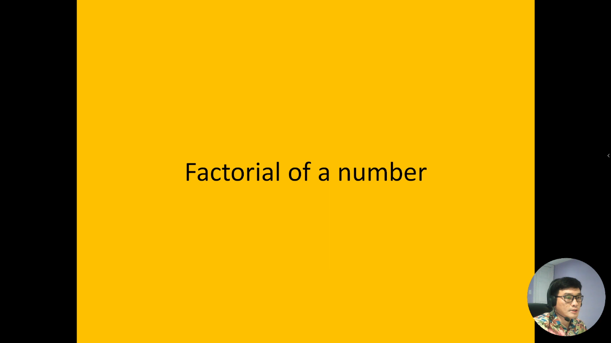
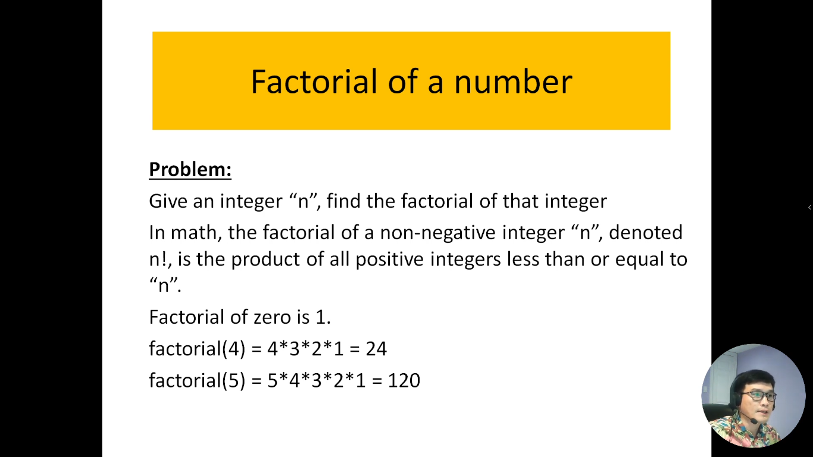

# 10. Thuật toán tìm giai thừa của một số nguyên

Giai thừa là một khái niệm toán học quan trọng và thường được sử dụng rộng rãi trong khoa học máy tính và các ứng dụng thống kê. Giai thừa của một số nguyên dương "n," thường được ký hiệu là "n!" là tích của tất cả các số nguyên từ 1 đến "n." Ví dụ, giai thừa của 5 (ký hiệu là 5!) bằng 5 x 4 x 3 x 2 x 1 = 120.

Thuật toán tìm giai thừa của một số nguyên là một quá trình tính toán để xác định giai thừa của một số cụ thể. Việc này có thể được thực hiện bằng nhiều cách, từ cách đệ quy đơn giản đến việc sử dụng vòng lặp. Thuật toán này là một phần quan trọng trong nhiều ứng dụng liên quan đến tính toán, toán học ứng dụng, và lập trình.

Trong quá trình giới thiệu này, chúng ta sẽ khám phá các thuật toán phổ biến để tìm giai thừa của một số nguyên, cùng với cách chúng hoạt động và làm thế nào để áp dụng chúng trong lập trình và tính toán. Chúng ta sẽ thấy rằng tìm giai thừa không chỉ quan trọng trong toán học mà còn có nhiều ứng dụng thực tế trong phân tích dữ liệu và lập trình.

---

