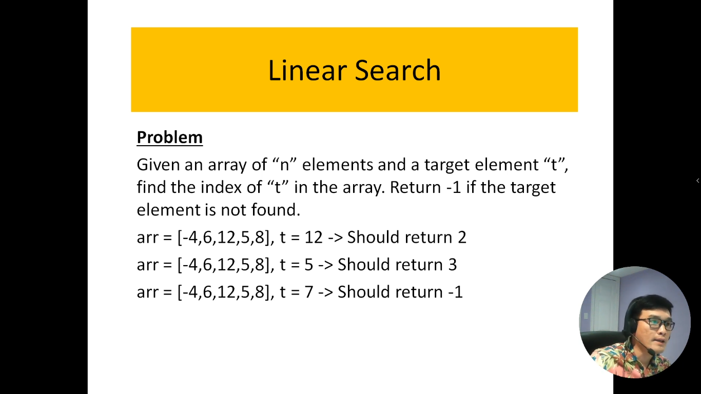
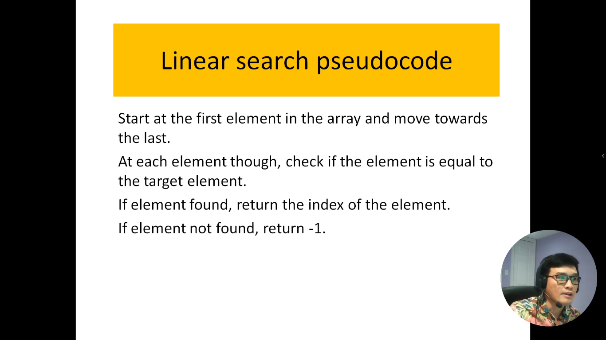
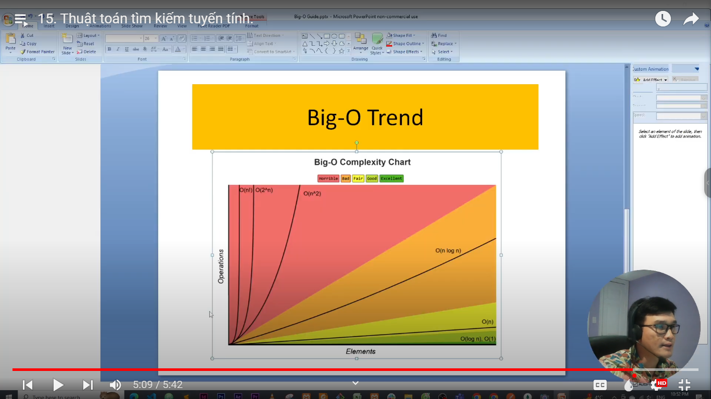
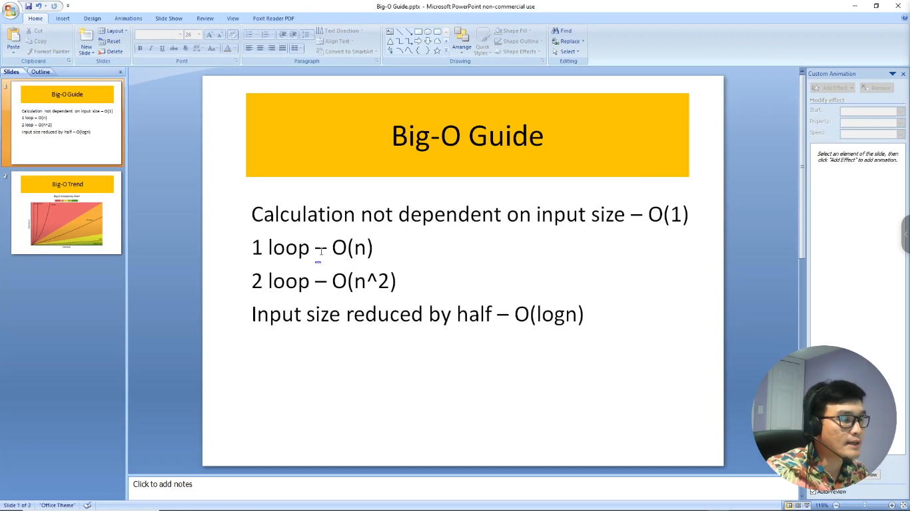

# 15. Thuật toán tìm kiếm tuyến tính.

Trong lĩnh vực khoa học máy tính và thống kê, tìm kiếm tuyến tính là một trong những phương pháp cơ bản để xác định vị trí của một phần tử cụ thể trong một tập dữ liệu. Phương pháp này thường được áp dụng khi danh sách dữ liệu không được sắp xếp hoặc khi bạn cần kiểm tra từng phần tử một.

Thuật toán tìm kiếm tuyến tính hoạt động đơn giản: nó duyệt qua từng phần tử của danh sách, bắt đầu từ phần tử đầu tiên và tiếp tục cho đến khi tìm thấy phần tử cần tìm hoặc kiểm tra hết toàn bộ danh sách. Nếu phần tử được tìm thấy, thuật toán trả về vị trí của nó; nếu không, nó thông báo rằng phần tử không tồn tại trong danh sách.

Phương pháp tìm kiếm tuyến tính có ưu điểm dễ hiểu và dễ triển khai, nhưng có độ phức tạp thời gian là O(n) trong trường hợp xấu nhất, với n là kích thước của danh sách. Do đó, nó thường không hiệu quả với các danh sách lớn. Tuy nhiên, nó có ứng dụng trong nhiều trường hợp, đặc biệt khi bạn cần kiểm tra từng phần tử một hoặc khi danh sách không được sắp xếp.

Trong giới thiệu này, chúng ta sẽ tìm hiểu về cách thuật toán tìm kiếm tuyến tính hoạt động, cách triển khai nó và các tình huống mà nó phù hợp nhất.

---

---

# Giải thích code

Đây là bảng thứ tự độ phức tạp của thuật toán

Tính toán không phụ thuộc vào kích thước đầu vào

- Khi bài toán có 1 vòng lặp thì đó là thuật toán có time-complexity tuyến tính: O(n)

=> Trong bài toán của mình có 1 vòng lặp, như vậy nó có độ phức tạp về thời gian là tuyến tính O(n)
