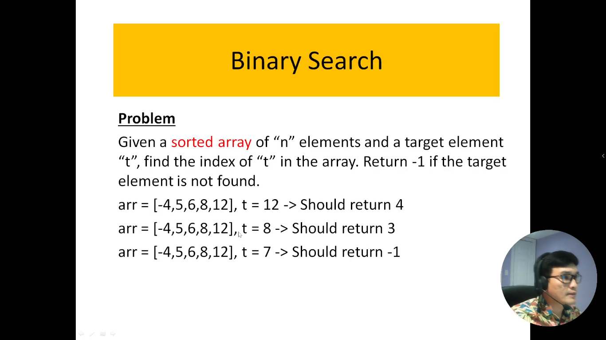
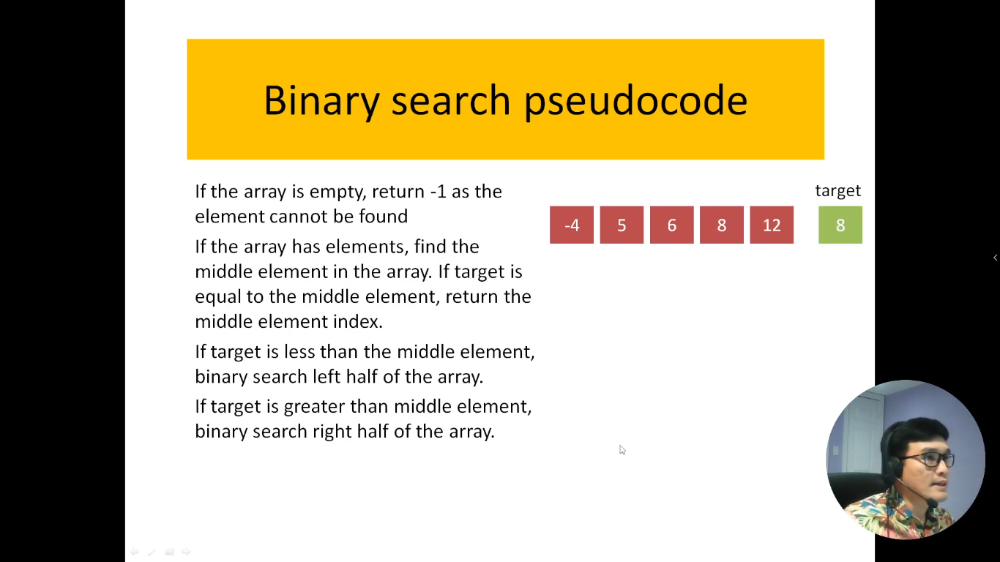
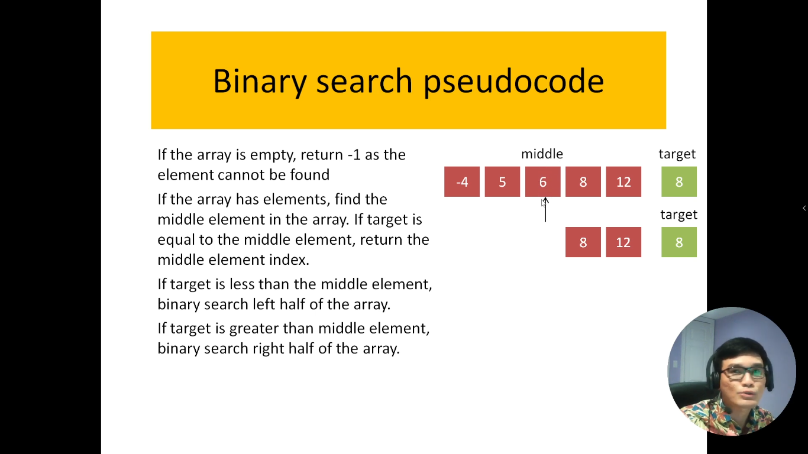
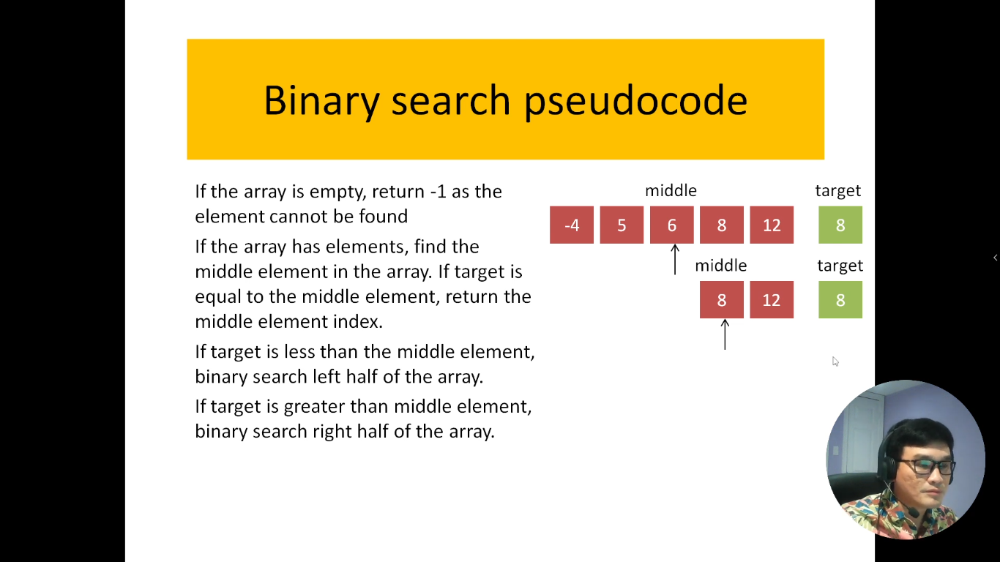
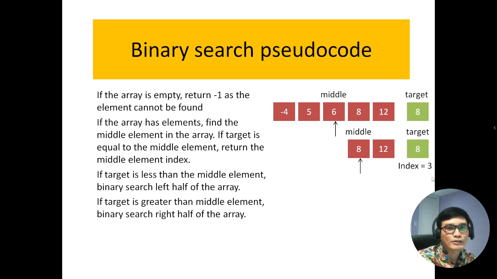
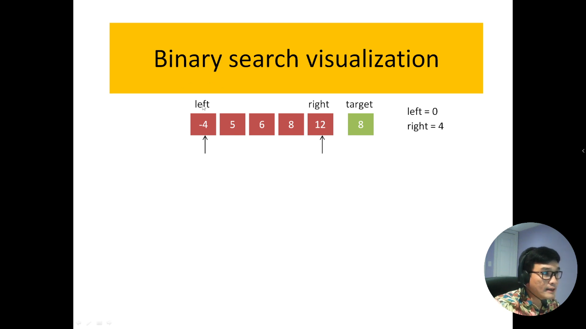
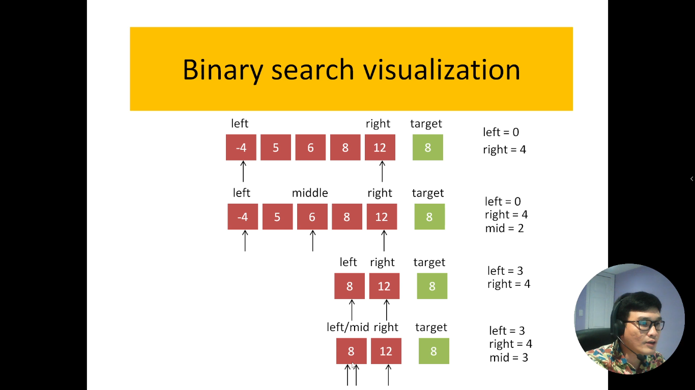
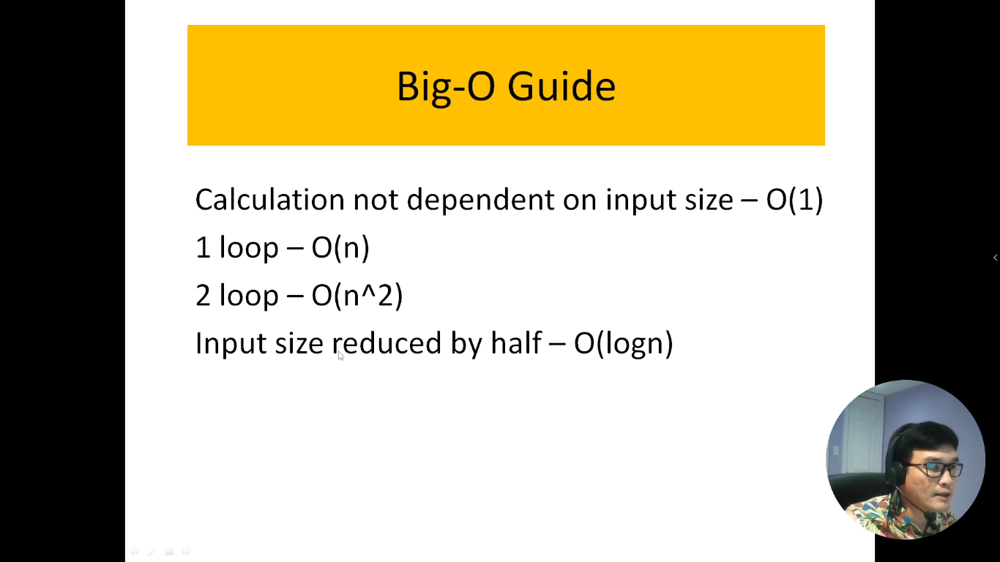
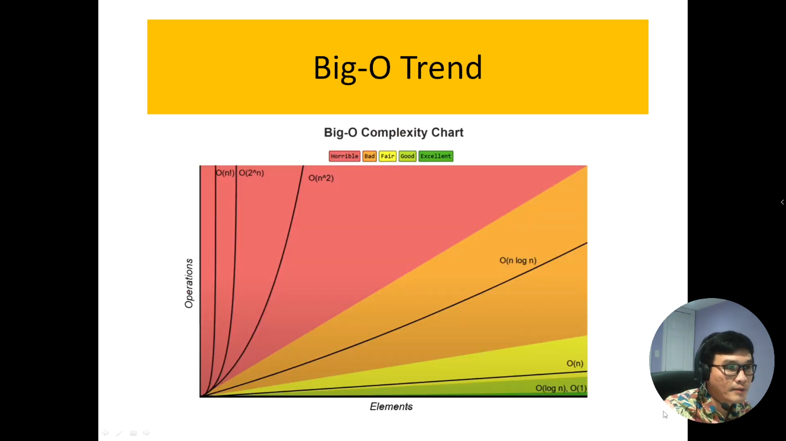

# 16. Thuật toán tìm kiếm nhị phân.

Thuật toán tìm kiếm nhị phân là một trong những phương pháp tìm kiếm phổ biến và hiệu quả trong lĩnh vực khoa học máy tính và toán học. Phương pháp này thường được sử dụng để tìm kiếm một phần tử cụ thể trong một danh sách hoặc mảng đã được sắp xếp theo thứ tự tăng dần. Thuật toán tìm kiếm nhị phân là một ví dụ điển hình của việc sử dụng chia để trị để giải quyết vấn đề.

Cách hoạt động của thuật toán tìm kiếm nhị phân là tương đối đơn giản: nó bắt đầu với việc so sánh phần tử cần tìm với phần tử ở giữa danh sách. Nếu phần tử cần tìm bằng với phần tử ở giữa, thuật toán trả về vị trí của nó. Nếu không bằng, thuật toán loại bỏ một nửa danh sách dựa trên kết quả so sánh, sau đó tiếp tục tìm kiếm trong nửa danh sách còn lại. Quá trình này lặp lại cho đến khi tìm thấy phần tử cần tìm hoặc xác định rằng phần tử đó không tồn tại trong danh sách.

Thuật toán tìm kiếm nhị phân có độ phức tạp thời gian tốt là O(log n) trong trường hợp xấu nhất, với n là kích thước của danh sách. Điều này làm cho nó rất hiệu quả khi làm việc với danh sách lớn.

Trong giới thiệu này, chúng ta sẽ nghiên cứu cách hoạt động của thuật toán tìm kiếm nhị phân, cách triển khai nó, và các tình huống mà nó phù hợp nhất, đặc biệt là khi bạn đã có danh sách được sắp xếp.

---

---

# Giải thích code

- Cách thức hoạt động bài toán này là: mình sẽ lấy vị trí index của số thứ 1 và vị trí index cuối cùng cộng lại --> sau đó mình đem chia cho 2 (Nếu kết quả ra số lẻ thì mình dùng toán tử `Math.floor()` để làm tròn xuống)

- Sau khi tính ra kết quả thì mình sẽ lấy kết quả đó làm phần tử ở giữa của mảng (thì đường nào nó nó cũng là phần tử ở giữa, bởi vì chia cho 2 mà 😆)

- Sau khi có được số ở giữa thì mình sẽ lấy cái số `target` so sánh với số nằm ở vị trí ở giữa đó:

  - Nếu số `target` nhỏ hơn với số ở vị trí ở giữa thì kết quả sẽ là 1 số nằm ở bên phía tay trái.
  - Còn nếu số `target` lớn hơn với số ở vị trí ở giữa thì kết quả sẽ nằm ở phía bên phải.
  - Còn nếu số `target` bằng với số nằm ở vị trí ở giữa mảng thì kết quả sẽ là số đó lun.

- Sau khi mình biết bên trái/phải sẽ có 1 trong những số là kết quả của chúng ta thì sau đó --> chúng ta lại tiếp tục cộng tất cả các số bên trái/phải lại với nhau rồi chia 2 (lấy kết quả là số làm tròn xuống).
- Sau khi có được số nằm giữa rồi thì chúng ta tiếp tục so sánh với số `target` tiếp. Cứ như vậy, chúng ta sẽ tìm được vị trí của số `target` mà chúng ta muốn tìm

---

## Tìm độ phức tạp về thời gian của thuật toán

- Khi thuật toán có 1 vòng lặp thì đó là: O(n)
- Khi thuật toán có 2 vòng lặp thì đó là: O(n^2)
- Khi kích thước đầu vào giảm 1 nữa thì đó là: O(logn)

Quay về với bài toán của mình

- Bài toán của mình có 1 vòng lặp, mỗi lần chạy thì kích thước của mảng nó sẽ giảm đi 1 nữa (do có chia 2)

=> Vậy thuật toán của bài mình là: `BigO = O(logn)`
