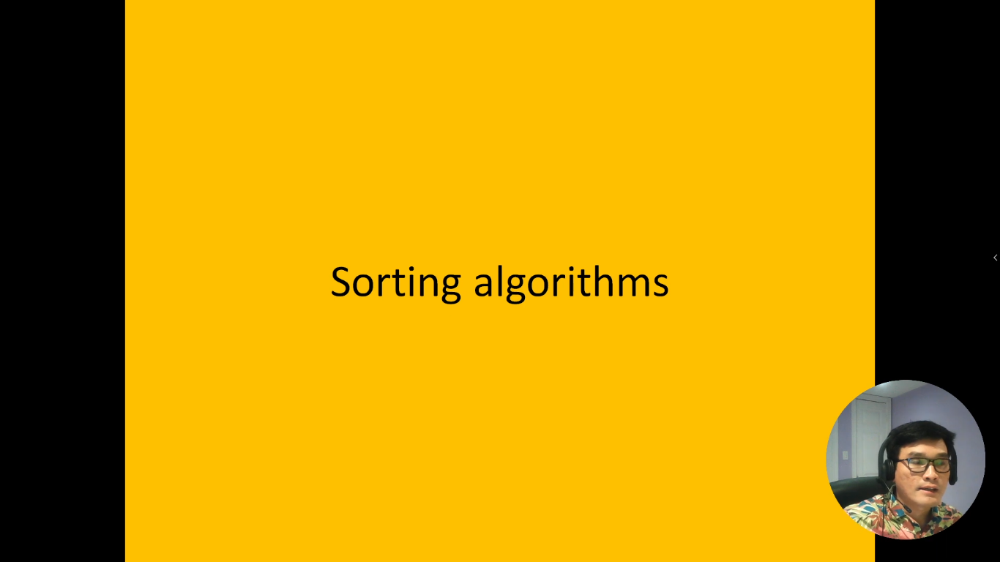
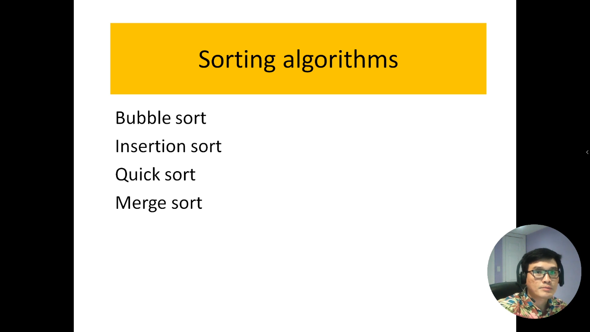
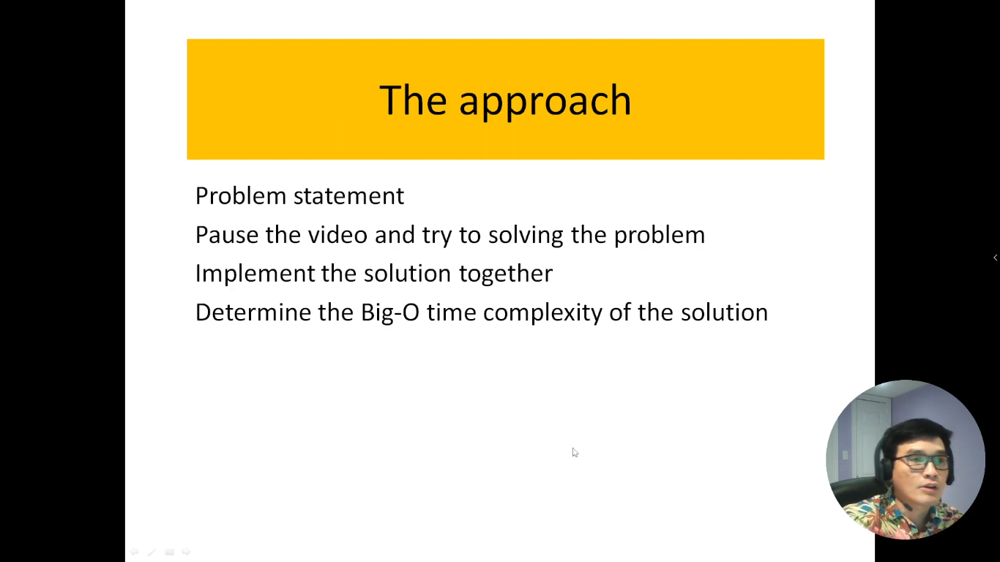

# 18. Thuật toán sắp xếp.

Trong lĩnh vực khoa học máy tính, sắp xếp là một phần quan trọng của việc xử lý và quản lý dữ liệu. Có nhiều thuật toán sắp xếp khác nhau, và trong phạm vi này, chúng ta sẽ giới thiệu bốn trong số những thuật toán sắp xếp quan trọng nhất: Bubble Sort, Insertion Sort, Quick Sort và Merge Sort.

Bubble Sort: Bubble Sort là một thuật toán sắp xếp đơn giản và dễ hiểu. Nó hoạt động bằng cách so sánh cặp phần tử liền kề trong danh sách và hoán đổi chúng nếu chúng không được sắp xếp đúng thứ tự. Quá trình này lặp lại cho đến khi danh sách được sắp xếp hoàn toàn. Tuy Bubble Sort có độ phức tạp thời gian là O(n^2) trong trường hợp xấu nhất, nó thường không được sử dụng trong các tập dữ liệu lớn.

Insertion Sort: Insertion Sort là một thuật toán sắp xếp khác dựa trên việc chèn phần tử từ danh sách chưa sắp xếp vào danh sách đã sắp xếp. Nó hoạt động bằng cách chọn một phần tử từ danh sách chưa sắp xếp và chèn nó vào đúng vị trí trong danh sách đã sắp xếp. Insertion Sort có độ phức tạp thời gian là O(n^2) trong trường hợp xấu nhất, nhưng nó có thể hiệu quả với các danh sách nhỏ hoặc đã gần sắp xếp.

Quick Sort: Quick Sort là một thuật toán sắp xếp nhanh và hiệu quả dựa trên việc chia danh sách thành các phần nhỏ và sắp xếp riêng rẽ chúng. Nó hoạt động bằng cách chọn một phần tử gọi là "pivot" và sắp xếp các phần tử nhỏ hơn pivot vào bên trái và các phần tử lớn hơn pivot vào bên phải. Quá trình này được lặp lại cho cả hai nửa danh sách. Quick Sort có độ phức tạp thời gian trung bình là O(n log n), nhưng có thể dẫn đến độ phức tạp là O(n^2) trong trường hợp xấu nhất.

Merge Sort: Merge Sort là một thuật toán sắp xếp được xây dựng trên việc chia danh sách thành các phần nhỏ, sắp xếp riêng rẽ chúng và sau đó trộn (merge) các phần đã sắp xếp lại với nhau. Nó có độ phức tạp thời gian là O(n log n) trong tất cả các trường hợp, làm cho nó hiệu quả và ổn định. Merge Sort thường được ưa chuộng trong việc sắp xếp danh sách lớn.

Các thuật toán sắp xếp này có ưu điểm và hạn chế riêng, và lựa chọn thuật toán phụ thuộc vào tình huống cụ thể và cấu trúc dữ liệu của bạn. Chúng thường là một phần quan trọng trong học thuật toán và xử lý dữ liệu.

---

- Có 4 thuật toán quan trọng và được sử dụng nhiều nhất
  - `Bubble sort`: sắp xếp nổi bọt
  - `Insertion sort`: sắp xếp chèn
  - `Quick sort`: sắp xếp nhanh
  - `Merge sort`: sắp xếp trộn

