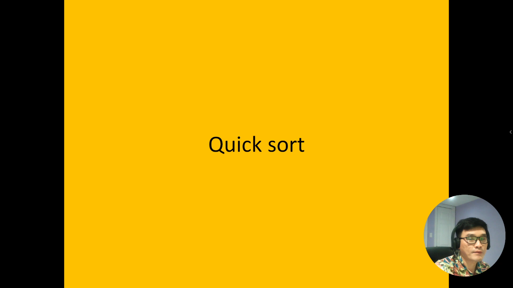
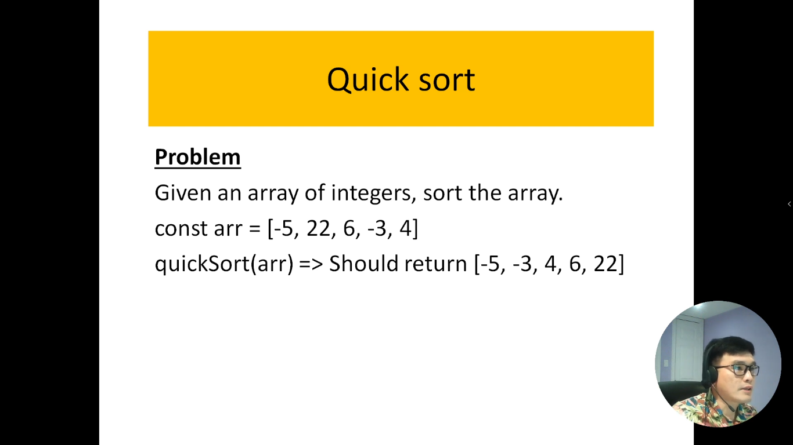
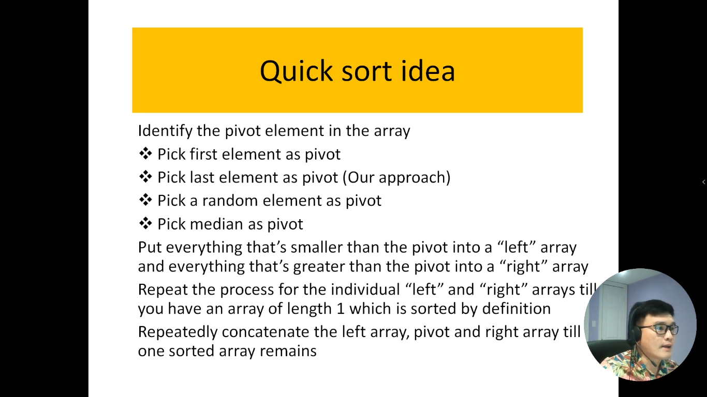
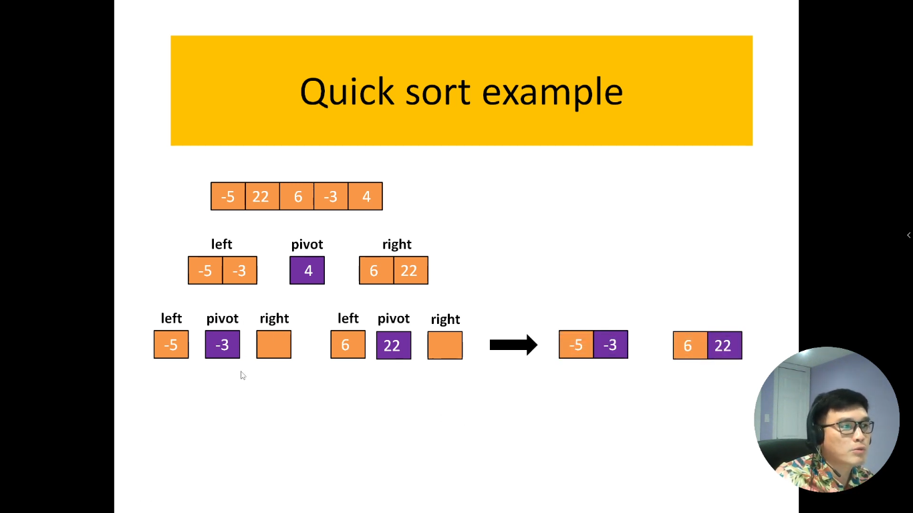
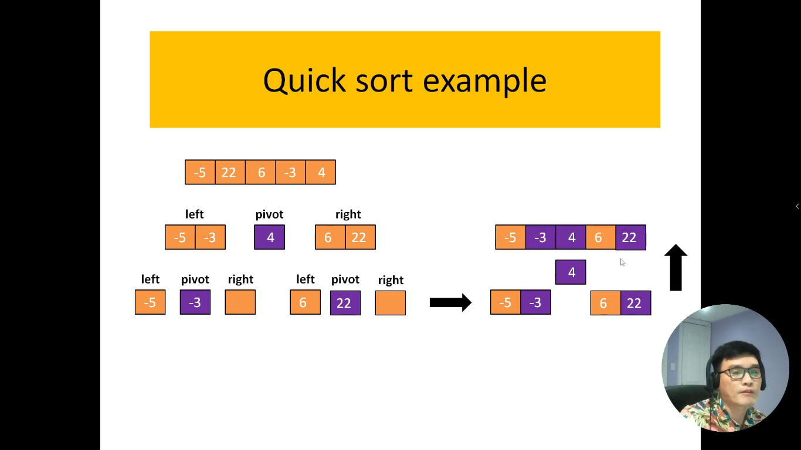

# 21. Thuật toán sắp xếp nhanh trong JavaScript.

Sắp xếp Nhanh, hay QuickSort, là một thuật toán sắp xếp hiệu quả được biết đến với khả năng thực hiện nhanh chóng trên các tập dữ liệu lớn. Được phát triển bởi Tony Hoare vào năm 1960, QuickSort sử dụng chiến lược chia để trị để tạo ra sự sắp xếp một cách hiệu quả.

Thuật toán QuickSort hoạt động dựa trên các bước cơ bản sau:

Chọn Phần Tử Chốt (Pivot): Một phần tử được chọn từ dãy số để làm phần tử chốt. Lựa chọn này có thể ảnh hưởng đáng kể đến hiệu suất của thuật toán.

Phân Chia Dãy Số: Dãy số được phân chia thành hai phần, một phần chứa các phần tử nhỏ hơn hoặc bằng phần tử chốt và một phần chứa các phần tử lớn hơn.

Sắp Xếp Đệ Quy: Quá trình sắp xếp lại được áp dụng đệ quy cho cả hai phần đã được phân chia. Bước này lặp lại cho đến khi dãy số được sắp xếp hoàn toàn.

QuickSort thường được ưa chuộng vì hiệu suất tốt nhất trong nhiều trường hợp, đặc biệt là trên các tập dữ liệu lớn. Tuy nhiên, hiệu suất của nó có thể bị ảnh hưởng nếu phần tử chốt được chọn không phù hợp. Nếu được triển khai đúng cách, QuickSort là một lựa chọn mạnh mẽ trong việc giải quyết vấn đề sắp xếp.

---

Ý tưởng khi làm thuật toán `Quick Sort`

Đây là code flow của thuật toán

Sau khi kết hợp 2 bên trái và phải xong thì chúng ta chèn số `pivot`(số cuối cùng) vào ở giữa. Như vậy là chúng ta được mảng đã sắp xếp

---

# Xác định độ phức tạp thời gian (time-complexity)

1. Trường hợp tồi tệ nhất:

- Độ phức tạp tồi tệ (`worse case`) nhất của thuật toán là khi cái mảng của mình được sắp xếp và chia thành 2 mảng mới khác nhau

- 👉 sau đó nó gộp 2 mảng lại với nhau thì nó có độ phức tạp thời gian là: `O(n^2)`

2. Trường hợp trung bình:

- Độ phức tạp trung bình (`Average case`) nhất của thuật toán là khi cái thuật toán của mình chạy hàm đệ quy và nó chia cái mảng của mình thành 2 cái (đó là bên trái và bên phải) --> kiểu đó giống như là cái mảng nó giảm 1 nửa và nó kết hợp với 1 vòng lặp nữa là vòng lặp for (mà có 1 vòng lặp for thì đó là hàm tuyến tính)

- 👉 Từ đó suy ra ta có độ phức tạp thời gian là: `O(nLog(n))`
