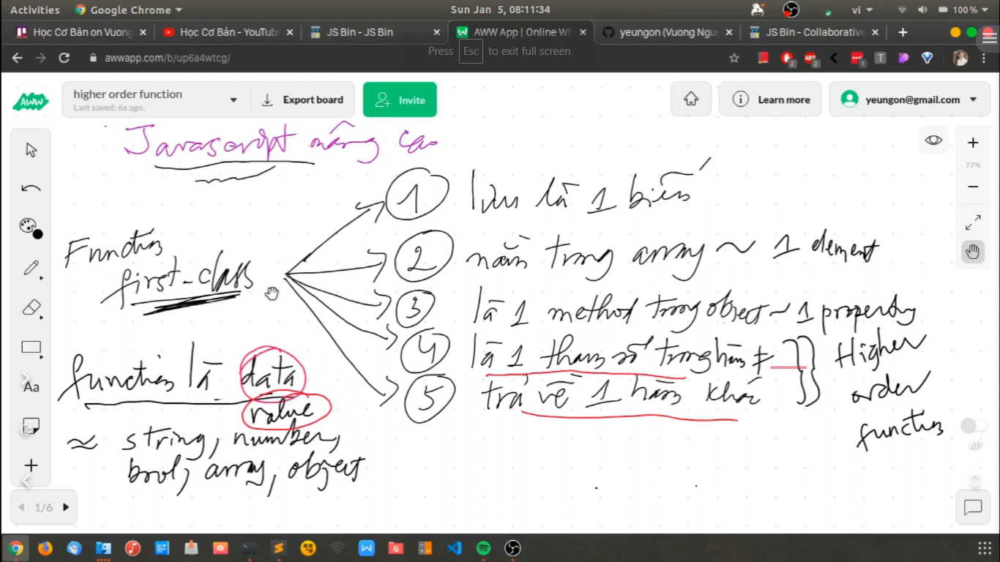
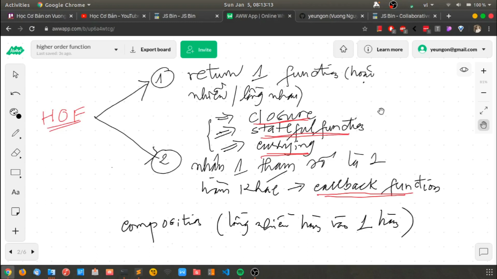
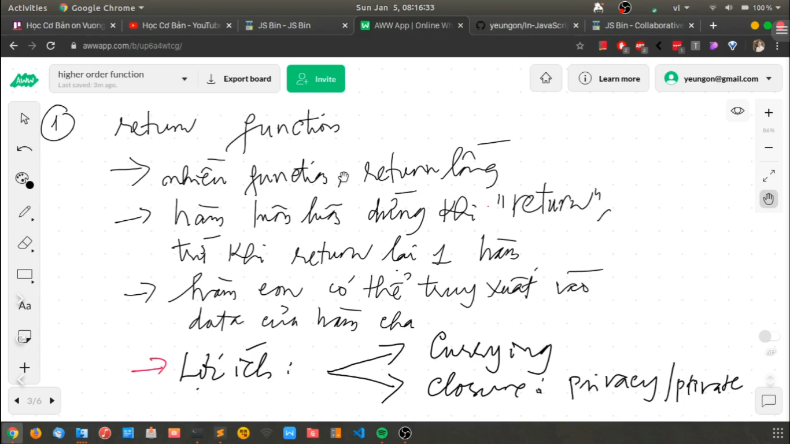
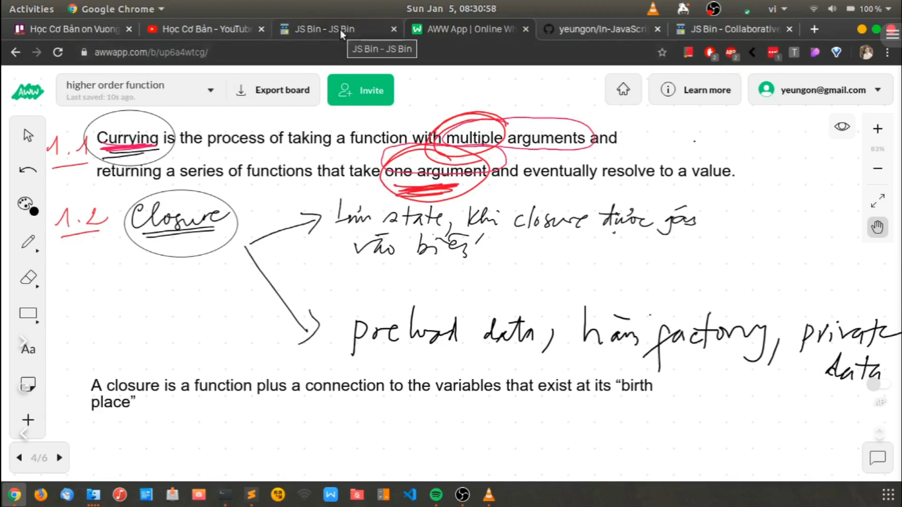
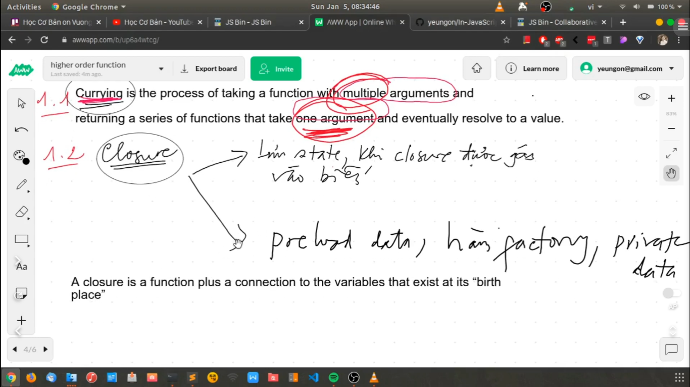
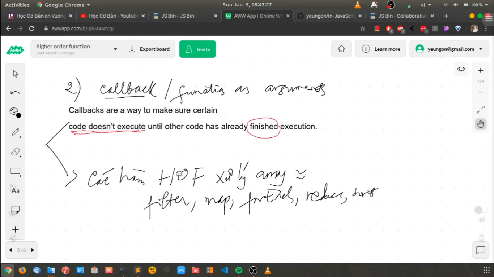

# [JavaScript chuyên sâu] - Higher order function - phần 2: closure, currying, callback

Higher order function (HOF) trong JavaScript là khái niệm then chốt, từ đó ta hiểu được các khái niệm quen dùng như closure, currying function, callback và cách xử lý bất đồng bộ.

Currying function giúp ta viết hàm nhiều tham số thành nhiều hàm một tham số, dựa trên nền tảng của HOF. HOF giúp ta tạo các hàm cho phép lưu biến private, tạo hàm là factory hoặc preload data.

---

- Trong functional programming chúng ta biết rằng function là dạng first-class. Cũng giống như function là dạng data, value, hoặc string, number, boolean, any, object.

- Function mà dạng first-class thì nó có 5 đặc điểm sau mà cái hàm được coi là dạng data hoặc value:
  - hàm của chúng ta nó có thể lưu vào 1 cái biến
  - chúng ta có thể khai báo 1 cái array và đưa cái hàm vào và chúng ta truy xuất vào cái array này và chúng ta có thể gọi cái hàm này như bình thường
  - chúng ta có thể viết 1 cái object và chúng ta viết 1 cái hàm, hàm đấy là 1 property của object và nó được coi là 1 cái phương thức của object đó
  - cái thứ 4 và 5 là hai cái đặc tính mà nó khiến cho chúng ta coi nó là 1 dạng Higher Order Function. Bởi vì thứ nhất là nó được coi là tham số trong hàm khác và đồng thời khi chúng ta viết cái hàm thì hàm này nó có thể trả về 1 hàm khác

---

- Thứ nhất: Có 2 điều mà chúng ta học trong video này là: 1 cái hàm nó trả về 1 cái hàm khác hoặc lồng nhiều hàm vào nhau
- Thứ hai: Truyền 1 hàm vào hàm khác với 1 tư cách là một tham số, lúc này chúng ta quan tâm đến callback function và khái niệm composition (có nghĩa là lồng nhiều hàm vào 1 hàm). Chúng ta có thể viết hàm lồng nhiều hàm khác vào 1 hàm

---

- return function có nghĩa là:

  - có nhiều function, nó sẽ return về các function lồng nhau
  - hàm nó luôn luôn dừng lại khi chúng ta dùng từ khóa 'return'. Nhưng mà hàm sẽ không bao giờ dừng lại khi mà chúng ta return lại 1 hàm khác (chuyện này nó rất quan trọng, nên chú ý)
  - hàm con có thể truy xuất vào data của hàm cha
  - lợi ích của điều này thì chúng ta có 2 cái: currying và closure (privacy/private)

- Bây giờ chúng ta sẽ nói về tác dụng của hàm này: thế nào là Currying Function và làm thế nào để chúng ta tạo biến private

- Currying function: thay vì chúng ta viết 1 cái hàm có nhiều tham số, thay vào đó chúng ta viết nhiều hàm nhưng có 1 tham số
  

- Thế nào là closure? Closure là một dạng Higher Order Function mà nó được gán vào 1 cái biến. Mỗi khi chúng ta gọi cái biến này, tức là chúng ta đang gọi cái hàm Higher Order Function đấy và nó sẽ trả lại cho chúng ta 1 closure.
- Cái biến mà chúng ta khai báo đó thì nó không có khả năng truy xuất trực tiếp vào trong data. Nhưng nhờ vào closure thì nó khả năng làm được cái việc đấy. Thì đó là khái niệm, nhưng chúng ta nên tìm hiểu thêm các ví dụ về nó để hiểu hơn.
  

- Tóm lại Closure là 1 dạng Higher Order Function mà khi chúng ta gán nó vào 1 biến, và chúng ta dùng cái biến này để truy xuất vào data của cái closure đó. Các bạn có thể hiểu là 1 cái hàm con mà có thể truy xuất data của hàm cha

- Như trong ví dụ của chúng ta code bên file `script.js`, ta có biến `myMoney` của hàm `xem` và có thể truy xuất data bên ngoài của hàm cha `taikhoan`

---

Một vấn đề nữa rất là quan trọng trong Higher Order Function đó là callback

- Chúng ta có thể hiểu là ta truyền 1 hàm vào trong cái hàm khác nó được đóng vai trò như là 1 tham số
- Tại sao nó lại quan trọng? Nhờ có nó mà JavaScript xử lý được các tác vụ bất đồng bộ (`asynchonous`), như chúng ta xử lý tác vụ đồng bộ.
- Chúng ta còn có các hàm Higher Order Function để xử lý array như là: `filter`, `map`, `forEach`, `reduce`, `sort`. Những hàm này rất quan trọng, nó giúp cho chúng ta xử lý data, thay đổi, xóa sửa data liên quan đến array mà không cần phải loop nó

---
