# [JavaScript chuyên sâu] - So sánh Constructor Function và Factory Function

Đây là hai trong số các cách tạo ra object trong javascript. Vậy sự khác nhau giữa Constructor Function và Factory Function là gì? Chúng ta cũng sẽ review lại Closure trong JavaScript.

Tìm hiểu về Higher Order Function và Closure: `Video 02`

---

- Constructor Function và Factory Function là 2 cái rất là quan trọng trong JavaScript nó giúp cho chúng ta tạo ra các object giống nhau. Và các object này nó có data riêng, nó có vùng hoạt động riêng, nó cũng có thể được coi là statefull function. Chúng ta có thể hiểu nó là những cái object có data riêng

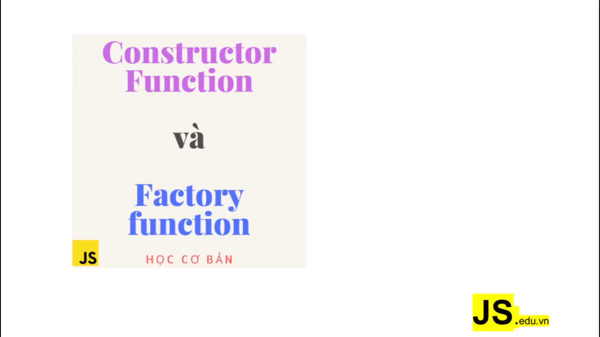

---

Những cách tạo 1 object

- Khởi tạo biến x và gán cho nó 1 cái object rỗng. Được gọi là `literal`
  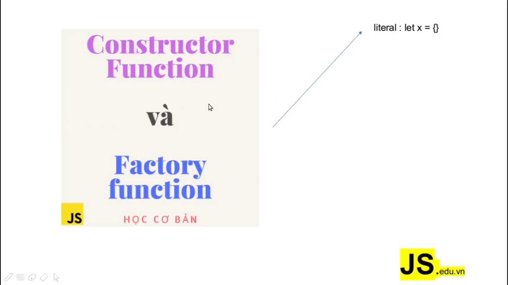

- Khai báo 1 biến và khởi tạo bằng cách sử dụng từ khóa `new Object` (cách này nhiều người khuyên không nên sử dụng)
  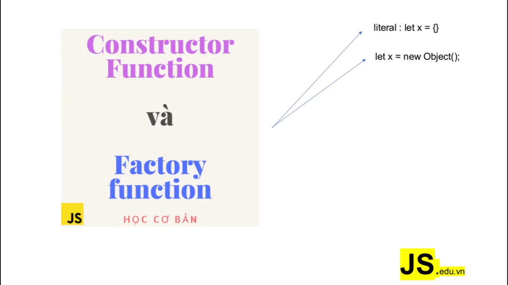

- Một cách nữa, cách này nhiều người cũng hay dùng. Cách này người ta có nhu cầu sao chép 1 cái object từ 1 cái object đã có trước đó. Chẳng hạn như ở đây chúng ta có object `x` (cách 1), bây giờ người ta tạo ra 1 cái object `y`, nó giống như object `x` thì người ta dùng cách này (`Object.create(x)`)
  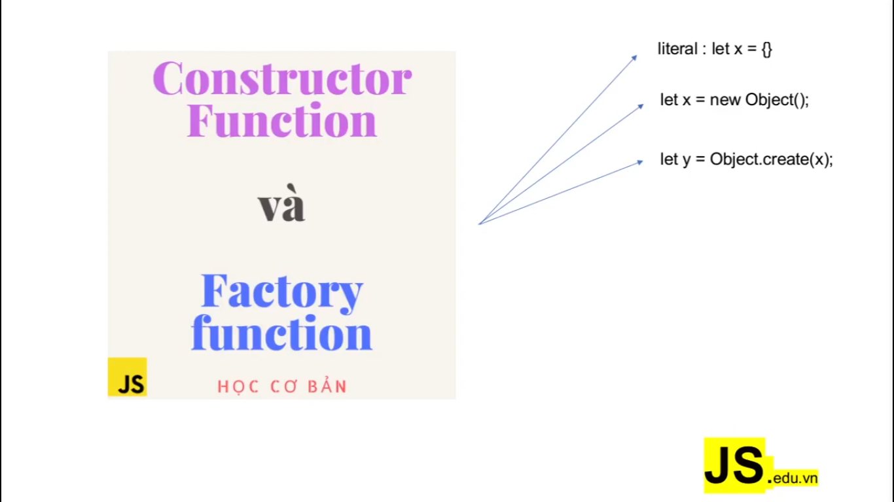

- Ngoài ra chúng ta vẫn còn có 1 vài cách khác để tạo ra object (3 cách sau)
  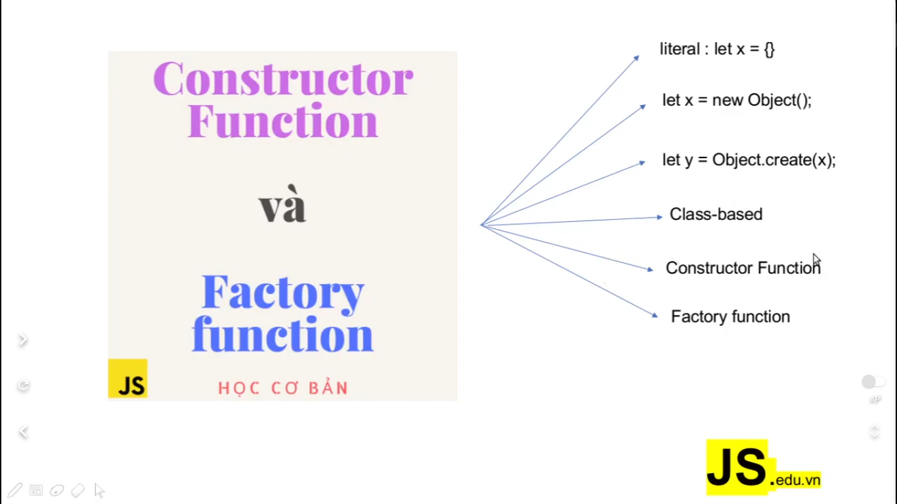

- 3 cách đầu thì giúp cho chúng ta tạo ra những object đơn lẻ thôi
- còn 3 cách sau thì nó giúp chúng ta tạo ra hàng loạt các object. Đây là cách mà chúng ta vẫn hay dùng object có dữ liệu hoặc cấu trúc khác nhau. Dĩ nhiên nó sẽ khác nhau nếu chúng ta truyền vào các tham số

---

- Đây là cách mà JavaScript nó thiết kế ra để chúng ta tạo ra hàng loạt các object mà có thể nói đây là cái cách mà chúng ta viết JavaScript theo cái tư duy của `hướng đối tượng` (OOP)
- Ở đây, chúng ta sẽ không nói về `class-based`, vì nó là theo kiểu ES6, thực ra nó cũng là cái dạng `single-syntax`, nó giúp cho chúng ta viết cái dạng `class`
- Tóm lại `Constructor Function` và `Factory Function` nó rất quan trọng. Trong video này chúng ta sẽ tìm hiểu về vấn đề này

---

# Constructor Function

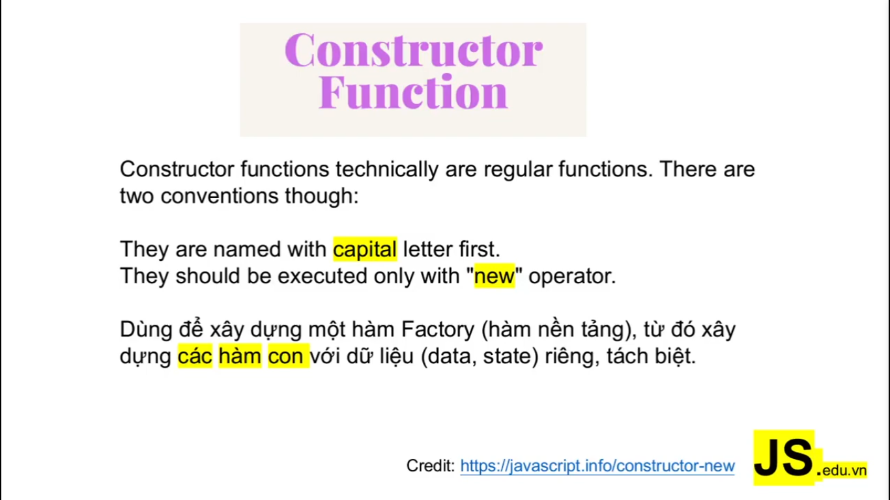

- Nó là các hàm thông thường thôi. Thay thì chúng ta viết tên của hàm bằng chữ thường, thì qua cách này thì chúng ta phải viết chữ cái đầu tiên là phải viết hoa (`capital`)
- Thay vì chúng ta gọi hàm và truyền vào tham số luôn thì cách này lại làm: tạo ra các object từ function này, nói chung là không gọi trực tiếp, mà chúng ta sẽ dùng cái từ khóa là `new`

👉 Credit: [Constructor-new](https://javascript.info/constructor-new)

- Nó có thể tạo 1 hàm mà trong đó nó có các object con và có data riêng biệt

- **Lưu ý:** Trong Reactjs khi sử dụng hook thì bây giờ người ta chuyển qua dùng `function` hết rồi thay vì sử dụng dạng `class`

- Về cơ bản thì JavaScript là `function`, còn class thì nó chỉ là dạng `single-syntax`. Chúng ta viết dạng class cũng như giống với các ngôn ngữ khác như là Java, PHP

- Về kiểu `Constructor Function` này thì nó rất là hay như là chúng ta có thể gắn cho nó 1 cái `function` mới hoặc `property` mới tại trong hàm constructor

---

# Factory Function

- Bây giờ chúng ta nói về `Factory Function`, mà trong cái này thì nó cũng liên quan đến `Closure` (nếu các bạn không nhớ Closure thì có thể ôn lại)
  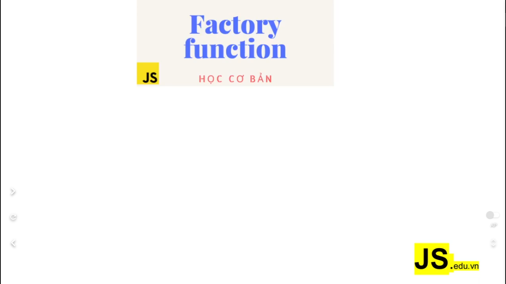

- Về cơ bản thì nó là dạng `statefull function`, nó là dạng function. Nó có khả năng truy cập vào data hay là state của các biến outer (bên ngoài function, hay còn gọi là biến cha). Nhờ đó nó có thể tạo nên `Factory Function` mà nó chứa các state của từng vùng hoạt động một.

- Đây là khái niệm về `Factory Function`:
  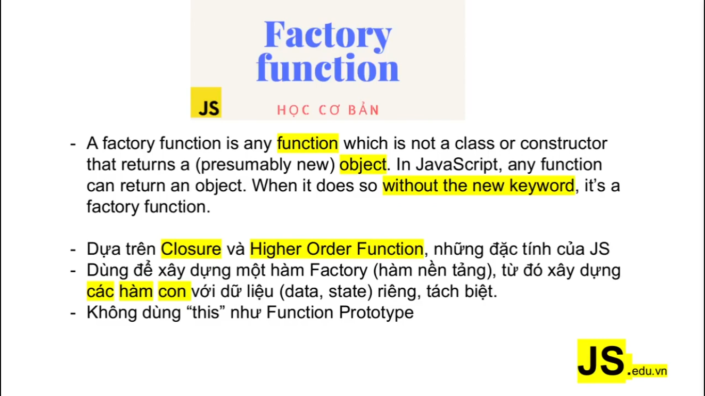

- Nếu như ở trong `Constructor Function` thì chúng ta sử dụng từ khóa `new` để tạo 1 object mới. Thì ở `Factory Function` chúng ta không sử dụng từ khóa `new` và nếu như `Constructor Function` không dựa trên `Closure` và `HOF` thì `Factory Function` nó dựa trên `Closure` và `HOF`. Vì `HOF` nó là đặc thù của JavaScript, có nghĩa là nó có thể truyền 1 tham số vào 1 hàm khác, và nó có khả năng return về 1 hàm hoặc return về nhiều hàm lồng nhau (nested function)

- Nếu như `Constructor Function` chúng ta sử dụng từ khóa `this`, thì bên `Factory Function` chúng ta không cần dùng

- Lưu ý rằng, `Factory Function` cũng chính là nền tảng để chúng ta tạo nên các object mà nó chứa các giá trị khác nhau, state khác nhau, khi chúng ta truyền vào các tham số khác nhau

---

# So sánh `Constructor Function` và `Factory Function`

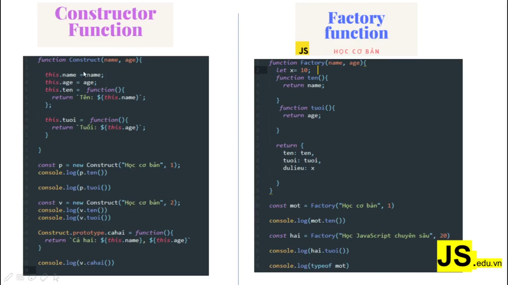

---

# Tham khảo thêm

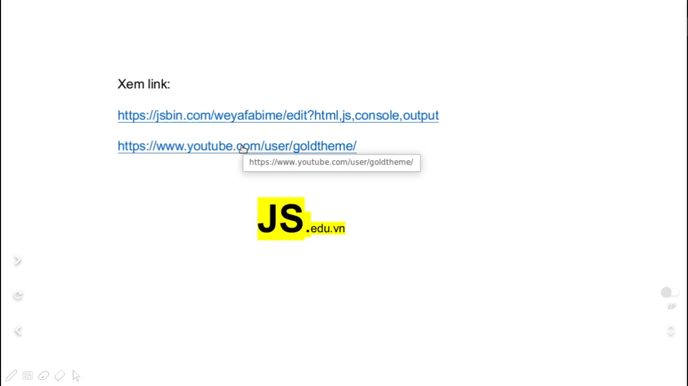

---

# Những bình luận trong video hữu ích

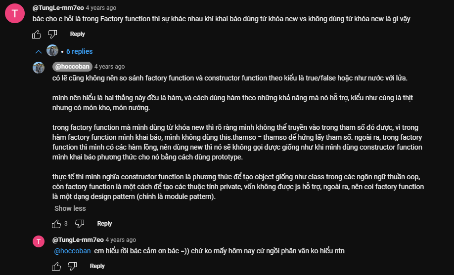

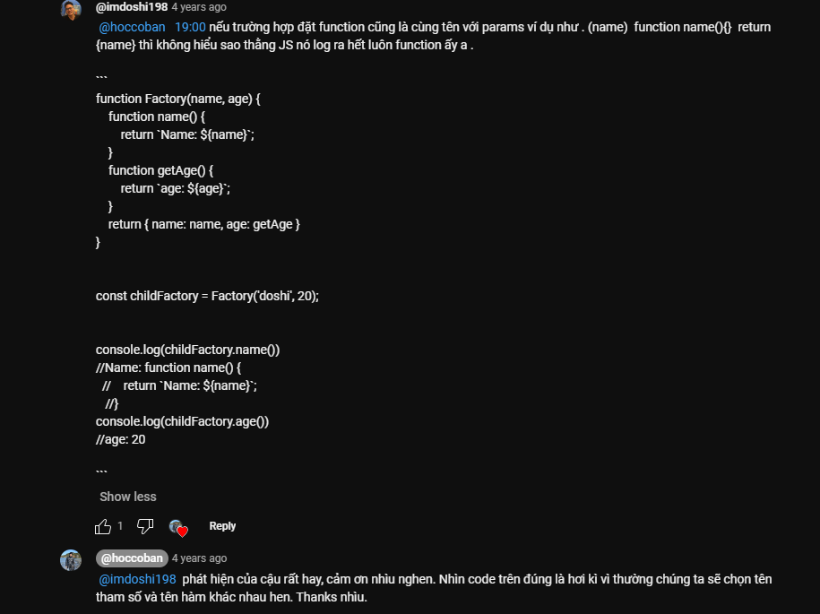
