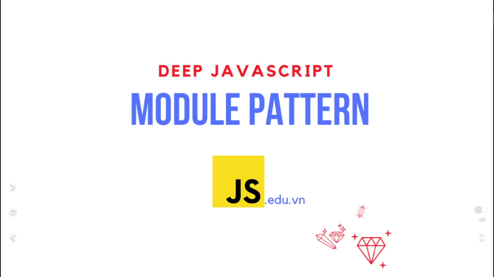
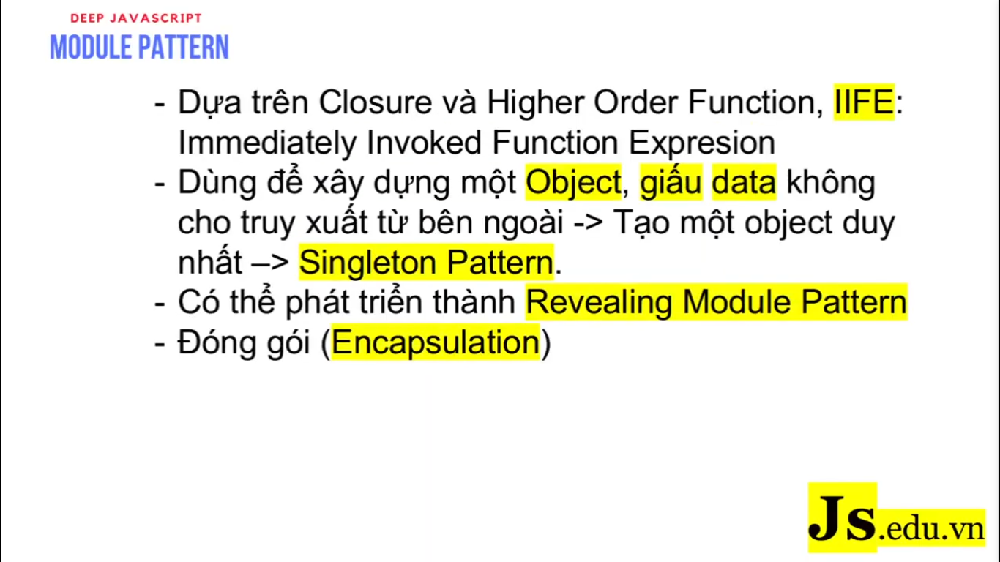
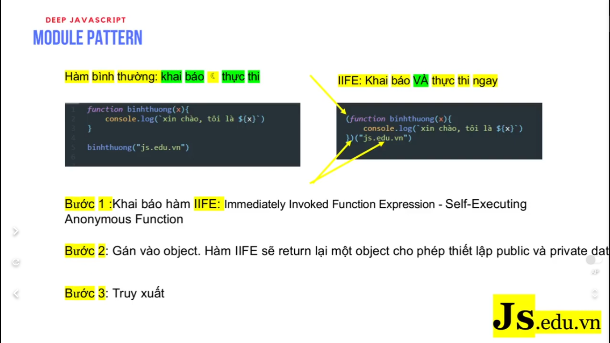
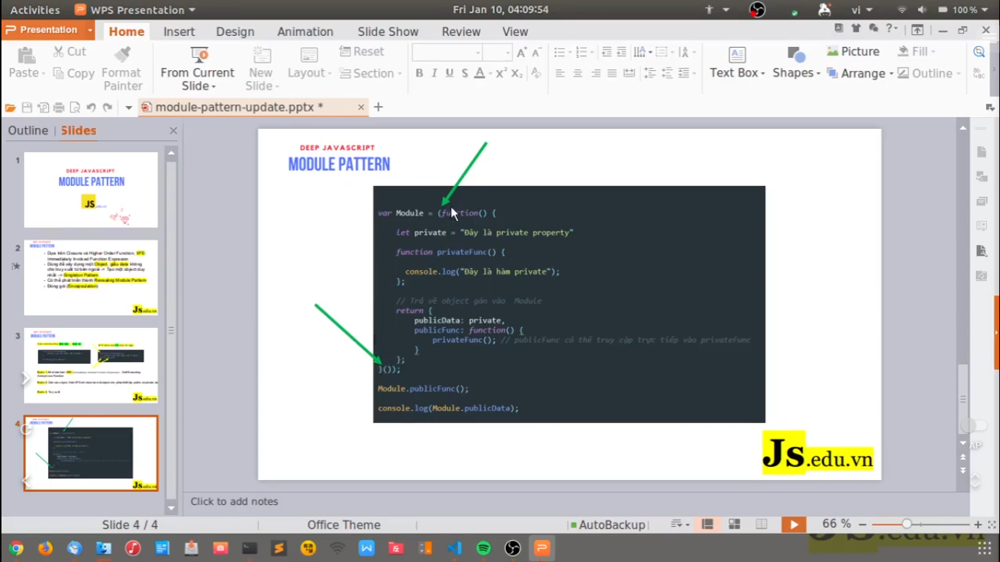

# [JavaScript chuyên sâu]: Từ hàm IIFE tới Module Pattern

Tìm hiểu Closure và Higher Order Function, chúng ta sẽ tìm hiểu ứng dụng các đặc tả này của JavaScript để thiết kế Module Pattern. Đây là một mẫu thiết kế được dùng rất phổ biến của JavaScript, nhất là jQuery.

---

- `Module Pattern` nó dựa vào `Closure` và `Higher Order Function`. Hai khái niệm đó thì nó rất quan trọng và nó cũng là nền tảng trong JavaScript. Bởi vì trong JavaScript hầu hết nó là function, nó dựa vào function thế nên là chúng ta cần hiểu 2 khái niệm này. Hiểu được vì sao mà JavaScript nó lại dựa vào function để nó thiết kế hình thức hướng đối tượng

- Để hiểu được `Module Pattern` này thì chúng ta cũng cần phải hiểu được `IIFE` (Immediately Invoked Function Expression). `IIFE` nó là cái hàm mà nó có khả năng khởi tạo và thực thi cùng lúc

- Tác dụng của `Module Pattern` này là nó giúp cho chúng ta có thể giấu được data của chúng ta, tạo các private data.

- Nếu như người ta có hỏi làm thế nào để chúng ta tạo được `private property` và `private method` ở trong JavaScript thì chúng ta sẽ hình dung là trong JavaScript không có kiểu `class-base` giống như là PHP biến được property hoặc là biến `private method`. Thì trong JavaScript này chúng ta sẽ sử dụng function và hạn chế của ngôn ngữ này nó sẽ tạo nên cái hình thức pattern thiết kế mà nó giúp cho ngôn ngữ linh hoạt hơn.

- Pattern này cũng chính là cơ sở để người ta xây dựng nên `Singleton Pattern`, trong đó nó chỉ có 1 cái object được khởi tạo mà thôi.

- Cũng từ Pattern này mà người ta xây dựng nên `Revealing Module Pattern`.

- Pattern này nó cũng minh họa cho cái tính chất `Encapsulation` (đóng gói)

---

Thì đầu tiên chúng ta muốn biết được Module Pattern này thì chúng ta phải biết được hàm khởi tạo và hàm thực thi cùng lúc (đó là IIFE)

- Code bên tay trái: chúng ta khai báo hàm và thực thi hàm như bình thường
- Code bên tay phải: chúng ta sử dụng phương pháp IIFE. Trong đó nó sử dụng 2 dấu ngoặc. 1 dấu là bọc lại toàn bộ hàm khai báo, 1 dấu còn lại là thực thi hàm

---

# Tham khảo thêm

---

- Ở đây chúng ta cũng có nói về Closure. Đây là khái niệm tương đối khó trong JavaScript, nhưng mà nó chỉ khác 1 chút so với những ngono ngữ khác thôi
- Vì JavaScript bắt buộc phải dùng những thứ này để có thể tạo nên được các object mà nó có khả năng uyển chuyển, linh hoạt hơn so với những ngôn ngữ khác
