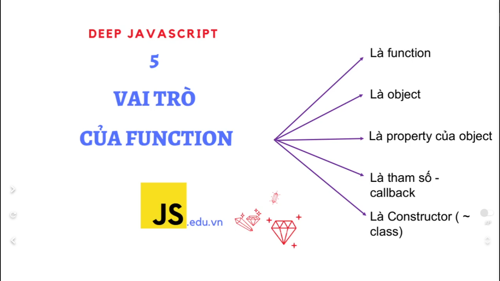
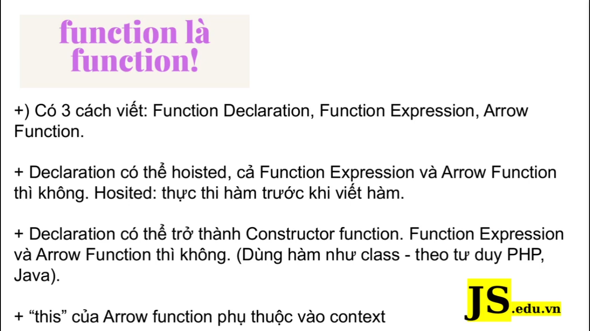
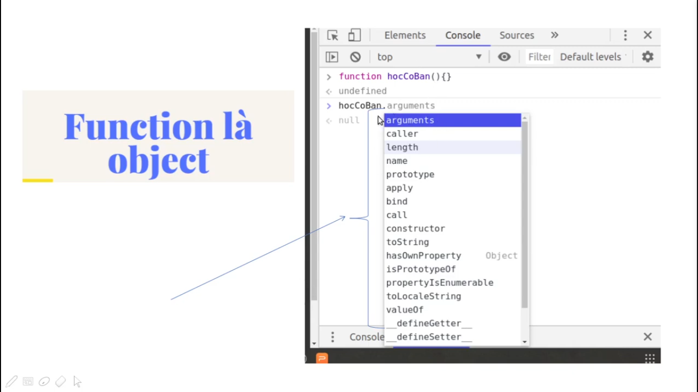
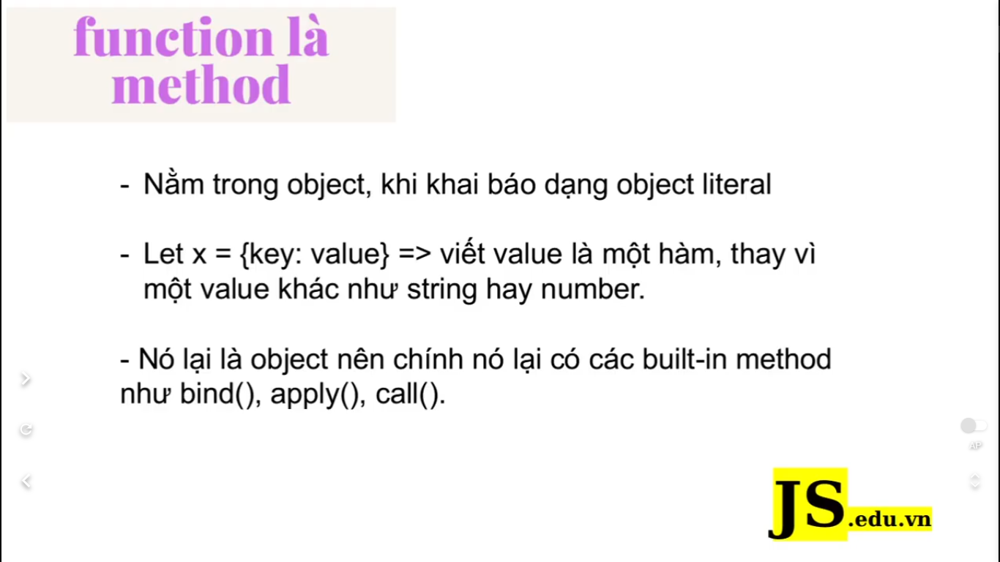
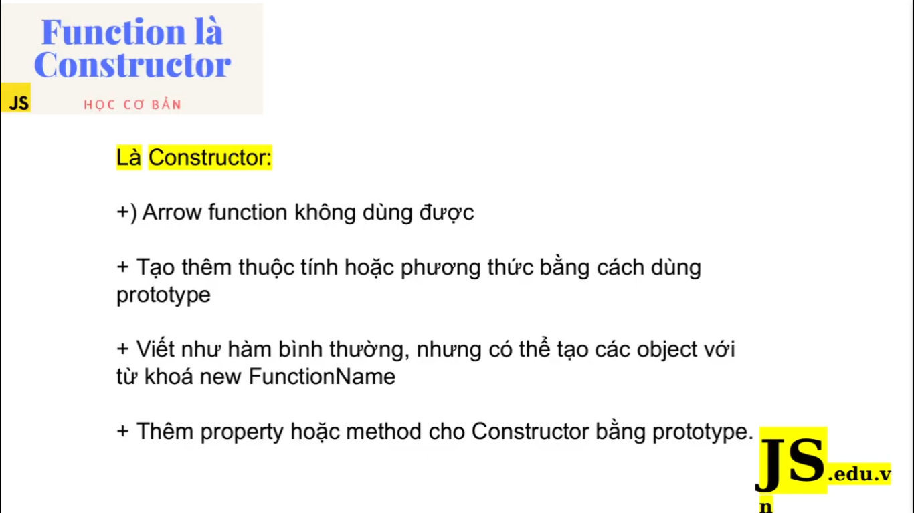
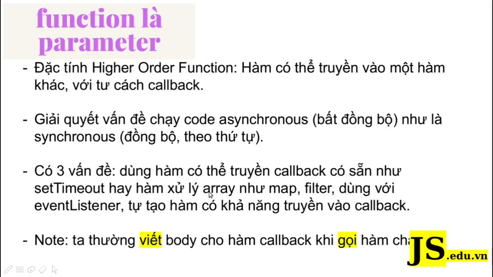
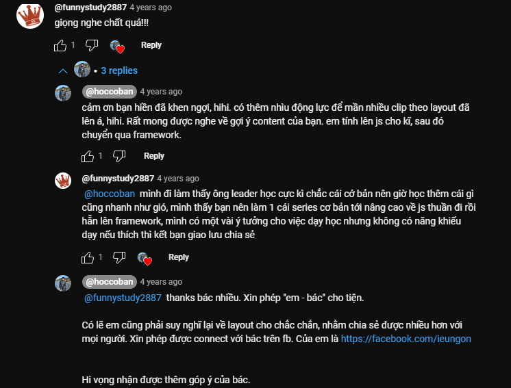
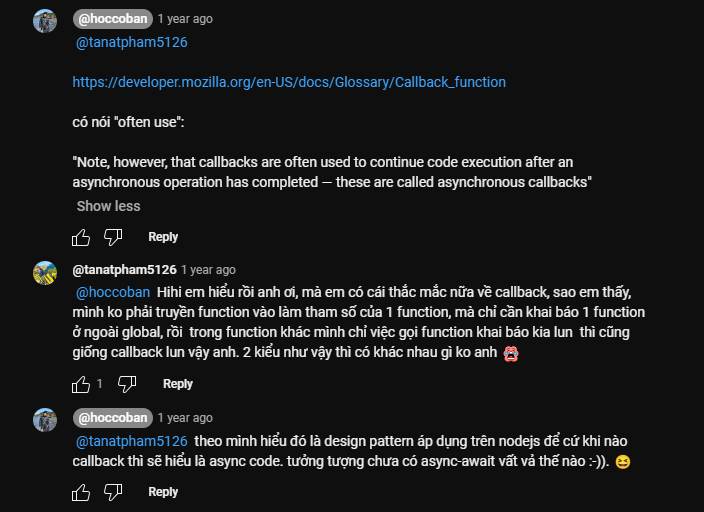
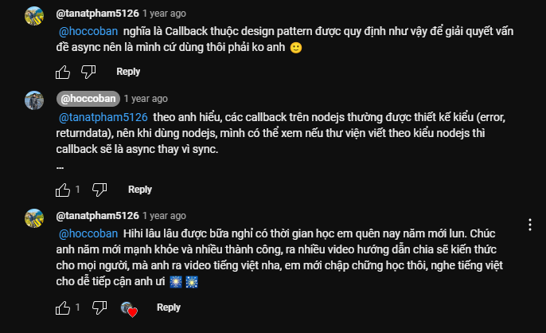

# [JavaScript chuyên sâu] - 5 vai trò của Function: function, object, property, callback, constructor

Hàm là khái niệm trung tâm của JavaScript, một ngôn ngữ theo kiểu functional programming. Hàm trong JavaScipt là data, là first-class, có thể đảm nhiệm vai trò.

Hàm của JavaScript vừa đóng vai trò là hàm bình thường, vừa là một object, một constructor, và có thể truyền vào hàm khác với tư cách một callback. Hàm cũng là method trong object.

---

Những vai trò của function trong JavaScript: gồm có 5 vai trò

# 1. Function là Function

- Có 3 cách viết hàm trong JavaScript: `Function Declaration`, `Function Expression`, `Arrow Function`, thì đó là những cách khác nhau trong JavaScript

- Về cơ bản thì khi chúng ta viết hàm theo kiểu `Declaration` (viết theo kiểu dùng từ khóa function, rồi name function, rồi gọi function), cái kiểu viết đó là kiểu viết theo kiểu truyền thống. Chúng ta có thể gọi hàm, thực thi hàm, mà trước khi mà chúng ta khai báo --> đó người ta gọi là hoisted.

- Còn đối với `Function Expression` và `Arrow Function` thì chúng ta không dùng được kiểu này. `Function Expression` là chúng ta gắn cái function vào 1 cái biến. Và `arrow function` (hàm mũi tên) thì chúng ta sử dụng cái dạng syntax mới trong ES6 để chúng ta có thể viết hàm 1 cách dễ dàng hơn và giúp chúng ta xử lý cái từ khóa `this` 1 cách dễ dàng hơn

- Một điểm chúng ta cần lưu ý là `Declaration Function` cũng có thể trở thành `Constructor Function`. Về cơ bản chúng ta hiểu là `Constructor Function` đóng vai trò như 1 cái class, khi chúng ta tạo các object liên quan từ `Constructor Function` này thì chúng ta dùng từ `new`. Đó là vấn đề mà chúng ta đã học ở các bài trước

---

# 2. Function là object:

- Đây là nội dung tương đối quan trọng, mà chúng ta vẫn hay sai lầm giữa hàm và object

- Thực ta `hàm` nó là một `object`? Vì sao lại nói như vậy. Bất kì khi nào chúng ta viết cái hàm thì chúng ta đều có thuộc tính và những phương thức dụng sẵn. Nghĩa là cái thằng hàm nó luôn luôn có những phương thức và thuộc tính dựng sẵn khi chúng ta viết

- Hãy nhìn vào ví dụ này:
  

  - Khi chúng ta viết cái hàm `hocCoBan` thì bản thân nó đã có sẵn các phương thức, mà các phương thức đó là của `object`

- Giải thích tiếp, vì sao gọi `hàm` là `object`? bởi vì chúng ta có thể thêm thuộc tính cho nó, và chúng ta sẽ gọi nó

---

# 3. Function là property hoặc method của object:

- Chúng ta hay khai báo object theo kiểu `literal object`, vì đó là cách khai báo bình thường. Nó chỉ cần khai báo tên biến và gán cho nó 1 cái object là được.

- Trong object thì dùng từ khóa `key` và `value` (Ví dụ: key là tên của hàm, value thì chúng ta truyền vào đó 1 hàm).

- Thông thường object thì chúng ta không sử dụng `arrow function`

- Chúng ta có thể tách hàm này ta và sử dụng ở object khác, bình thường thì chúng ta sử dụng function được thiết kế riêng ở bên ngoài, function đó không nằm trong object. Thì khi đó chúng ta sẽ sử dụng các method như: `bind()`, `apply()`, `call()` để sử dụng các object từ bên ngoài

---

# 4. Function là Constructor

Chúng ta đã học về `constructor function` và `factory function` (nếu quên thì hãy ôn lại video trước)

---

Hàm trong JavaScript có 1 cái chức năng gọi là `Higher Order Function` (đã học ở những bài trước). Thì hàm trong JavaScript có thể trở thành `parameter` (tham số) của các hàm khác.

Chúng ta hay nghe đến khái niệm đó là `callback hell` trong JavaScript

- Đầu tiên chúng ta phải hiểu rằng là cái Pattern này, người ta thiết kế để có thể xử lý được các tác vụ bất đồng bộ theo cách đồng bộ -> để ta có thể lấy được các kết quả mà chúng ta mong muốn. Bởi vì cái JavaScript là đơn luồng (single thread) nên không thể xử lý các tác vụ lâu hoặc là các tác vụ tốn thời gian thì nó sẽ bị chặn lại. Thì khi đó chúng ta bắt buộc phải dùng cái cách giải quyết bất đồng bộ để xử lý vấn đề đó

- Có 3 vấn đề về `callback` khi chúng ta sử dụng trong code:

  - Chúng ta sẽ có những hàm sử dụng để thực hiện bất đồng bộ, method tiêu biểu nhất là `setTimeout`. Khi chúng ta sử dụng `setTimeout` thì các code trong đó sẽ chạy sau, sau 1 thời gian nhất định.

  - Chúng ta cần phải hiểu được cách xử lý các `event`. Như là khi click vào cái nút nào đó thì cái chức năng đó sẽ thực hiện sau

  - Thứ 3 là nhiều người cảm thấy khó hiểu bởi vì cái cách mà chúng ta viết callback như thế nào. Khi chúng ta viết callback ấy, viết body của callback ấy thì thường là chúng ta sẽ gọi hàm cha --> về cơ bản là nó như vậy. Chúng ta sẽ thiết kế hàm cha và truyền vào nó 1 cái callback thì cái body của callback như nào thì chúng ta sẽ viết khi mà chúng ta gọi hàm cha. Body viết sau thì nó giúp chúng ta linh hoạt hơn

---

setTimeout luôn luôn chạy sau cùng

---

# Phần nên học kỹ:

`Callback` là một kiến thức cốt lõi trong javascript, chúng ta nên thuộc nằm lòng các kiến thức này như là:

- Cách nó hoạt động ra sao? hoạt động như thế nào trong code?

---

# Những bình luận hay trong video

Tranh luận về callback

