# [JavaScript chuyên sâu ] - Xử lý bất đồng bộ - phần 2: Event loop trên browser và Nodejs

Phần 2 trong nội dung xử lý đồng bộ và bất đồng bộ của JavaScript trên hai môi trường browser và nodejs. Video mô tả sự giống và khác nhau của cơ chế xử lý bất đồng bộ trên trình duyệt và trên run time xử lý back-end nodejs. Các API khác nhau của Nodejs và đặc thù của browser sẽ giúp chúng ta xử lý các tác vụ tương ứng.

Nội dung của video rất dài và có thể nói, là toàn diện nhất hiện nay về event loop trên browser và nodejs. Những vấn đề phức tạp như các phase của evemt loop trên Nodejs, sự khác biệt giữa tác vụ microtask và tác vụ macrotask sẽ được trình bày đầy đủ cả lí thuyết và ví dụ cụ thể.

Chúng ta sẽ tìm hiểu lí do vì sao JavaScript là ngôn ngữ single-threaded đơn luồng, nhưng lại xử lý rất tốt các tác vụ đa luồng. Bản chất của JavaScript có thể blocking các tác vụ I/O, nhưng nhờ cơ chế xử lý bất đồng bộ, chúng ta dễ dàng scale up nâng cấp mở rộng hệ thống, cân bằng tải (trong trường hợp backend với Nodejs).

---

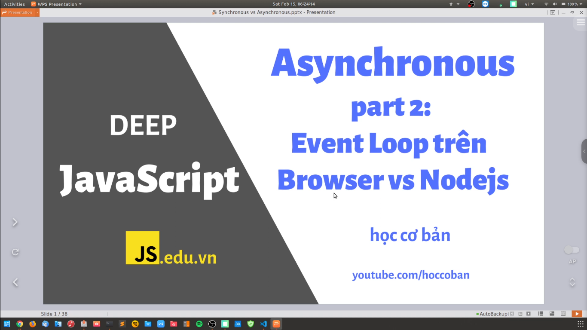
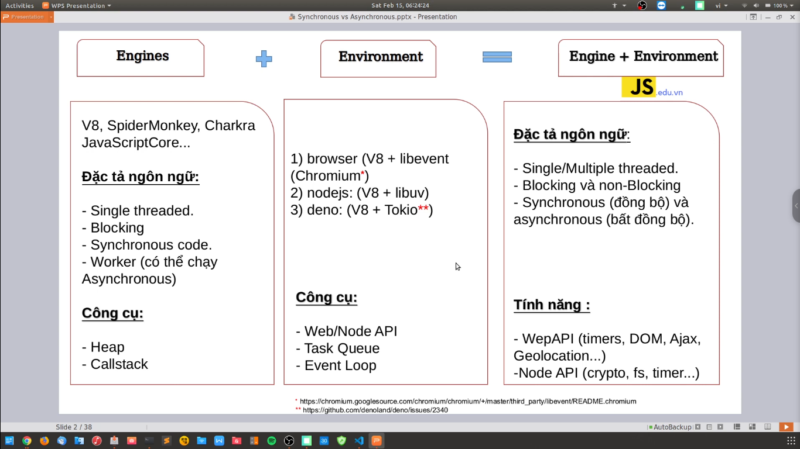

- Về cơ bản thì JavaScript nó không chạy bất đồng bộ được.

- Nếu nó chạy được thì nó phải nhờ vào cái môi trường của nó (`browser`) thì mới có thể chạy được. Môi trường đấy nó sử dụng môi trường `libevent`.

- Còn trên `NodeJS` thì nó sử dụng thư viện `libuv`.

- Còn trên `deno` thì chạy `Tokio`

- **Lưu ý:** NodeJS nó chỉ là môi trường runtime thôi. Ngoài NodeJS thì vẫn còn những môi trường khác

---

# Phân biệt giữa Browser và NodeJS

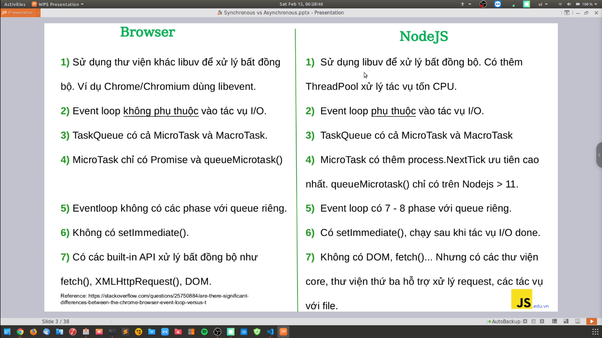

- V8 nó biên dịch mã JavaScript thành mã máy
- Task Queue nó là những hành động, trong đó có: Micro Task, Macro Task

---

# Trong bài này thì chúng ta tập trung vào kiến thức `Event Loop` trong JavaScript

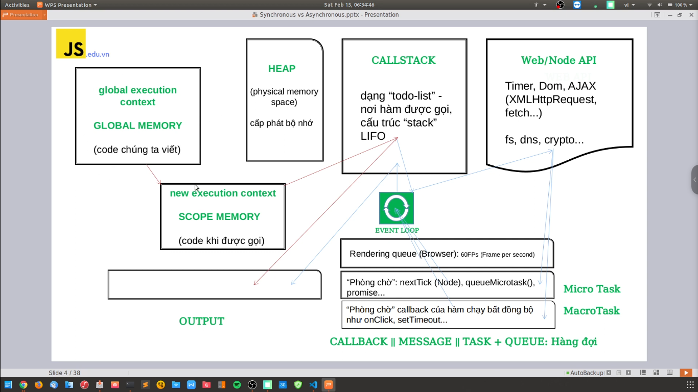

Độ ưu tiên khi có các task trong Web API -> sau khi nó xử lý xong -> và sau đó nó sẽ render ra màn hình cho user

👉 Rendering Queue (Browser) 👉 Micro Task 👉 Macro Task

Về cơ bản thì trong những trường hợp mình gặp thì ít khi gặp trường hợp `Rendering Queue` (Browser). Chúng ta thường xuyên phải xử lý `Micro Task` và `Macro Task` là nhiều nhất

---

# Các ví dụ cơ bản về Event Loop (code đồng bộ và bất đồng bộ)

1. Ví dụ 1

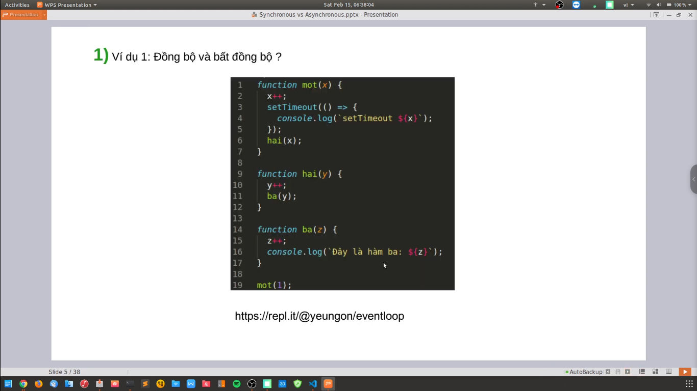

Đây là ví dụ của file `script_1.js`

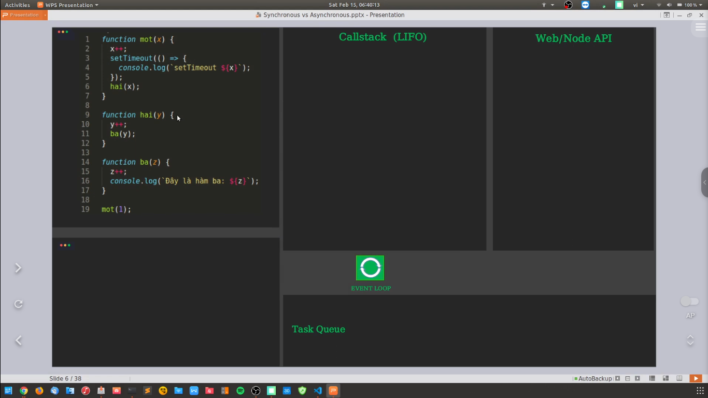

Trong callstack thì nó thực thi theo phương pháp LIFO (Last In First Out -> Vào sau ra trước)

Thì code chạy tới đoạn có setTimeout thì callstack sẽ chuyển nó qua Web API. Khi mà callstack trống (không còn task nào thực thi nữa) thì lúc đó Web API sẽ chuyển setTimeout đó qua bên callstack -> và thực hiện nó.

setTimeout luôn thực hiện cuối cùng

2. Ví dụ 2

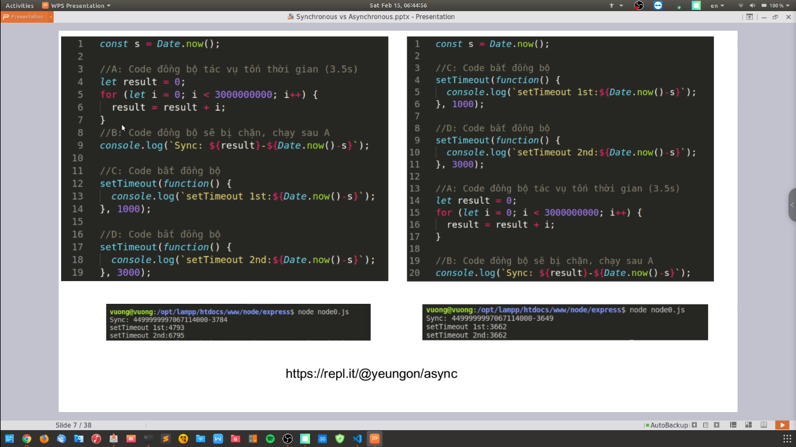

---

# Những bình luận hay trong video

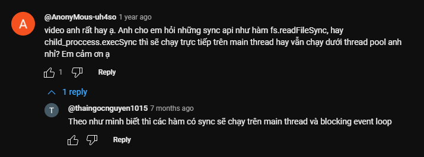

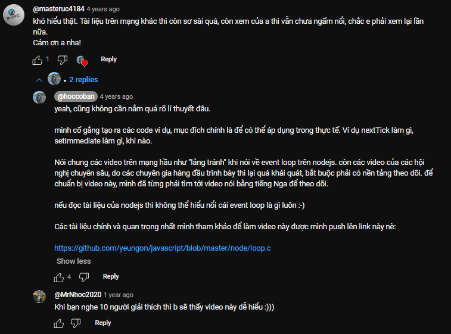
-> Link code trong video tác giả đã xóa code rồi, mình vô không thấy code nữa

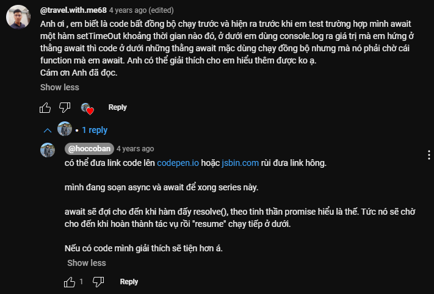
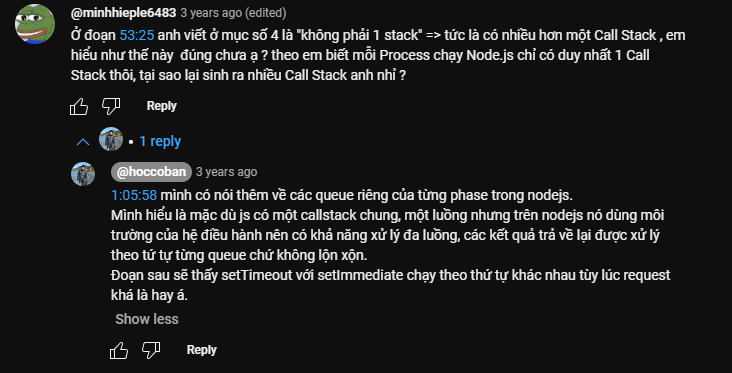
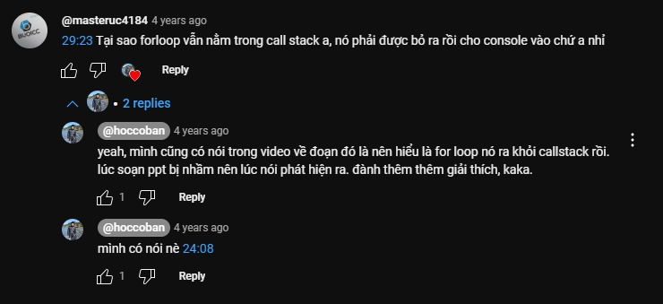
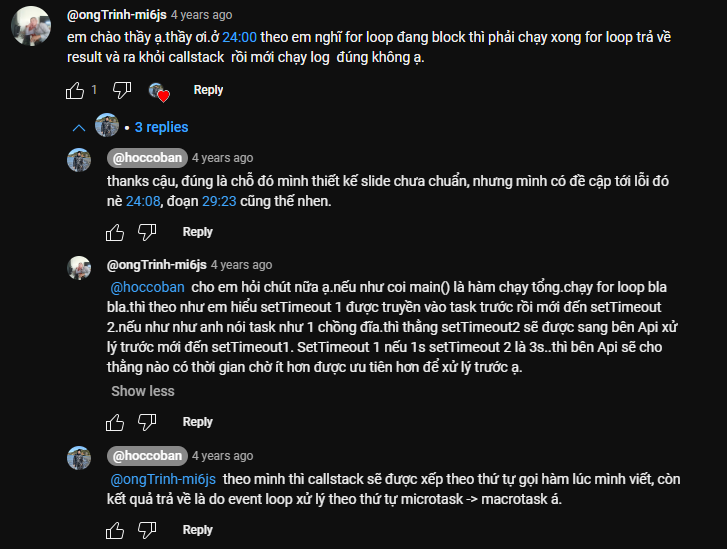
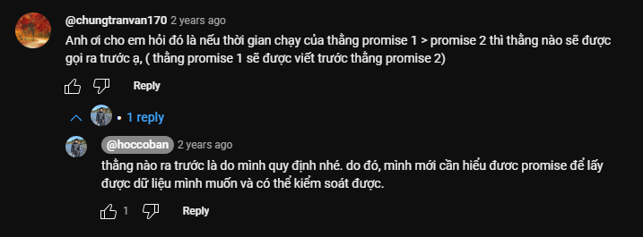

Đây là phần bình luận dài nhất trong video
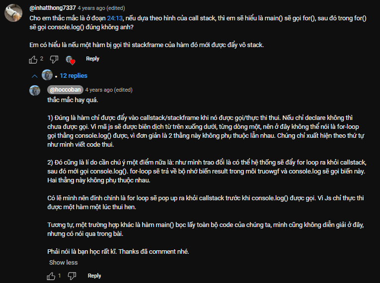
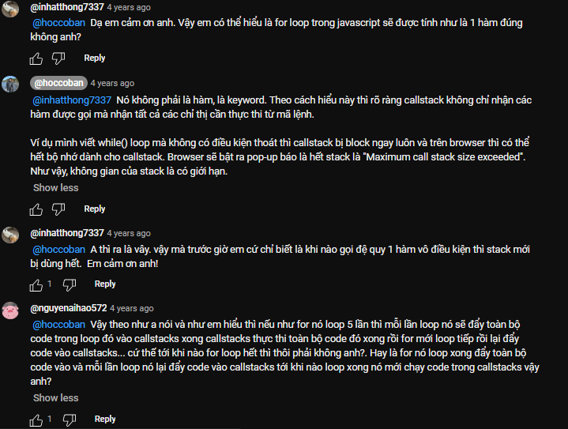
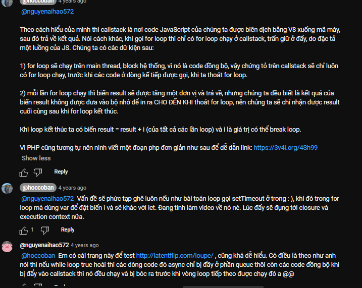
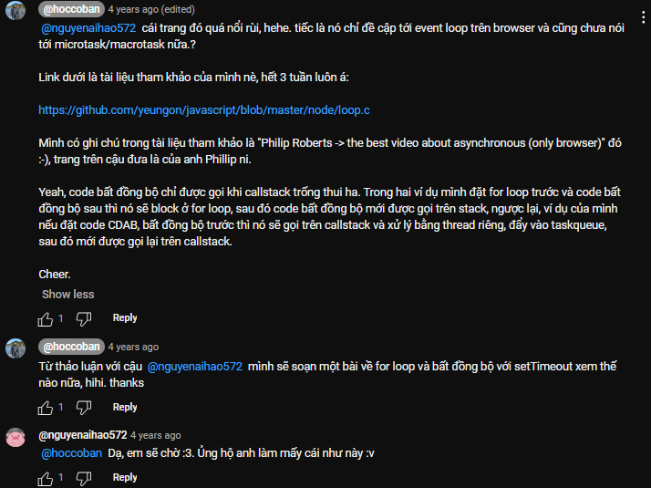
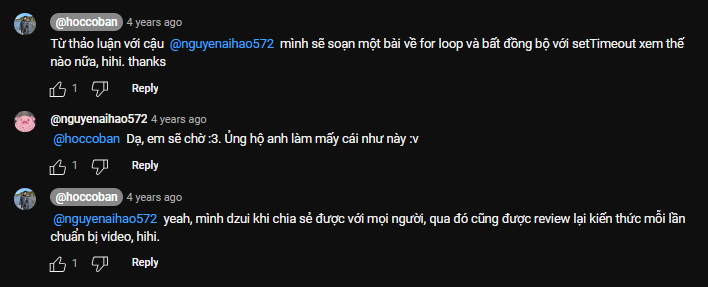

Phần này thảo luận về khi ta chạy code JavaScript thì trình biên dịch V8 sẽ dịch ra code C++...và từ đó trình duyệt sẽ dịch code từ C++ ra kết quả
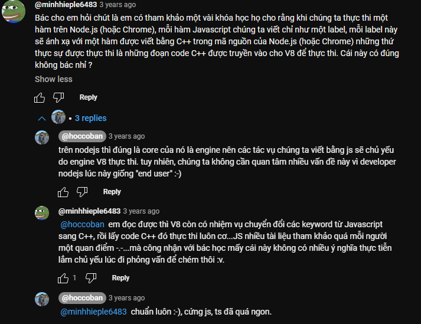

Phần này hỏi về Event Loop trong NodeJS
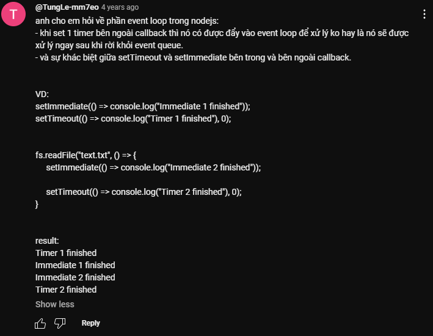
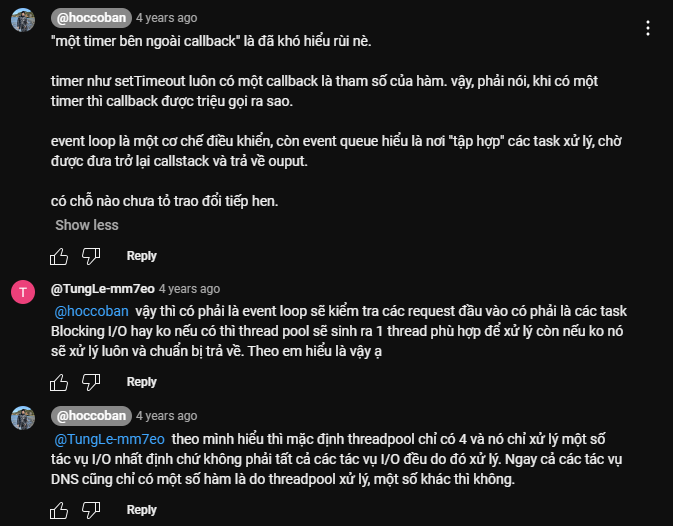
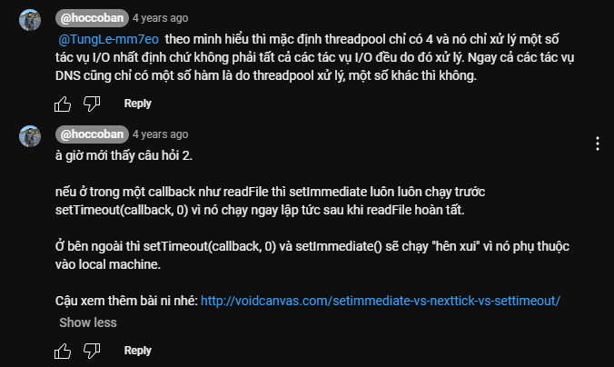
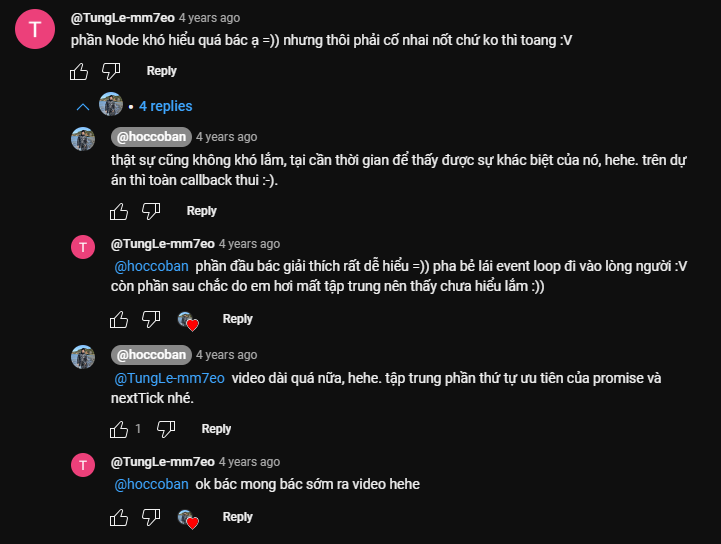
