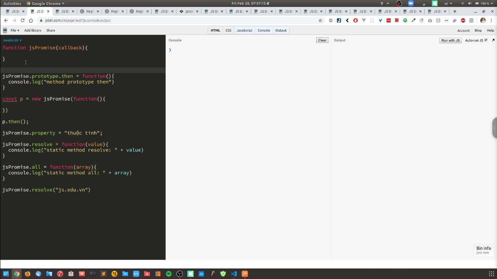
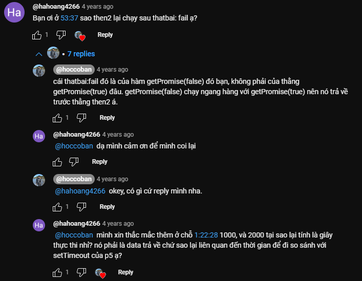

# [ JavaScript chuyên sâu ] - Xử lý bất đồng bộ - phần 3 - Promise

Promise có sẵn trong javasript, giúp viết code bất đồng bộ dễ dàng hơn. Sức mạnh của promise chính là khả năng nối các tác vụ bất đồng bộ và trả về kết quả theo mong muốn.

Hiểu biết về Promise sẽ giúp chúng ta nắm được bản chất của việc xử lý bất đồng bộ khi dùng cú pháp ES7 async - await.

---

# Promise là gì

- Chúng ta phải hiểu là `Promise` nó khác so với các `Promise` là library nó dựa trên cái `Promise` để nó có thể giúp chúng ta viết code tốt hơn. Thì chúng ta hiểu `Promise` là cái chuẩn và có rất nhiều cách mà người ta implement và viết những cái thư viện dựa trên cái chuẩn đấy.

- Thông thường, bây giờ chúng ta có thể sử dụng `Promise` trên browser, NodeJS của JavaScript mà chúng ta chưa cần sử dụng library. Chúng ta có thể sử dụng thư viện `q`, `bluebird`,...để có thể viết code tốt hơn. Tất nhiên, hiện nay nó có rất nhiều sự lựa chọn.

- Hiện nay thì nó có rất nhiều sự lựa chọn, có 1 đặc điểm đó là cái NodeJS thì nó bắt đầu chuyển hóa cái Pattern từ dạng callback (như hàm `readFile`) và chúng ta có thể sử dụng các thư viện được NodeJS thêm vào để có thể `Promise` hóa. Tức là biến các code theo kiểu là callback ngày xưa -> và trở thành `Promise` để chúng ta sử dụng dễ dàng hơn.

- Có 1 điều nên nhớ là: khi chúng ta nói đến `Promise`, thì chúng ta nói tới việc dùng nó để xử lý code bất đồng bộ theo kiểu đồng bộ. Nghĩa là chúng ta có thể lấy được thứ tự xuất hiện của tất cả data. Thì hiện nay, chúng ta thường sử dụng `async/await` để có thể viết bất đồng bộ 1 cách dễ dàng hơn -> bản chất của nó thì cũng dựa trên `Promise` mà thôi.

- Promise thì chúng ta cần phải nhớ 1 điều nữa là: các tác vụ mà chúng ta sử dụng Promise thì đó là các tác vụ bất đồng bộ -> thì nó thuộc nhóm `micro task`, thì nó sẽ được ưu tiên hơn những tác vụ bất đồng bộ nhưng mà thuộc nhóm `macro task` (như là timer, setTimeout,...)

---

# Tại sao chúng ta lại dùng Promise?

Đây là các ví dụ đơn giản để giải thích lý do chúng ta phải sử dụng Promise

Các bạn hình dung như này cho dễ hiểu về cơ chế promise này:

-> Đây là ví dụ: Bây giờ tôi phải nấu cơm, có 3 công việc cần phải làm đó là luộc trứng, nấu cơm, luộc thịt.

**Cách 1: Cách này quá tệ**

-> Đây là cách stupid: bắt cơm lên -> đứng nhìn đợi cơm chín -> sau khi cơm chín thì mình đi nấu nước sôi -> nước sôi xong rồi bỏ trứng vào -> đứng nhìn đợi trứng chín -> sau khi trứng chín thì đi luộc thịt

**Cách 2: Áp dụng promise vào nấu cơm**

-> Đây là cách thông minh hơn tí -> bắt cơm lên -> trong khoảng thời gian cơm chín thì mình đi nấu nước xôi để luộc trứng -> bắt nước xôi luộc trứng lên -> trong khoảng thời gian nước xôi thì mình đi luộc thịt -> luộc thịt xong thì cơm vừa chín -> xong

Đấy là cái ví dụ rất dễ hiểu trong cuộc sống của chúng ta

Nhưng mà khi làm việc gì thì cũng có 2 trạng thái đó là `resolve` (thành công) và `reject` (thất bại). Nếu thành công thì nó sẽ trả về resolve, còn thất bại thì sẽ trả về `reject`

---

# Các ví dụ về Promise

đây là code trong file `promise.js`

- Đoạn code này tổng thể của nó chạy là chỉ có 3 giây thôi (chứ không phải 6 giây nhé). Do chúng ta sử dụng Promise, code bất đồng bộ. Khi mà p1 nó đợi 3 giây, thì p2 p3 vẫn được thực thi luôn. Tổng thời gian nó đợi là 3 giây

- Nếu mà chúng ta code đồng bộ (code chạy tuần tự) thì code chạy sẽ tốn 6 giây

---

đây là ví dụ trong file `callback.js`

Trong code JavaScript thì nó sẽ ưu tiên xử lý code đồng bộ trước, rồi sau đó nó mới thực thi các đoạn code bất đồng bộ. Code bất đồng bộ chỉ xuất hiện khi các code đồng bộ chạy xong. Trong code bất đồng bộ thì nó ưu tiên về macro task, micro task -> thì macro task sẽ được chạy trước

Trong JavaScript thì 1 hàm có thể được truyền vào hàm khác như 1 tham số -> đó được gọi là callback

Nhìn vào ví dụ đó. Chúng ta có 2 cách truyền hàm vào tham số: 1 là truyền callback vào hàm, 2 là viết callback trực tiếp vào hàm

Đây là các pattern rất là quen thuộc của NodeJS và JavaScript. Nếu như chúng ta chưa quen thì rất khó hình dung được về những cái chúng ta viết callback ở trong promise. Bởi vì chúng ta dùng `Promise` để fix `callback hell`, nhưng mà chúng ta vẫn sẽ sử dụng callback pattern. 2 cái khái niệm này nó khác nhau đó nhé (cần tìm hiểu thêm)

---

đây là ví dụ trong file `function constructor.js`

Chúng ta nên biết là class của JavaScript thực chất nó là function. Trên cơ sở function đó thì ta có thể tạo được cái object hoặc là tạo được các instance dựa trên function đó, thay vì trên class

Trong JavaScript thì chúng ta có 2 cách tạo class

---

đây là ví dụ trong file `prototype promise.js`

Để hiểu được prototype của JavaScript thì chúng ta cần phải nắm được cái khái niệm method prototype và state method. Thế thì trong promise thì nó có 2 cái nhóm method khác nhau và chúng ta cần phải nắm được sự khác biệt đó để có thể sử dụng nó

🎯 Bữa sau đọc lại file này thì nên tìm hiểu về `function prototype` và `function static`

---

🎯 Bữa sau đọc lại file này thì nên tìm hiểu về `promise prototype method` và `promise static method`

---

# Những bình luận hay trong video

