# 4. Khái niệm về Big O trong thuật toán.

Trong khoa học máy tính, Big O là một công cụ quan trọng để đo lường và biểu diễn độ phức tạp thời gian của một thuật toán. Nó giúp chúng ta hiểu rõ cách thời gian thực thi của một thuật toán tăng lên theo cách nào khi kích thước của dữ liệu đầu vào tăng lên.

Big O notation thường được biểu thị bằng ký hiệu "O(f(n))," trong đó "f(n)" đại diện cho một hàm số mô tả độ phức tạp thời gian. Cụ thể, các khía cạnh quan trọng của Big O là:

O(1) - Độ phức tạp hằng số: Thời gian thực thi của thuật toán không thay đổi theo kích thước dữ liệu đầu vào. Điều này thường xảy ra khi thuật toán thực hiện một số phép toán cố định, ví dụ như truy cập một phần tử trong một mảng.

O(log n) - Độ phức tạp logarithmic: Thời gian thực thi tăng theo cách logarit với kích thước đầu vào. Điều này thường xảy ra trong các thuật toán chia để trị hoặc tìm kiếm nhị phân.

O(n) - Độ phức tạp tuyến tính: Thời gian thực thi tăng tỷ lệ thuận với kích thước đầu vào. Điều này xảy ra trong nhiều thuật toán tìm kiếm và sắp xếp đơn giản.

O(n^2) - Độ phức tạp bình phương: Thời gian thực thi tăng tỷ lệ bình phương với kích thước đầu vào. Thường xuất hiện trong các thuật toán sắp xếp như sắp xếp nổi bọt.

O(2^n) - Độ phức tạp mũ: Thời gian thực thi tăng một cách rất nhanh theo cách mũ theo kích thước đầu vào. Thường xuất hiện trong các thuật toán quyết định và sắp xếp kết hợp.

Hiểu Big O notation là quan trọng để có khả năng đánh giá hiệu suất và lựa chọn thuật toán thích hợp để giải quyết vấn đề cụ thể trong lĩnh vực khoa học máy tính.

---

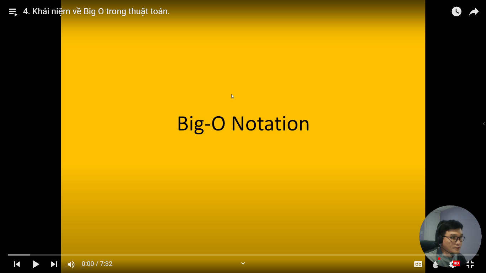
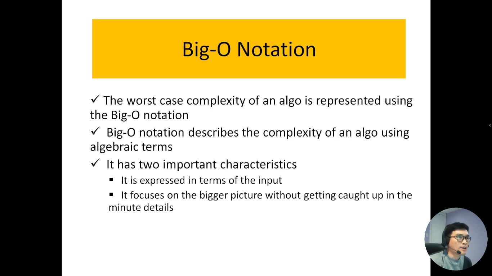
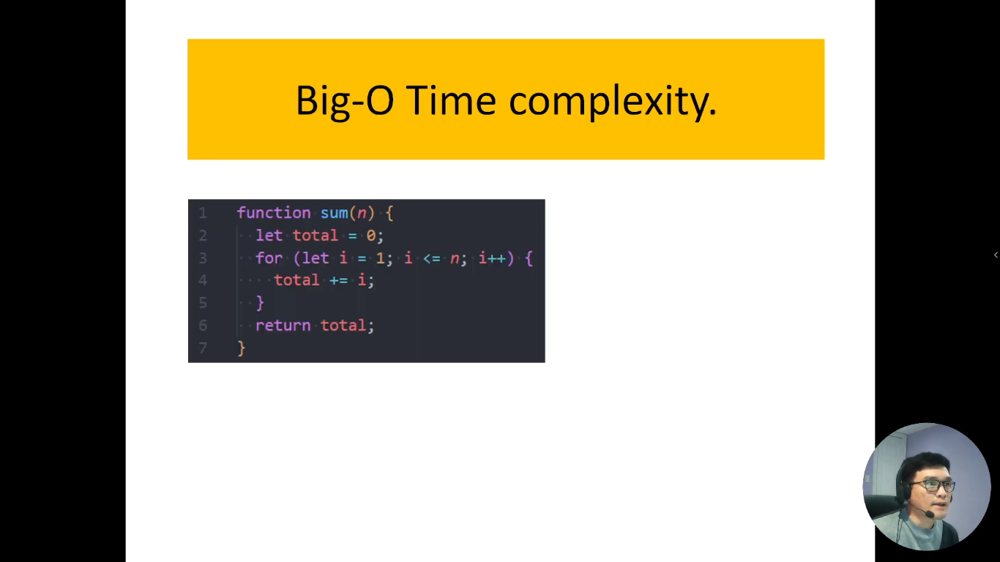
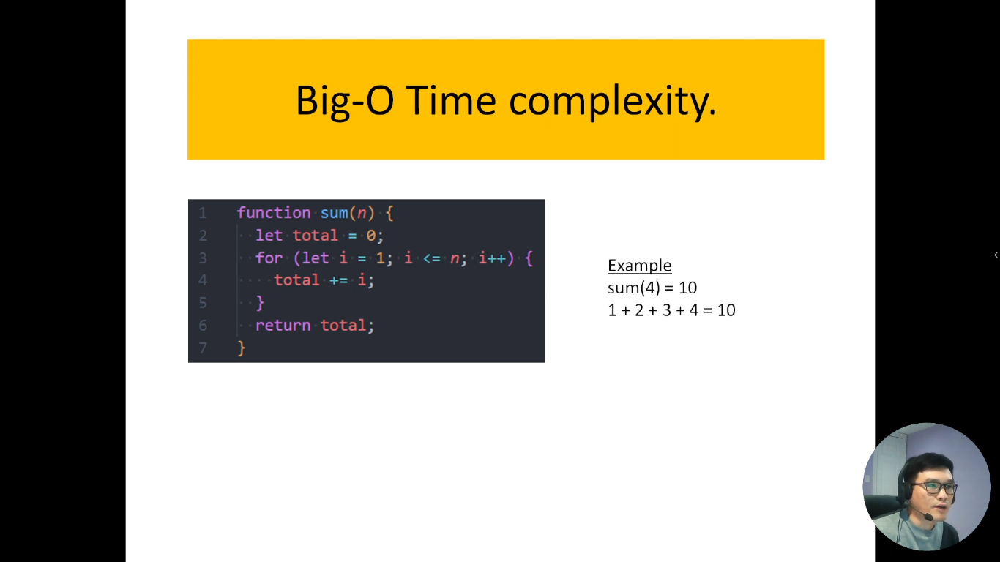
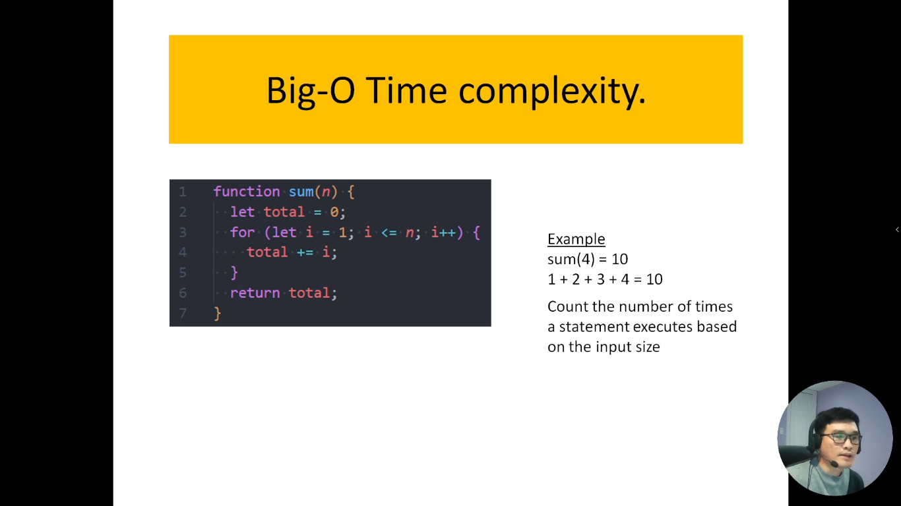
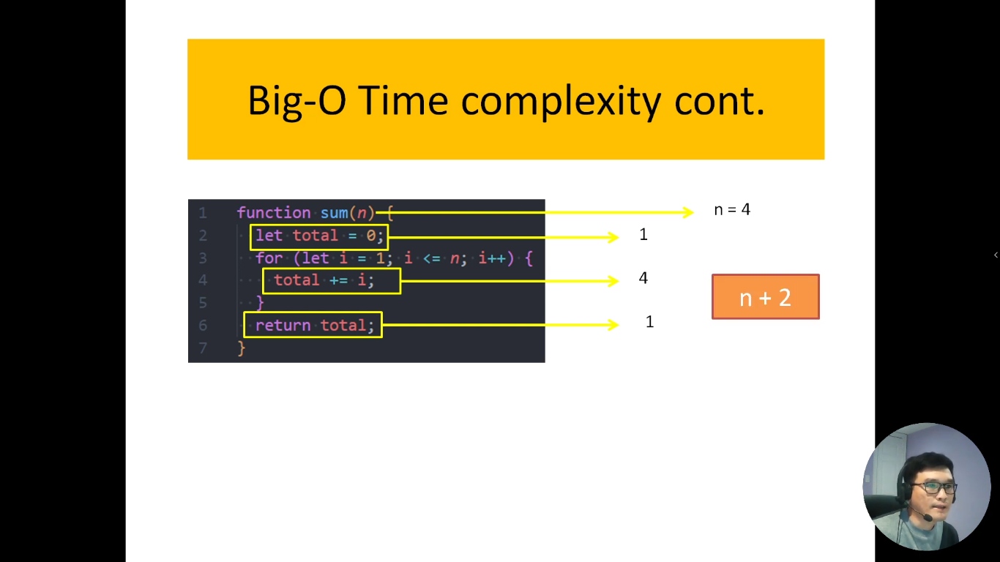
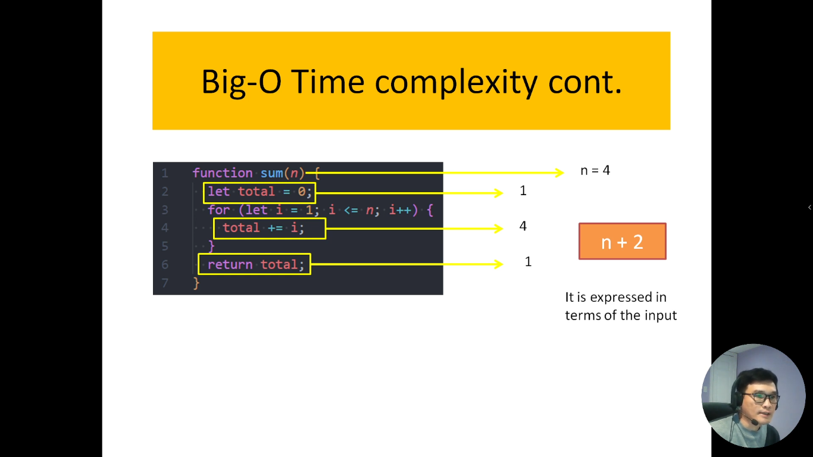
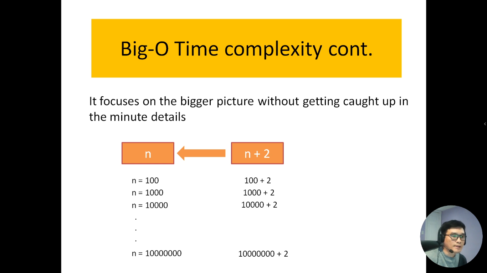
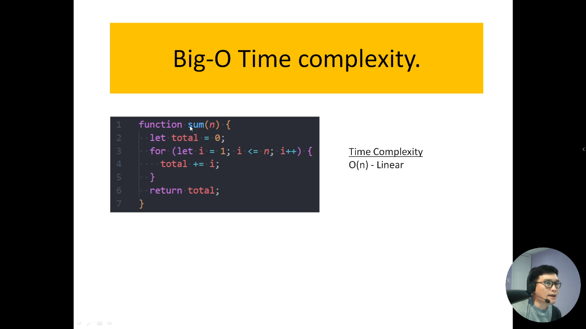
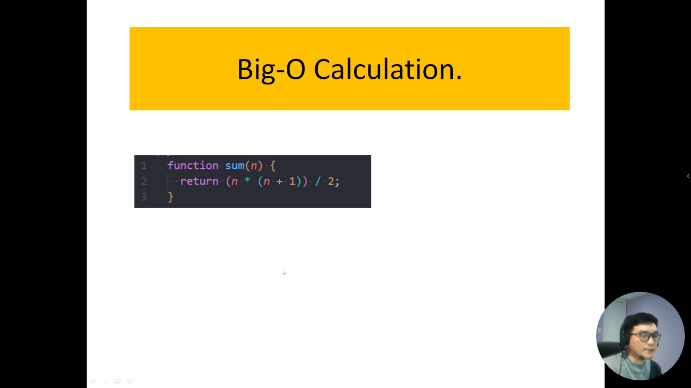
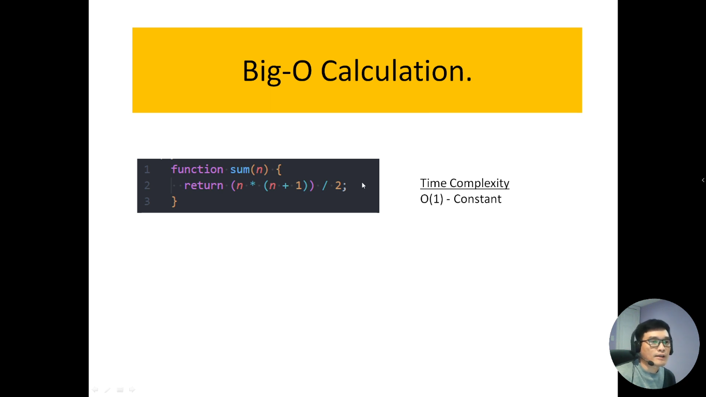
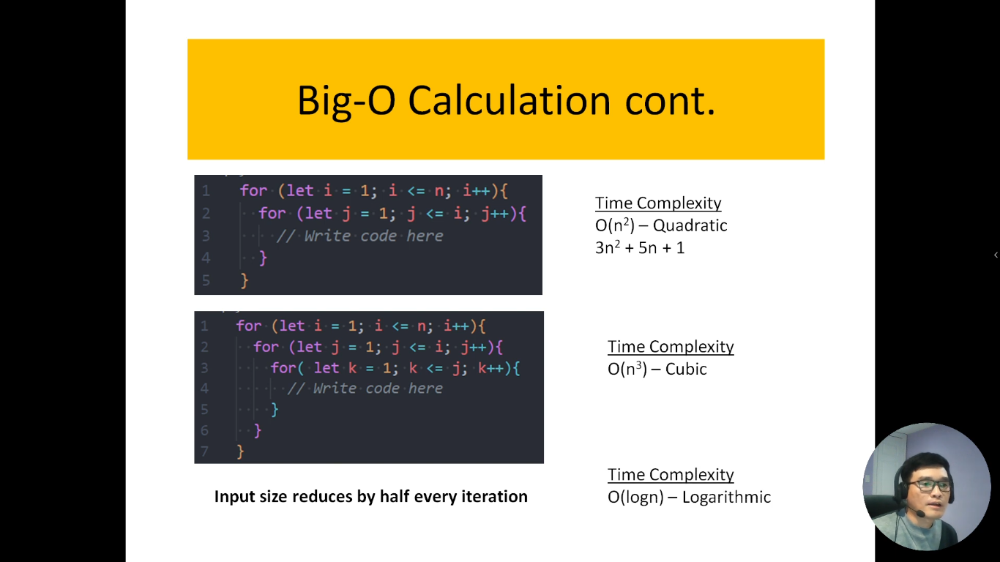
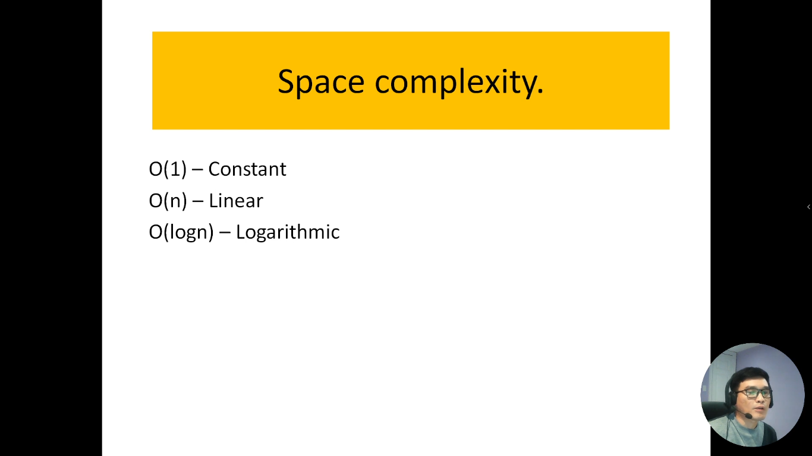
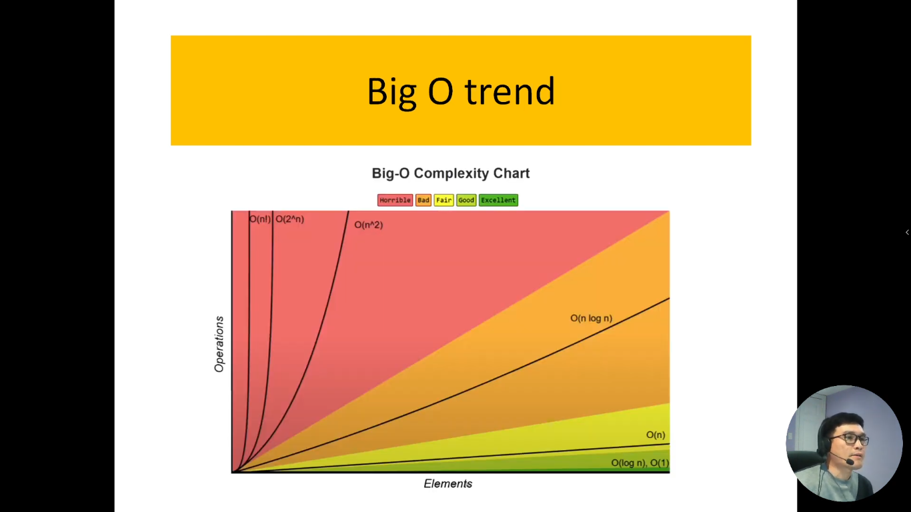
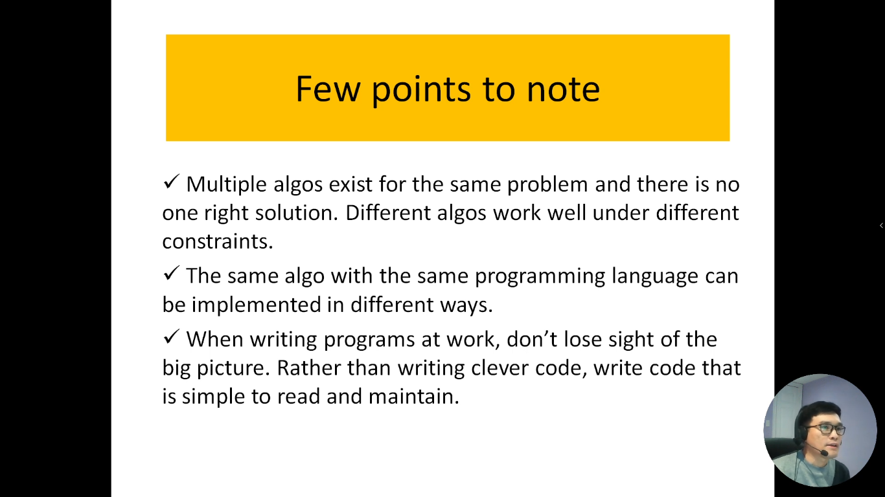
