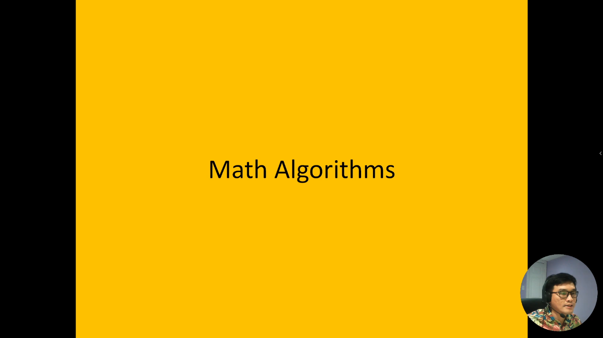
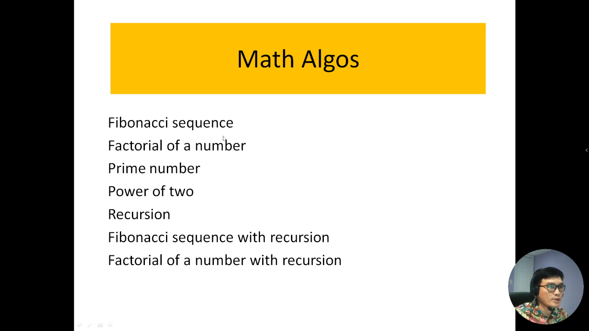
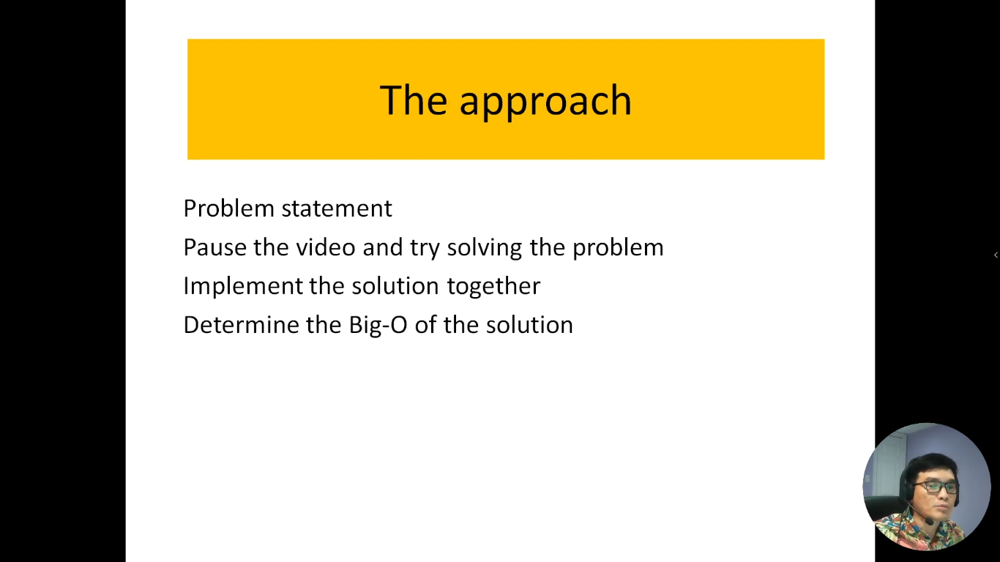

# 6. Thuật toán trong toán học

Trong video này, chúng tôi sẽ giới thiệu một số thuật toán thú vị mà chúng ta sẽ khám phá bằng ngôn ngữ JavaScript. Những thuật toán này bao gồm chuỗi số Fibonacci, tính giai thừa, kiểm tra số nguyên tố, hàm mũ hai, và sử dụng đệ quy để giải quyết các vấn đề liên quan đến chuỗi số Fibonacci và giai thừa. Chúng tôi sẽ dẫn bạn qua từng bước cụ thể để hiểu cách thực hiện các thuật toán này và áp dụng chúng trong lập trình với JavaScript

---

