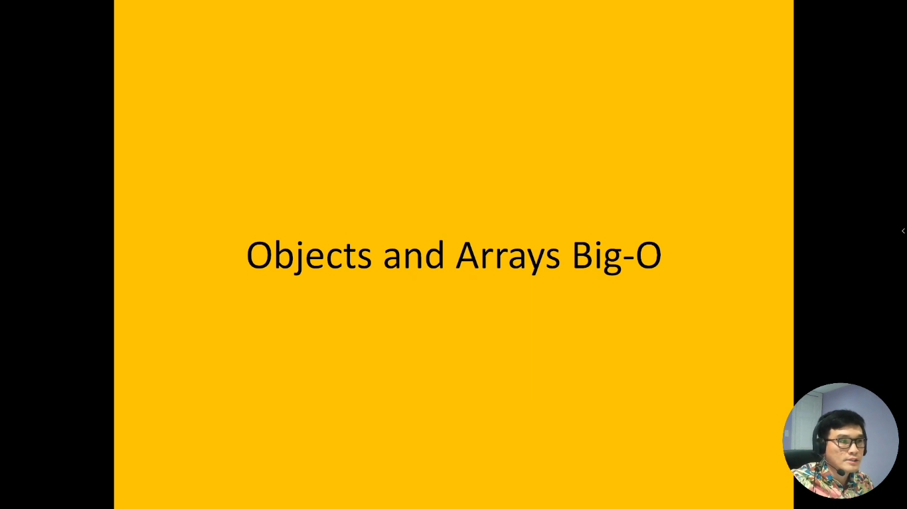
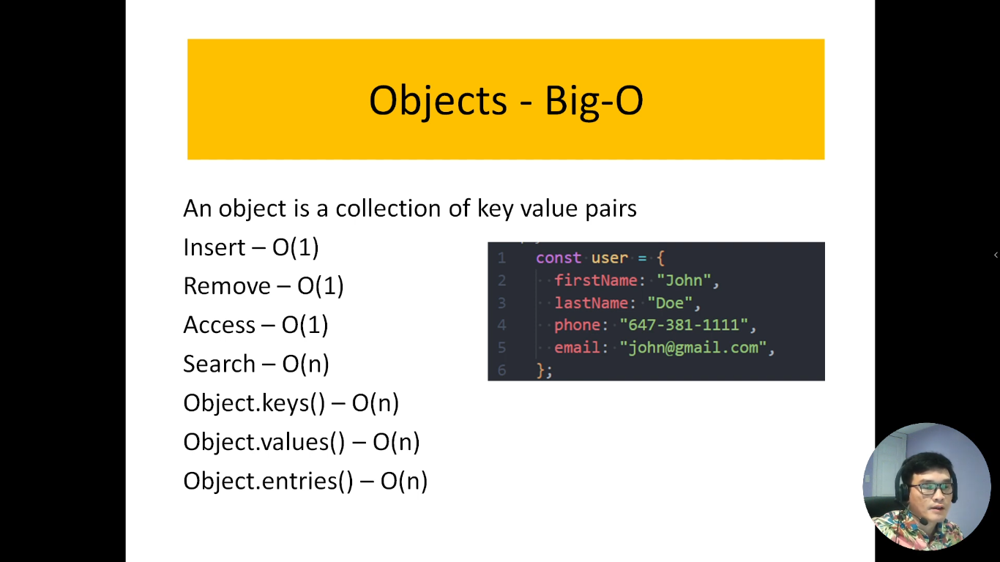
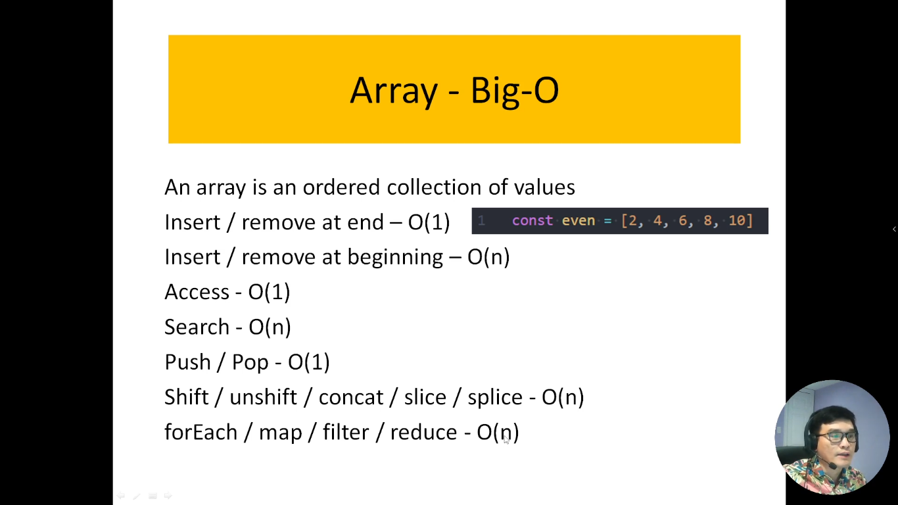

# 5. Độ phức tạp về thời gian đối với Mảng và Đối tượng.

Khi thực hiện các thao tác trên dữ liệu trong lập trình, việc hiểu độ phức tạp về thời gian của các cấu trúc dữ liệu như Mảng và Đối tượng rất quan trọng. Độ phức tạp về thời gian mô tả cách thời gian thực thi của các thao tác thay đổi khi kích thước dữ liệu đầu vào thay đổi. Dưới đây là giới thiệu về độ phức tạp về thời gian của Mảng và Đối tượng:

- Mảng (Array):

  - Truy cập (Access): O(1) - Độ phức tạp hằng số. Việc truy cập phần tử trong mảng mất một lượng thời gian cố định dựa trên chỉ số.
  - Chèn hoặc Xóa (Insertion/Deletion): O(n) - Độ phức tạp tuyến tính. Chèn hoặc xóa một phần tử từ mảng yêu cầu di chuyển các phần tử khác, do đó thời gian tăng tỷ lệ thuận với kích thước mảng.
  - Tìm kiếm (Search): O(n) - Độ phức tạp tuyến tính. Trong trường hợp tồi nhất, bạn có thể phải duyệt qua toàn bộ mảng để tìm kiếm phần tử cần.

- Đối tượng (Object):

  - Truy cập (Access): O(1) - Độ phức tạp hằng số. Truy cập một thuộc tính trong đối tượng dựa trên khóa (key) thường mất một thời gian cố định.
  - Chèn hoặc Xóa (Insertion/Deletion): O(1) - Độ phức tạp hằng số. Chèn hoặc xóa một thuộc tính trong đối tượng cũng mất một lượng thời gian cố định.
  - Tìm kiếm (Search): O(n) - Độ phức tạp tuyến tính. Nếu bạn cần tìm kiếm giá trị trong các thuộc tính của đối tượng, bạn có thể phải duyệt qua chúng, và thời gian tăng tỷ lệ thuận với số lượng thuộc tính.

Việc hiểu độ phức tạp về thời gian giúp lập trình viên đưa ra quyết định hợp lý khi lựa chọn cấu trúc dữ liệu phù hợp cho nhiệm vụ cụ thể và đảm bảo hiệu suất tối ưu của chương trình.

---

