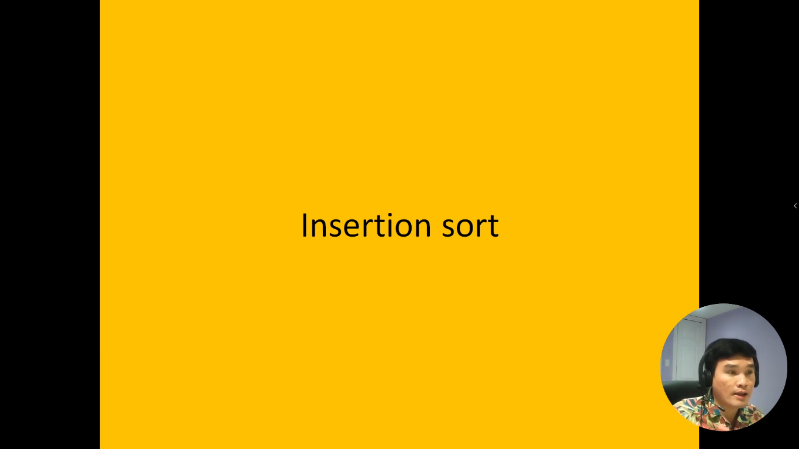
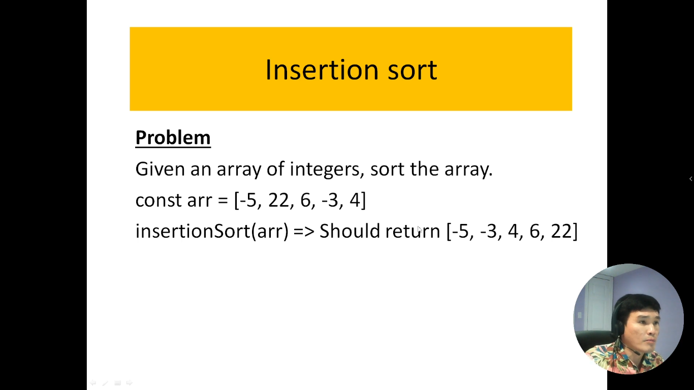
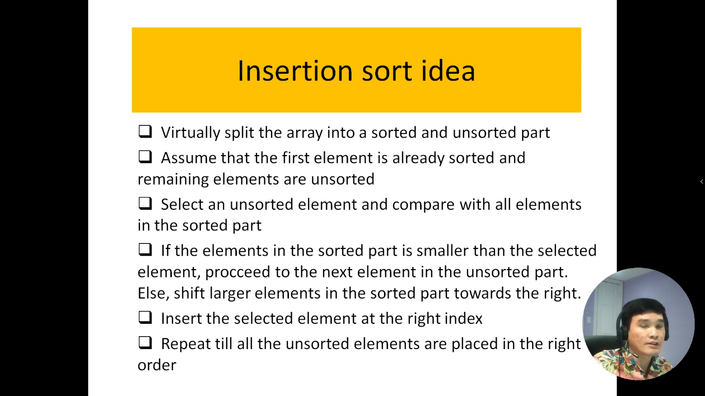
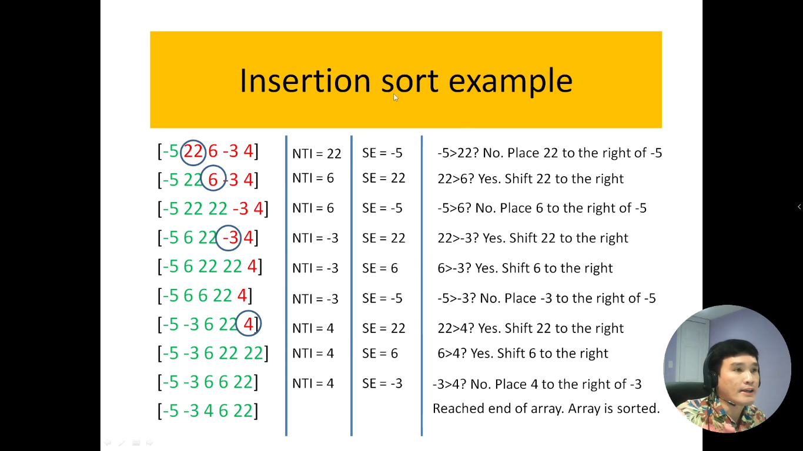
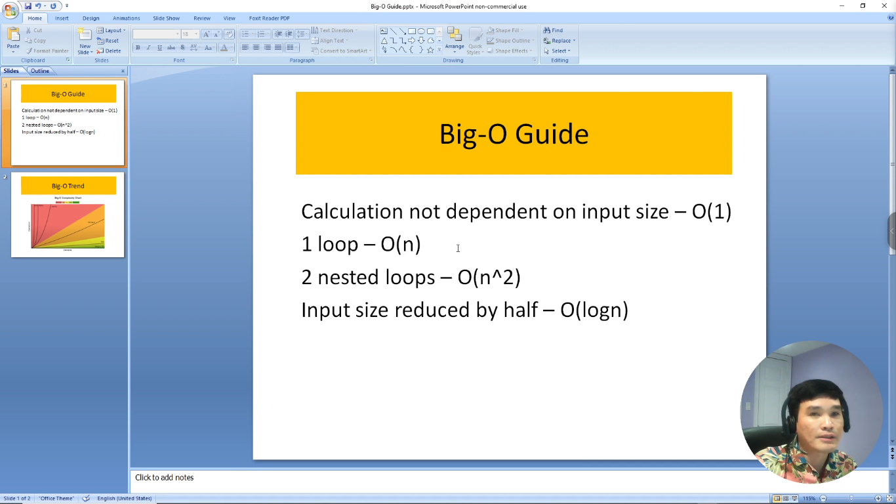

# 20. Thuật toán sắp xếp chèn trong JavaScript.

Phương pháp sắp xếp chèn (Insertion Sort) là một thuật toán sắp xếp đơn giản và hiệu quả, thường được sử dụng trong trường hợp mảng dữ liệu gần như đã được sắp xếp. Thuật toán này hoạt động bằng cách chia mảng thành hai phần: một phần đã được sắp xếp và một phần chưa được sắp xếp. Thuật toán sẽ từng bước chọn một phần tử từ phần chưa được sắp xếp và chèn nó vào đúng vị trí trong phần đã được sắp xếp.

Dưới đây là mô tả chi tiết của phương pháp sắp xếp chèn:

Bắt đầu từ phần tử thứ hai (vị trí 1) của mảng.
So sánh phần tử hiện tại với các phần tử trong phần đã được sắp xếp.
Nếu phần tử hiện tại nhỏ hơn phần tử nằm trước nó, đổi chỗ hai phần tử.
Lặp lại quá trình so sánh và đổi chỗ cho đến khi đặt phần tử hiện tại vào đúng vị trí trong phần đã được sắp xếp.
Chuyển sang phần tử tiếp theo trong phần chưa được sắp xếp và lặp lại quá trình cho đến khi toàn bộ mảng đã được sắp xếp.
Điều đặc biệt của phương pháp sắp xếp chèn là nó hoạt động tốt trên dữ liệu gần như đã được sắp xếp, và nó không yêu cầu nhiều không gian bộ nhớ bổ sung. Tuy nhiên, đối với dữ liệu lớn và không có sẵn sẵn sẵn, các thuật toán sắp xếp khác như QuickSort hoặc MergeSort có thể được ưa chuộng hơn.

---

---

Đây là bảng tính độ phức tạp thời gian (`Time-Complexity`)

- Nếu thuật toán có 1 vòng lặp thì độ phức tạp thời gian là tuyến tính: `O(N)`
- Nếu thuật toán có 2 vòng lặp lồng nhau thì độ phức tạp thời gian là: `O(n^2)`
- Nếu thuật toán có vòng lặp mà sau mỗi lần chạy mảng đầu vào nó giảm đi 1 nửa thì có độ phức tạp là: `O(log n)`

---

# Giải thích code của mình

Trong bài toán của mình có 2 vòng lặp lồng nhau nên có độ phức tạp là: `BigO = O(n^2)`
