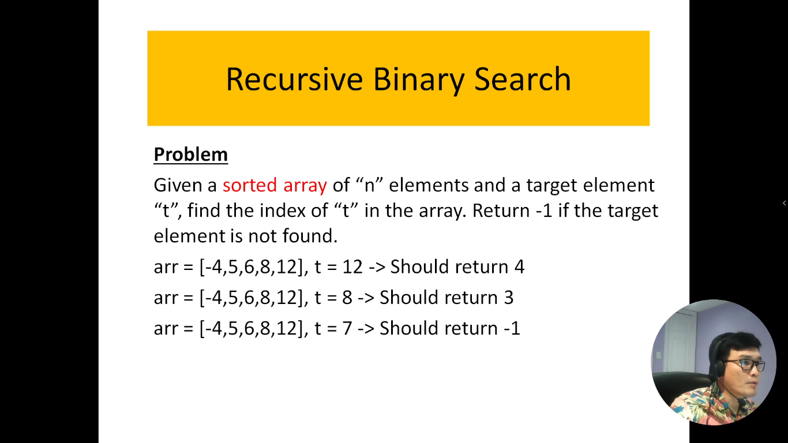
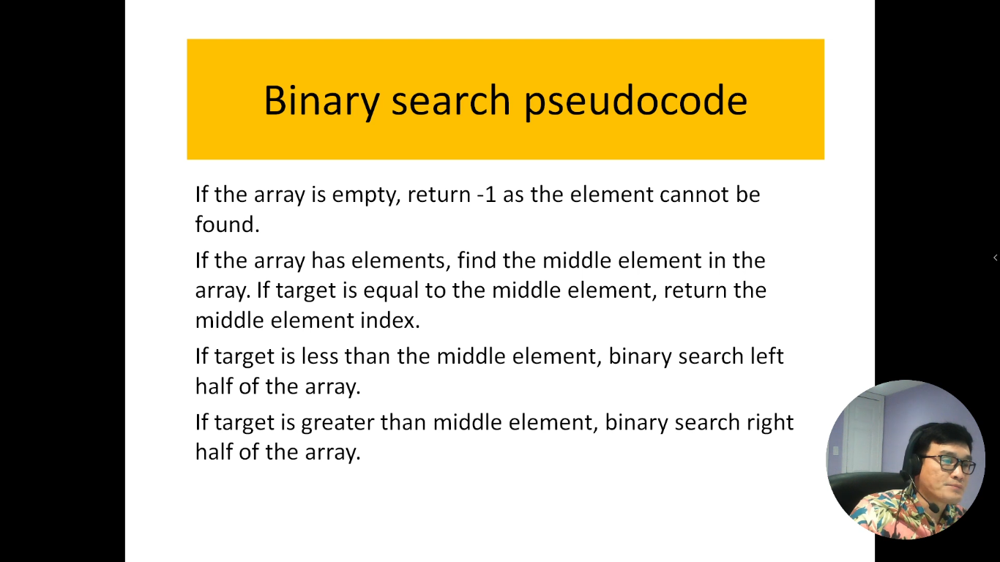
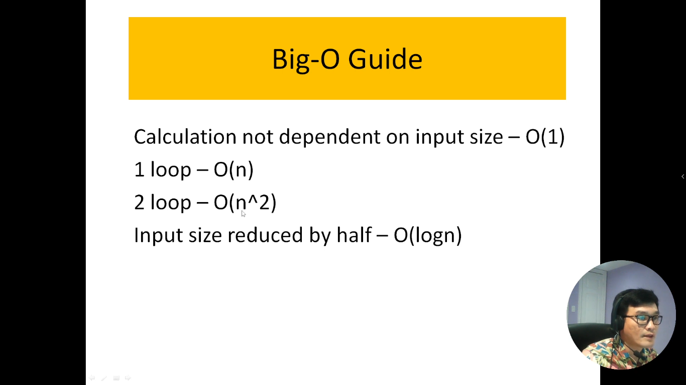

# 17. Tìm kiếm nhị phân bằng phương pháp đệ quy.

Tìm kiếm nhị phân là một phương pháp hiệu quả để xác định vị trí của một phần tử trong một danh sách đã được sắp xếp theo thứ tự tăng dần. Phương pháp này hoạt động bằng cách chia nhỏ danh sách thành hai nửa và liên tục tìm kiếm trong nửa danh sách phù hợp với phần tử cần tìm. Một biến thể thú vị của tìm kiếm nhị phân là tìm kiếm nhị phân bằng phương pháp đệ quy.

Tìm kiếm nhị phân đệ quy hoạt động theo cách sau: nó bắt đầu bằng việc so sánh phần tử cần tìm với phần tử ở giữa của danh sách. Nếu phần tử cần tìm bằng với phần tử ở giữa, thuật toán trả về vị trí của nó. Nếu không, nó xác định xem phần tử cần tìm nằm ở nửa trái hay nửa phải của danh sách, sau đó gọi đệ quy để tìm kiếm trong nửa phù hợp. Quá trình này lặp lại cho đến khi tìm thấy phần tử cần tìm hoặc xác định rằng phần tử đó không tồn tại trong danh sách.

Tìm kiếm nhị phân đệ quy là một ví dụ điển hình về cách sử dụng đệ quy trong giải quyết vấn đề. Nó giúp giảm thiểu mã nguồn và tạo ra một thuật toán dễ đọc và dễ hiểu.

Trong giới thiệu này, chúng ta sẽ tìm hiểu cách hoạt động của tìm kiếm nhị phân đệ quy, cách triển khai nó và các tình huống mà nó phù hợp nhất, đặc biệt là khi bạn đã có danh sách được sắp xếp.

---

---

## Độ phức tạp thời gian của thuật toán (Time-Complexity)

Quay lại bài toán của mình

- Nếu có 1 vòng lặp thì n tuyến tính hoặc nói cách khác thuật toán không phụ thuộc vào kích thướt đầu vào thì: O(n)
- Nếu có 2 vòng lặp thì n^2: O(n^2)
- Nếu mỗi vòng lặp mà kích thước của đầu vào giảm đi 1 nửa thì : O(log n) -> Cái này gọi là `logaric`

=> Bài toán của mình có 1 vòng lặp, mỗi lần chạy thì kích thước của mảng nó sẽ giảm đi 1 nữa (do có chia 2)

=> Vậy thuật toán của bài mình là: `BigO = O(logn)`
