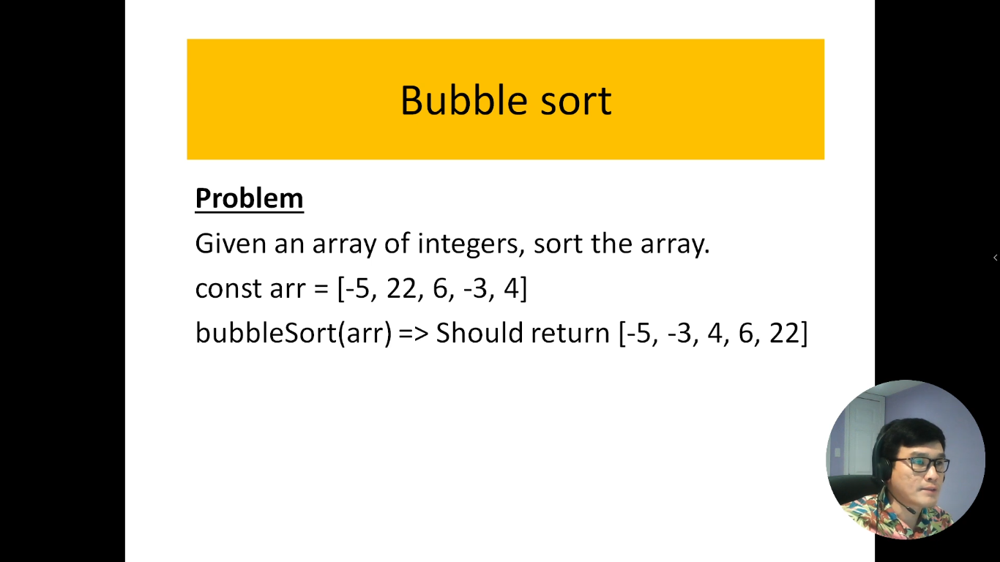
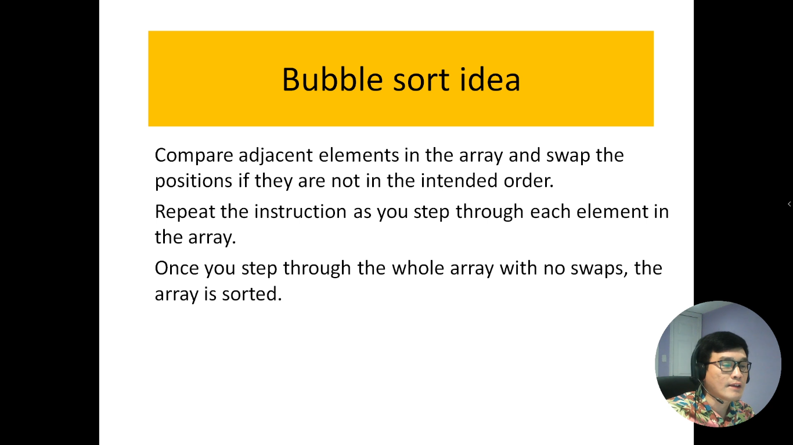
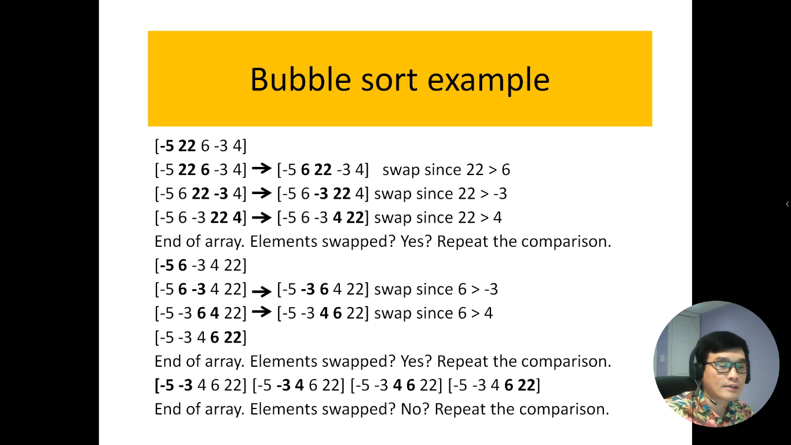
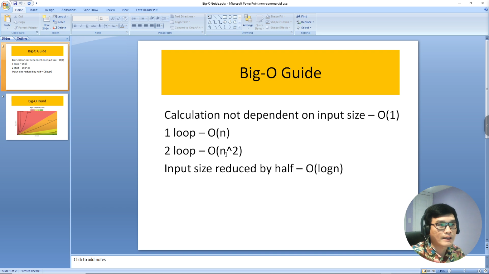

# 19. Thuật toán sắp xếp nổi bọt trong JavaScript.

Trong lĩnh vực lập trình và khoa học máy tính, thuật toán sắp xếp nổi bọt (Bubble Sort) là một trong những thuật toán sắp xếp cơ bản và dễ hiểu nhất. Nó được áp dụng để sắp xếp một mảng hoặc danh sách các phần tử thành một thứ tự thứ tự tăng dần hoặc giảm dần.

Thuật toán sắp xếp nổi bọt hoạt động bằng cách so sánh các cặp phần tử liền kề trong mảng và hoán đổi chúng nếu chúng không được sắp xếp đúng thứ tự. Quá trình này lặp lại cho đến khi không còn phần tử nào cần phải hoán đổi, đồng nghĩa với việc mảng đã được sắp xếp.

Trong giới thiệu này, chúng ta sẽ tìm hiểu về cách thuật toán sắp xếp nổi bọt hoạt động, cách triển khai nó bằng ngôn ngữ lập trình JavaScript, và các tình huống mà nó phù hợp. Chúng ta cũng sẽ xem xét độ phức tạp thời gian của thuật toán và cách nó ảnh hưởng đến hiệu suất trong các trường hợp thực tế.

---

---

Đây là bảng tính độ phức tạp thời gian (`Time-Complexity`)

- Nếu thuật toán có 1 vòng lặp thì độ phức tạp thời gian là tuyến tính: `O(N)`
- Nếu thuật toán có 2 vòng lặp lồng nhau thì độ phức tạp thời gian là: `O(n^2)`
- Nếu thuật toán có vòng lặp mà sau mỗi lần chạy mảng đầu vào nó giảm đi 1 nửa thì có độ phức tạp là: `O(log n)`

---

## Giải thích code

Tìm độ phức tạp về thời gian của thuật toán trong bài code của mình

=> Trong bài toán của mình có 2 vòng lặp nên độ phức tạp về thời gian của thuật toán là: `O(n^2)`
